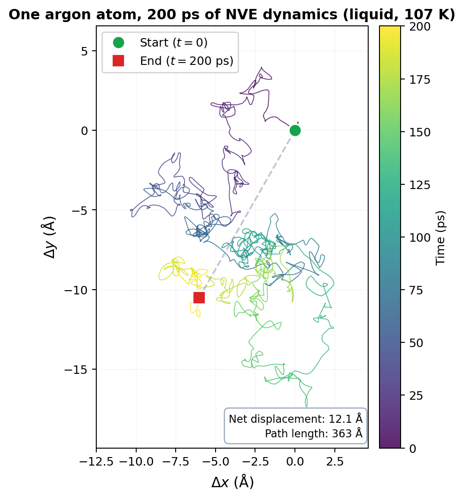
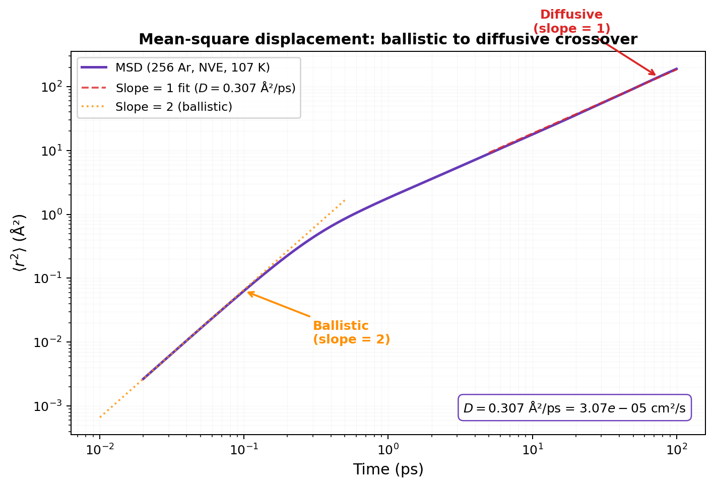
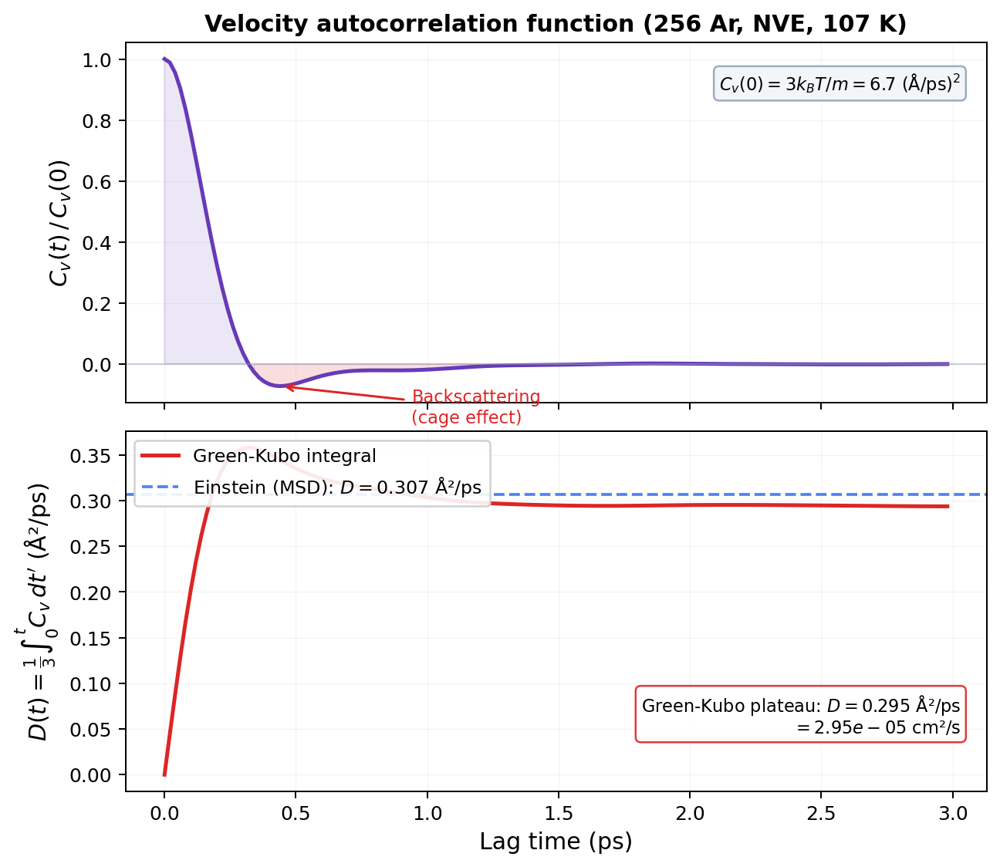

# Brownian Motion & Diffusion

!!! info "Huang, *Introduction to Statistical Physics* 2ed, Chapter 10 & LiveCoMS Best Practices for Computing Transport Properties"

## Confession time (again).

I've computed diffusion coefficients. Lots of them. Fire up LAMMPS, add `compute msd all msd`, run for a while, plot MSD vs time, fit a line, divide by 6. Out pops a number. $D = 2.4 \times 10^{-5}$ cm$^2$/s. Done.

But *why* does that work? Why does the mean-square displacement grow linearly with time? Why divide by 6? Where does that formula come from? And here's the one that really got me: why does the same physics that makes particles wander aimlessly also create friction when you push them?

That's what this page is about. We're going back to 1827. A botanist. A microscope. Pollen grains doing something nobody could explain. And we're following that thread all the way to the `compute msd` command in your LAMMPS input script.

Let's go.

## The drunkest walk you've ever seen

Robert Brown, 1827. He's staring through a microscope at pollen grains suspended in water. And they won't sit still. They jitter. They wander. They stop, reverse, wander off in a completely new direction. No pattern. No purpose. Just perpetual, random motion.

His first thought: maybe the pollen is alive. So he tried grinding up rocks and suspending the dust. Same behavior. Dead particles, same random jitter. Something invisible was shoving them around.

Fast forward to Jean Perrin, 1909. He tracked these particles obsessively. Recorded their positions every 30 seconds. Connected the dots. And got a tangled mess.

But here's what really blew people's minds: if Perrin had recorded positions every *second* instead of every 30, each straight segment would have been replaced by an equally tangled 30-segment path. Zoom in further? Same thing. The path is **fractal**. Its fractal dimension is $D_f = 2$, meaning it's so crinkly that it effectively fills a 2D surface.

<figure markdown="span">
  { width="600" }
  <figcaption>The trajectory of a single argon atom in a liquid, projected onto the x-y plane. 200 ps of NVE dynamics at 107 K. Color encodes time (viridis: dark = early, bright = late). Net displacement: 12 Å. Total path length: 363 Å. The path is 30x longer than the straight-line distance. That's diffusion.</figcaption>
</figure>

You can't really define an instantaneous velocity for a Brownian particle. The "velocity" you compute depends on your time resolution, and it diverges as you look at shorter intervals. The path is continuous everywhere, differentiable nowhere. Mathematicians love this object. Physicists find it... unsettling.

And this apparently useless random jitter? It won Perrin a Nobel Prize in 1926. Because it proved atoms exist.

!!! tip "Key Insight"
    Brownian motion is caused by random molecular impacts. Each collision delivers a tiny, random kick. The visible particle's trajectory is the cumulative result of billions of these kicks. The resulting path is fractal, random, and (as we're about to see) deeply connected to diffusion, friction, and thermodynamics.

## What's really going on

OK, so water molecules are hammering the pollen grain from all sides. Each individual collision is tiny and random. But they don't perfectly cancel. At any instant, there's a slight imbalance, a net force in some random direction. That's the kick. Next instant, another random net force in a different direction. The particle staggers around like a person trying to walk home after one too many.

This is the physical picture. Hold onto it. Everything that follows is just making this precise.

## Einstein enters the chat

Einstein, 1905. The same year as special relativity. The same year as the photoelectric effect. And tucked in between: a paper about particles stumbling around in water.

(The man had a productive year.)

Einstein's approach was brilliant in its simplicity. Don't try to track every molecular collision. That's $10^{13}$ collisions per second. Hopeless. Instead, zoom out and ask a statistical question:

> If a particle is at position $x$ right now, what's the *probability* that it moves by some displacement $\Delta$ during a short time $\tau$?

Call that probability density $f_\tau(\Delta)$. This **transition probability** has two properties that Einstein needed and nothing more:

1. **Symmetric**: $f_\tau(\Delta) = f_\tau(-\Delta)$. No preferred direction. The kicks are random.
2. **Normalized**: $\int_{-\infty}^{\infty} f_\tau(\Delta)\, d\Delta = 1$. The particle goes *somewhere*.

That's it. He didn't need to know the exact shape of $f_\tau$. Didn't need to model water molecules. Didn't need hydrodynamics. Just symmetry and normalization.

Here's the key move: Taylor-expand both sides of the particle conservation equation. The symmetry of $f_\tau$ kills the first-order term (no preferred direction). The normalization kills the zeroth-order term (cancels on both sides). The only surviving contribution is the second moment $\langle \Delta^2 \rangle_\tau$. Define the **diffusion constant** as $D = \langle \Delta^2 \rangle_\tau / 2\tau$, and you land on the **diffusion equation**:

$$\boxed{\frac{\partial n}{\partial t} = D \frac{\partial^2 n}{\partial x^2}}$$

Done. Beautiful. And notice what happened: the details of $f_\tau$ completely dropped out. A random walk with equal step sizes gives the same equation as one with Gaussian steps. The macroscopic behavior (diffusion) doesn't care about microscopic details. That's the central limit theorem doing its thing.

!!! warning "Common Mistake"
    The diffusion equation assumes the particle has no memory. Each jump is independent of the previous one. This is the **Markov property**. It's a great approximation for a Brownian particle in a fluid (where the velocity decorrelates in picoseconds), but it fails for systems with long-range correlations or confinement. If your system has memory effects, the simple $\langle r^2 \rangle \propto t$ law breaks down and you get **anomalous diffusion**: $\langle r^2 \rangle \propto t^\alpha$ with $\alpha \neq 1$.

## The answer: how far does a particle wander?

The diffusion equation has an exact solution: a Gaussian that spreads with time. The particle's position is normally distributed (central limit theorem: billions of random kicks add up to a Gaussian). The mean-square displacement in 1D is $\langle x^2 \rangle = 2Dt$. In three dimensions, each component is independent, so:

$$\boxed{\langle r^2 \rangle = \langle x^2 \rangle + \langle y^2 \rangle + \langle z^2 \rangle = 6Dt}$$

That's the famous Einstein relation for mean-square displacement. Linear in time. Not quadratic (that would be ballistic, free flight). Linear. The factor of 6 is just $2 \times 3$ dimensions.

And *that's* where the 6 comes from in your MSD analysis. When you compute `compute msd all msd` in LAMMPS and fit the slope of MSD vs time, you're extracting $6D$. Divide by 6, get $D$. Now you know why.

!!! note "MD Connection"
    In LAMMPS, `compute msd` gives you $\langle r^2 \rangle$ averaged over all atoms in the group. The output columns are $\langle x^2 \rangle$, $\langle y^2 \rangle$, $\langle z^2 \rangle$, and the total $\langle r^2 \rangle$. For an isotropic system, $D_x \approx D_y \approx D_z$. If they're not roughly equal, something is wrong (anisotropy, bad PBC, or insufficient sampling). That's a free sanity check.

## Two ways to get D

There are exactly two fundamental routes to the self-diffusion coefficient. They look completely different, but they're mathematically equivalent.

### Route 1: Einstein (MSD slope)

This is the one you already know. Run a simulation, track how far each particle moves from its starting position, average over all particles, and plot $\langle r^2 \rangle$ vs $t$. In the diffusive regime, it's a straight line with slope $6D$:

$$D = \frac{1}{6} \lim_{t \to \infty} \frac{d}{dt} \langle r^2(t) \rangle$$

In practice, you fit the slope of the linear region. Not the whole curve, just the part where the log-log slope is 1. At short times (the **ballistic** regime), particles fly freely and MSD grows as $t^2$. You want the long-time **diffusive** regime where MSD grows as $t$.

<figure markdown="span">
  { width="700" }
  <figcaption>Mean-square displacement of liquid argon (256 atoms, NVE, 107 K) on a log-log scale. At short times (< 0.1 ps), the slope is 2 (ballistic: particles fly freely). At long times (> 1 ps), the slope is 1 (diffusive: random walk). The crossover happens around the velocity decorrelation time. The slope-1 fit gives D = 0.307 Ų/ps.</figcaption>
</figure>

!!! note "MD Connection"
    Two gotchas when extracting $D$ from MSD. First: use **unwrapped coordinates** (`xu yu zu` in your LAMMPS dump). Wrapped coordinates jump at box boundaries and will destroy your MSD. LAMMPS's `compute msd` handles this internally, but post-processing from dump files requires `xu yu zu`. Second: your $D$ has a **finite-size artifact**. Hydrodynamic self-interactions through periodic images reduce $D$ by 10-15% for typical system sizes. The Yeh-Hummer correction adds $k_BT\xi/(6\pi\nu L)$ where $L$ is the box length and $\nu$ is the shear viscosity.

### Route 2: Green-Kubo (velocity autocorrelation)

This one is less intuitive but equally powerful. Instead of tracking displacement, track velocities. Specifically, compute the **velocity autocorrelation function** (VACF):

$$C_v(t) = \langle \mathbf{v}(t) \cdot \mathbf{v}(0) \rangle$$

This tells you: if a particle has velocity $\mathbf{v}(0)$ right now, how correlated is its velocity at time $t$ with that initial value?

At $t = 0$: $C_v(0) = \langle v^2 \rangle = 3k_BT/m$ (equipartition). At long times: $C_v(\infty) = 0$. The particle has forgotten which way it was going. The memory decays.

The diffusion coefficient is the time integral of this decay:

$$D = \frac{1}{3} \int_0^\infty \langle \mathbf{v}(t) \cdot \mathbf{v}(0) \rangle\, dt$$

<figure markdown="span">
  { width="700" }
  <figcaption>Top: Velocity autocorrelation function (normalized). Rapid decay from 1.0 to zero, with a negative dip from backscattering (the "cage effect": neighboring atoms bounce the particle back). Bottom: Running Green-Kubo integral reaches a plateau at D = 0.295 Ų/ps, matching the Einstein (MSD) value of 0.307 Ų/ps within 4%. Same physics, two methods, consistent answer.</figcaption>
</figure>

Why does this work? Think about it physically. $D$ measures how far a particle wanders. A particle wanders far if its velocity stays correlated for a long time (long memory = long steps in the same direction). If correlations decay instantly, the particle barely moves between randomizations. The integral of the VACF measures exactly this: the total "persistence" of velocity.

!!! tip "Key Insight"
    The Einstein method asks: "How far did you go?" The Green-Kubo method asks: "How long did you remember which way you were going?" Same physics, different questions. For self-diffusivity, the Einstein (MSD) method is generally more robust and more commonly used. But you should check that both give consistent answers within uncertainty. If they don't, you have a problem.

## The deep connection: fluctuation meets dissipation

Now for my favorite part of this whole story.

Imagine pushing a Brownian particle through a fluid with a constant external force $\mathbf{F}$. The particle accelerates briefly, then reaches a terminal drift velocity $\mathbf{u}$ where the applied force balances friction:

$$\mathbf{F} = \gamma \mathbf{u}$$

where $\gamma$ is the **friction coefficient**. For a sphere of radius $a$ in a fluid of shear viscosity $\nu$, Stokes' law gives $\gamma = 6\pi a \nu$. Bigger particle, more friction. More viscous fluid, more friction. Makes sense.

Now here's where it gets amazing.

In equilibrium (no external force), the particle diffuses with coefficient $D$. Under an external force, the same particle experiences friction $\gamma$. Einstein showed that $D$ and $\gamma$ aren't independent. They're locked together:

$$\boxed{D = \frac{k_BT}{\gamma}}$$

This is the **Einstein relation**. Also called the first **fluctuation-dissipation relation**. Read it carefully:

- **$D$ (diffusion)**: random wandering caused by molecular kicks. This is the **fluctuation**.
- **$\gamma$ (friction)**: resistance to directed motion caused by molecular kicks. This is the **dissipation**.
- **$k_BT$**: the thermal energy that connects them.

The same molecular collisions that make the particle diffuse randomly also resist its directed motion. Fluctuation and dissipation aren't separate phenomena. They're two faces of the same coin: random molecular impacts. That's crazy. And that's the whole foundation of non-equilibrium statistical mechanics in one equation.

Turn up the temperature? More violent kicks, more diffusion. But $\gamma$ doesn't change (it's a hydrodynamic property of the fluid). So higher $T$ means proportionally more diffusion. That's why hot liquids have higher diffusion coefficients.

Where does this come from? The logic is elegant: in equilibrium, particles diffuse away from high-concentration regions (Fick's law: $\mathbf{j} = -D\nabla n$) and simultaneously drift under any external potential ($\mathbf{j} = -n\nabla U / \gamma$). These two currents must balance to give zero net flow. That balance, combined with the Boltzmann distribution ($n \propto e^{-U/k_BT}$), forces $D = k_BT/\gamma$. No other value is consistent with equilibrium.

### The Green-Kubo connection

Combining $D = k_BT/\gamma$ with the VACF integral gives the **fluctuation-dissipation theorem** in its most direct form:

$$\frac{1}{\gamma} = \frac{1}{3k_BT} \int_0^\infty \langle \mathbf{v}(t) \cdot \mathbf{v}(0) \rangle\, dt$$

The left side is inverse friction (dissipation). The right side is an integral of equilibrium velocity correlations (fluctuation). They're equal. The system's response to a perturbation is completely determined by its spontaneous fluctuations. This isn't just true for diffusion. It's a general principle: electrical resistance relates to voltage fluctuations (Nyquist noise), heat capacity relates to energy fluctuations, compressibility relates to density fluctuations.

!!! warning "Common Mistake"
    The fluctuation-dissipation theorem is a **linear** result. It assumes small deviations from equilibrium and linear response. For strongly driven systems, far-from-equilibrium processes, or systems with very slow relaxation (glasses, protein folding), it may not hold. In MD terms: if your simulation hasn't equilibrated, or if you're driving it hard, don't blindly trust Green-Kubo results.

### What about `fix langevin`?

If you've used `fix langevin` in LAMMPS, you've already met the equation that formalizes all of this. The **Langevin equation** writes the force on a Brownian particle as friction plus random kicks:

$$m\dot{v} = -\gamma v + \xi(t)$$

The first term is dissipation (friction opposing motion). The second is fluctuation (random force from molecular impacts). The fluctuation-dissipation theorem tells you the amplitude of $\xi(t)$ is not free; it's locked to $\gamma$ and $T$. If you get the friction right, the noise amplitude is determined. And vice versa.

So `fix langevin` IS Brownian dynamics. It adds explicit friction and random kicks to your particles. Which is exactly why it gives correct *equilibrium* properties (the Boltzmann distribution is maintained) but incorrect *dynamics*. The random kicks destroy the natural velocity correlations. Your particles diffuse at the rate dictated by $\gamma$, not by the actual interatomic forces. For computing transport properties, that's fatal.

!!! note "MD Connection"
    `fix langevin` and Andersen thermostat: great for sampling equilibrium configurations, terrible for transport properties. `fix nvt` (Nose-Hoover): good for both, as long as the coupling constant is large ($\tau \geq 1$ ps). `fix nve`: the gold standard for dynamics. No thermostat contamination at all. Use the three-step cascade (NPT → NVT → NVE) for production runs when computing $D$.

## Perrin's Nobel: why this matters

Let me come back to where we started. Perrin measured Brownian motion. From the MSD of tracked particles, he extracted $D$. From Stokes' law, he knew $\gamma = 6\pi a \nu$. From Einstein's relation $D = k_BT / \gamma$:

$$k_B = \frac{D \gamma}{T} = \frac{6\pi a \nu D}{T}$$

And since $k_B = R / N_A$:

$$N_A = \frac{RT}{6\pi a \nu D}$$

He got $N_A = 7.05 \times 10^{23}$ (modern value: $6.022 \times 10^{23}$). Not bad for staring at pollen through a microscope. That result proved atoms are real, not just a useful fiction.

In Perrin's own words: "It will henceforth be difficult to defend by rational arguments a hostile attitude to molecular hypotheses."

Brownian motion didn't just prove atoms exist. It connected the random, thermal, microscopic world to measurable, macroscopic quantities. And it gave us the fluctuation-dissipation theorem, arguably the most important idea in statistical mechanics after the Boltzmann distribution.

Every time you compute a diffusion coefficient from an MD trajectory, you're following the same logical thread that Perrin used to prove the atomic hypothesis. That's wild.

## Takeaway

Brownian motion is random molecular kicks made visible. Einstein showed that this randomness obeys the diffusion equation, regardless of microscopic details, giving $\langle r^2 \rangle = 6Dt$. The same collisions that cause diffusion (fluctuation) also create friction (dissipation), linked by the Einstein relation $D = k_BT/\gamma$. You can compute $D$ from the MSD slope (Einstein) or from integrating the velocity autocorrelation function (Green-Kubo). Both methods rest on the same fluctuation-dissipation connection. Just remember: unwrapped coordinates, fit the diffusive regime, correct for finite size, and never use Langevin dynamics for transport properties.

??? question "Check Your Understanding"
    1. You compute $D$ from both MSD and Green-Kubo, and they agree. Nice. Now your labmate reruns the whole thing with `fix langevin` instead of `fix nve`. Both methods still give a number, but one of them is now garbage. Which one, and why?
    2. On the MSD log-log plot, there's a clean break from slope-2 (ballistic) to slope-1 (diffusive). What's physically happening at that crossover? How long does it take for liquid argon?
    3. You double the temperature of your system but somehow keep the viscosity the same. What happens to $D$? (The Einstein relation makes this a one-liner.)
    4. Your $D$ has a finite-size artifact that scales as $1/L$. You double the box length (8x more atoms at the same density). Does the error get better or worse, and by how much?
    5. Here's the paradox: `fix langevin` gives you the correct Boltzmann distribution (equilibrium is fine), but the diffusion coefficient is wrong (dynamics are ruined). How can the equilibrium be right but the dynamics be wrong? What exactly is Langevin breaking?
