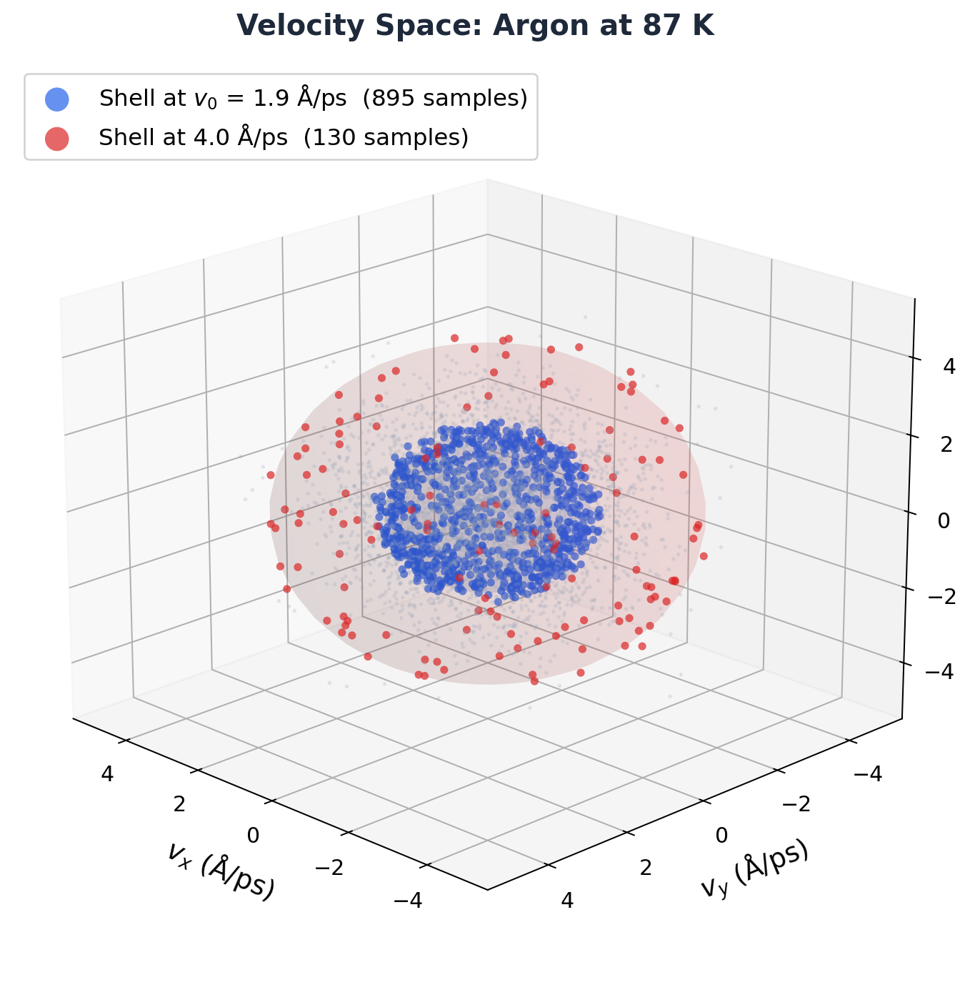
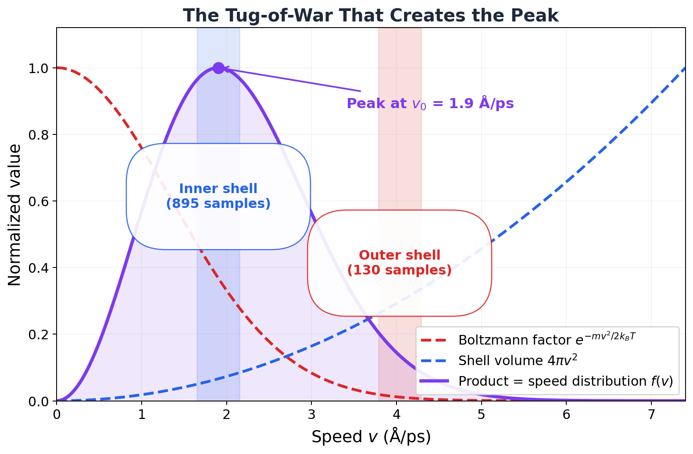
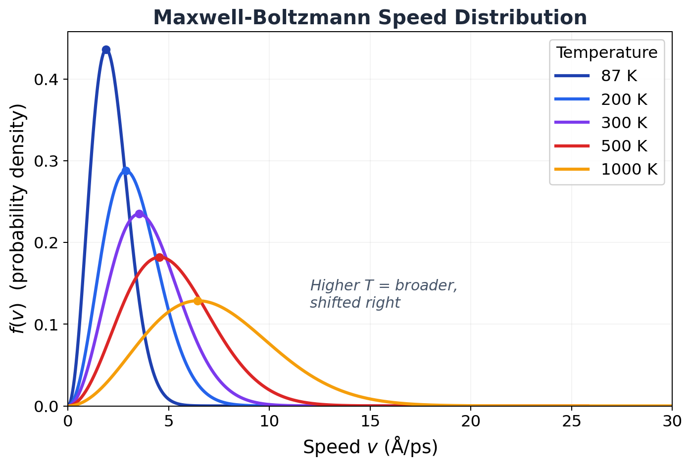
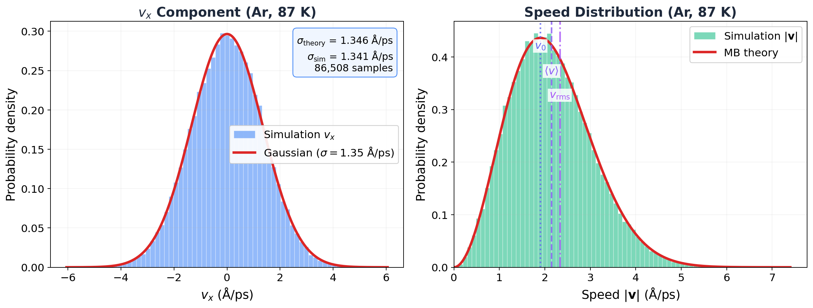

# 4.2 The Maxwell-Boltzmann Distribution

!!! info "Huang, *Statistical Mechanics* 2ed, Section 4.2"

## I've been lying to my simulations for years.

OK, not *lying* exactly. But every single time I wrote `velocity all create 300.0 12345`, I had no idea what that line was actually doing. "Initialize velocities at 300 K." Cool. Next line. Move on. Don't think about it.

Then one day I actually thought about it. Where do those velocities come from? Like, LAMMPS is picking a speed for each atom. How? Randomly? Uniformly between 0 and some max? All the same speed but random directions?

Nope. It draws from a very specific distribution. A Gaussian. And *that* Gaussian is the Maxwell-Boltzmann distribution. And the reason it's *that* specific Gaussian and not some other one? That's what took me down a rabbit hole. And I'm taking you with me.

Let's go.

## Why should you care?

Because you use this distribution every day and probably don't realize it.

- **Every simulation you've ever run** starts with `velocity all create`. That command draws from MB. If it drew from some other distribution, your system would start out of equilibrium, spend the first chunk of your simulation fixing itself, and waste your compute time. MB is the right starting point. The *only* right starting point.
- **That temperature formula** you know by heart, $\frac{1}{2}m\langle v^2 \rangle = \frac{3}{2}k_BT$? It's not a definition someone made up. It *falls out* of the MB distribution. It's a consequence, not an assumption.
- **Validation**: Want to know if your simulation is actually in equilibrium? Histogram the velocities. If the histogram doesn't match MB, something is broken. Full stop.

## The bad intuition: "all speeds are equally likely"

And I'm sure you're thinking, "Equal probability of microstates means equal probability of velocities, right?"

Wrong. So wrong.

Here's why. Think about 3D momentum space. The states with speed between $v$ and $v + dv$ live on a spherical shell of radius $v$. That shell has surface area $4\pi v^2$. Bigger $v$? Bigger shell. More states.

But the Boltzmann factor $e^{-mv^2/2k_BT}$ says higher speeds are exponentially *less* likely per state.

So you've got two things fighting each other. Geometry says "more fast states!" Boltzmann says "fast states are expensive!" The tug-of-war between these two creates a peak. Not uniform. Not symmetric. A very specific, lopsided distribution with a single maximum.

Who wins? Neither. They compromise. And the compromise is the Maxwell-Boltzmann distribution.

Let me show you what this looks like with real atoms.

<figure markdown="span">
  { width="600" }
  <figcaption>4,000 velocity snapshots from our 108-atom argon simulation, pooled across many timesteps. Each dot is one atom at one instant. The blue shell highlights snapshots near the most probable speed (1.9 Å/ps). The red shell is at 4.0 Å/ps. Same shell thickness, but the inner shell caught 895 samples and the outer shell only 130. Seven times fewer. The Boltzmann factor won that round.</figcaption>
</figure>

That cloud of dots? Those are real velocities from our 108-atom argon box, pooled across hundreds of frames. Each dot is one atom at one timestep (the same atom shows up many times, once per frame, with a different velocity each time). The cloud is spherical (isotropic, no preferred direction) and densest near the center (low-speed states are most populated per unit volume). But the blue shell at $v_0 = 1.9$ Å/ps has way more *total* atoms than the center, because the shell is bigger. That's the $4\pi v^2$ factor doing its thing.

Now look at the competition broken down:

<figure markdown="span">
  { width="700" }
  <figcaption>The tug-of-war that creates the peak. Blue dashed: shell volume (grows as v-squared, more states at higher speeds). Red dashed: Boltzmann factor (decays exponentially, each state less probable). Purple solid: their product, the actual speed distribution. The shaded bands correspond to the two shells from the 3D plot above.</figcaption>
</figure>

The blue dashed line ($4\pi v^2$) rockets upward. The red dashed line ($e^{-mv^2/2k_BT}$) plummets. Their product (purple) peaks at $v_0$ and then dies. That peak is the Maxwell-Boltzmann distribution. The whole thing, geometry vs exponential decay, in one picture.

## The derivation: collisions tell you everything

Here's where it gets cool. Huang derives the whole thing from one simple idea: **in equilibrium, collisions don't change the distribution.**

Two molecules collide. Momenta before: $\mathbf{p}_1$, $\mathbf{p}_2$. Momenta after: $\mathbf{p}_1'$, $\mathbf{p}_2'$. The condition for equilibrium:

$$f_0(\mathbf{p}_1)f_0(\mathbf{p}_2) = f_0(\mathbf{p}_1')f_0(\mathbf{p}_2')$$

Every collision produces exactly as many molecules of each type as it consumes. The distribution doesn't budge.

Now watch this. Take the log of both sides:

$$\log f_0(\mathbf{p}_1) + \log f_0(\mathbf{p}_2) = \log f_0(\mathbf{p}_1') + \log f_0(\mathbf{p}_2')$$

Stare at that. The left side is before the collision. The right side is after. They're equal. That means $\log f_0(\mathbf{p})$ is a **conserved quantity** in collisions. It's additive (it sums over particles), and it's conserved (same before and after).

What quantities are conserved in a collision? Energy. Momentum. And that's it (for spinless molecules). So $\log f_0$ must be a linear combination of these:

$$\log f_0(\mathbf{p}) = -A(\mathbf{p} - \mathbf{p}_0)^2 + \log C$$

Exponentiate:

$$f_0(\mathbf{p}) = C \, e^{-A(\mathbf{p} - \mathbf{p}_0)^2}$$

That's a Gaussian. We got a Gaussian from nothing but "collisions conserve energy and momentum." That's it. That's the whole argument.

If the gas isn't moving as a whole, $\mathbf{p}_0 = 0$. Five constants total: $C$, $A$, and three components of $\mathbf{p}_0$. We need to pin down $C$ and $A$.

## Pinning down the constants

Baby steps. Two conditions, two unknowns.

**Condition 1**: There are $n = N/V$ molecules per unit volume. So $f_0$ must integrate to $n$:

$$n = C \int d^3p \, e^{-Ap^2} = C\left(\frac{\pi}{A}\right)^{3/2}$$

That's just a Gaussian integral in 3D. Gives us $C = n(A/\pi)^{3/2}$. One down.

**Condition 2**: The average kinetic energy per molecule is $\epsilon$. Setting $\mathbf{p}_0 = 0$:

$$\epsilon = \frac{1}{n}\int d^3p\, \frac{p^2}{2m}\, f_0(\mathbf{p}) = \frac{3}{4Am}$$

You need the Gaussian moment $\int x^2 e^{-\lambda x^2} dx = \sqrt{\pi}/(2\lambda^{3/2})$ to get there. So $A = 3/(4\epsilon m)$. Two down.

But we still don't know $\epsilon$. We need one more piece of physics.

## The pressure trick

This is slick. Huang connects $\epsilon$ to something we can measure: pressure.

Picture a wall. Molecules slam into it and bounce off. A molecule with $x$-momentum $p_x$ (heading toward the wall) bounces back with $-p_x$. Momentum transferred: $2p_x$. The number hitting per second per unit area: $v_x f_0(\mathbf{p})\, d^3p$ (only counting $v_x > 0$, obviously). Add it all up:

$$P = \int_{v_x > 0} d^3p\, (2p_x v_x) f_0(\mathbf{p}) = \frac{1}{m}\int d^3p\, p_x^2 f_0(\mathbf{p})$$

Now here's the trick. $f_0$ depends only on $|\mathbf{p}|$, not on direction. So $\langle p_x^2 \rangle = \langle p_y^2 \rangle = \langle p_z^2 \rangle = \frac{1}{3}\langle p^2 \rangle$. That turns the integral into:

$$P = \frac{2}{3}n\epsilon$$

Compare with the ideal gas law $P = nk_BT$:

$$\epsilon = \frac{3}{2}k_BT$$

THAT'S where $\frac{3}{2}k_BT$ comes from. Not a definition. Not an assumption someone pulled out of the air. It's the kinetic energy per molecule that makes the pressure come out right. The $3$ is the three spatial dimensions. Each one contributes $\frac{1}{2}k_BT$. That's equipartition, showing up before we've even formally stated it.

Done. Beautiful.

## The formula

Ready? Here it is. The Maxwell-Boltzmann distribution for a gas at rest:

$$\boxed{f_0(\mathbf{p}) = \frac{n}{(2\pi mk_BT)^{3/2}} \exp\!\left(-\frac{\mathbf{p}^2}{2mk_BT}\right)}$$

In terms of velocity ($\mathbf{v} = \mathbf{p}/m$):

$$f_0(\mathbf{v}) = n\left(\frac{m}{2\pi k_BT}\right)^{3/2} \exp\!\left(-\frac{m\mathbf{v}^2}{2k_BT}\right)$$

OK, stop. Look at that. Really look at it.

It's a Gaussian. Just a Gaussian. Each velocity component, $v_x$, $v_y$, $v_z$, is independently drawn from a normal distribution with mean zero and variance $k_BT/m$.

No correlations between components. No weird coupling. No dependence on what the other molecules are doing. Just three independent coin flips from the same bell curve.

If you followed that, congratulations. You just derived the velocity distribution that every MD code on the planet uses to initialize simulations.

!!! tip "Key Insight"
    Here's the part that blew my mind. This distribution doesn't care about the collision cross section. Doesn't matter if your molecules interact via Lennard-Jones, Coulomb, or hard spheres. As long as *some* interactions exist (so collisions happen and the system can equilibrate), the result is the same Gaussian. Argon, water, methane, DNA in solution. Same distribution. Always. The interactions control how *fast* you get to equilibrium. They don't change what equilibrium *looks like*.

## The speed distribution: the shape you actually see

The formula above gives the probability for the velocity *vector*. But if you histogram speeds ($v = |\mathbf{v}|$) from your simulation, you see a different shape. That's because you need to multiply by the spherical shell volume $4\pi v^2$:

$$f(v) = 4\pi n \left(\frac{m}{2\pi k_BT}\right)^{3/2} v^2 \exp\!\left(-\frac{mv^2}{2k_BT}\right)$$

This is NOT a Gaussian. It's a Gaussian times $v^2$, and that changes everything. At low $v$: the $v^2$ factor is winning (function goes up). At high $v$: the exponential is crushing everything (function drops to zero). In between: a peak. One single maximum.

<figure markdown="span">
  { width="700" }
  <figcaption>The Maxwell-Boltzmann speed distribution for argon at five temperatures. Higher temperature = broader distribution shifted to higher speeds. Dots mark the most probable speed at each temperature. The area under each curve is the same (normalized to particle density).</figcaption>
</figure>

Look at that. At 87 K (liquid argon), the distribution is tall and narrow. Most atoms crawl along at ~2 Å/ps. At 1000 K? The peak is squashed flat, and atoms are cruising at 7 Å/ps. Same molecule, same mass. Temperature just dials the width.

Three speeds you need to know:

| Speed | Formula | Ar at 87 K | What it is |
|-------|---------|------------|------------|
| Most probable $v_0$ | $\sqrt{2k_BT/m}$ | 1.90 Å/ps | Where the peak lives |
| Mean $\langle v \rangle$ | $\sqrt{8k_BT/(\pi m)}$ | 2.15 Å/ps | Average of all speeds |
| RMS $v_\text{rms}$ | $\sqrt{3k_BT/m}$ | 2.33 Å/ps | The one in $\frac{1}{2}mv_\text{rms}^2 = \frac{3}{2}k_BT$ |

Always in this order: $v_0 < \langle v \rangle < v_\text{rms}$. The ratios are locked at $1 : 1.128 : 1.225$. Temperature doesn't matter. Mass doesn't matter. It's geometry.

## Let me show you.

OK, enough theory. I pulled 86,508 velocity samples from our argon NVT simulation (108 atoms, 87 K, 801 production frames from [Chapter 7](../ch07/7.2-energy-fluctuations.md)) and compared them to the prediction. Zero fitting. Zero adjustable parameters. Just the formula and the data.

<figure markdown="span">
  { width="100%" }
  <figcaption><b>Left</b>: Histogram of a single velocity component from argon NVT at 87 K, overlaid with the Gaussian prediction. The stats box shows theory vs measured standard deviation. <b>Right</b>: Speed distribution from simulation vs MB theory, with the most probable speed, mean speed, and RMS speed marked.</figcaption>
</figure>

Look at the left panel. Blue histogram: every single $v_x$ measurement from 801 frames. Red curve: the theoretical Gaussian with $\sigma = \sqrt{k_BT/m} = 1.35$ Å/ps.

They're on top of each other. Measured $\sigma_{v_x} = 1.341$ Å/ps. Predicted: 1.346 Å/ps. Agreement to 0.4%.

86,508 velocity samples. Zero adjustable parameters. 0.4% agreement.

That's not close. That's *exact*. A formula derived from "collisions conserve energy and momentum" predicts the velocity of every argon atom in a box to better than half a percent. From first principles.

That's crazy.

Right panel: same thing for the speed distribution. The $v^2$-weighted version. Theory and simulation stacked right on top of each other. The three vertical lines ($v_0$, $\langle v\rangle$, $v_\text{rms}$) land exactly where they should.

!!! note "MD Connection"
    So what does `velocity all create 87.0 12345` actually do? Now you know. For each atom, LAMMPS draws $v_x$, $v_y$, $v_z$ independently from a Gaussian with $\sigma = \sqrt{k_BT/m}$. Then it removes the center-of-mass velocity (so the box doesn't drift) and rescales to hit *exactly* $T = 87$ K.

    But here's the beautiful part. You could initialize with *garbage* velocities. All atoms moving right. Half the atoms frozen. Doesn't matter. Collisions will fix it. The Boltzmann transport equation guarantees that any distribution relaxes to MB. Give it a few picoseconds. The MB distribution is the attractor. The only stable equilibrium. Everything else decays into it.

    It's like gravity for velocity distributions.

## External forces: the barometric formula

What if there's a gravitational field? Or any conservative force $\mathbf{F} = -\nabla\phi(\mathbf{r})$?

Huang shows the distribution just picks up a Boltzmann factor in the potential:

$$f(\mathbf{r}, \mathbf{p}) = f_0(\mathbf{p})\, e^{-\phi(\mathbf{r})/k_BT}$$

The velocities are still MB (same Gaussian everywhere). But the *density* now depends on position. For gravity ($\phi = mgz$):

$$n(z) = n(0)\, e^{-mgz/k_BT}$$

The **barometric formula**. Density drops exponentially with altitude. Scale height: $k_BT/(mg) \approx 8.5$ km for nitrogen at room temperature. That's why the atmosphere thins out as you go up. That's why your ears pop on airplanes. That's why Everest needs supplemental oxygen. One exponential.

!!! note "MD Connection"
    If you slap a `fix gravity` on your LAMMPS simulation, the z-density profile will follow this exponential. Histogram the atom z-coordinates, fit to $e^{-mgz/k_BT}$, extract $T$. If it matches your thermostat setting, your simulation is correct. People actually use this as a thermostat validation test.

## Takeaway

The Maxwell-Boltzmann distribution is a Gaussian in each velocity component with width $\sqrt{k_BT/m}$. It falls out of one fact: collisions conserve energy and momentum. It's universal (independent of interaction details), it's the unique equilibrium attractor, and it's hiding inside every `velocity all create` command you've ever typed. The speed distribution gets a $v^2$ factor that makes it asymmetric, with three characteristic speeds locked in a fixed ratio. We tested it against 86,508 real velocity samples. Agreement: 0.4%. Not bad for a 150-year-old formula.

??? question "Check Your Understanding"
    1. You histogram the *speed* from your simulation and get that classic asymmetric MB curve. Your labmate histograms a single component, $v_x$, from the same data. They get a completely different shape. What shape, and why did the $v^2$ factor vanish?
    2. The RMS speed is always bigger than the mean speed. Always. Not just for MB, for *any* distribution. Why? (Hint: think about what squaring does to outliers.)
    3. You initialize your LAMMPS simulation with every atom at exactly the same speed, just random directions. What does the velocity distribution look like after 1 ps? After 100 ps? What's physically driving it toward MB?
    4. Here's a weird one. The barometric formula says density drops with altitude. But the velocity distribution at every height is the *same* Gaussian. If faster molecules can climb higher, why don't they pile up at the top?
