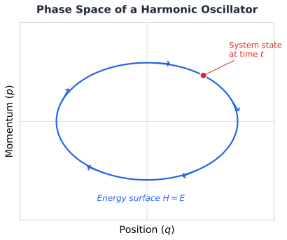
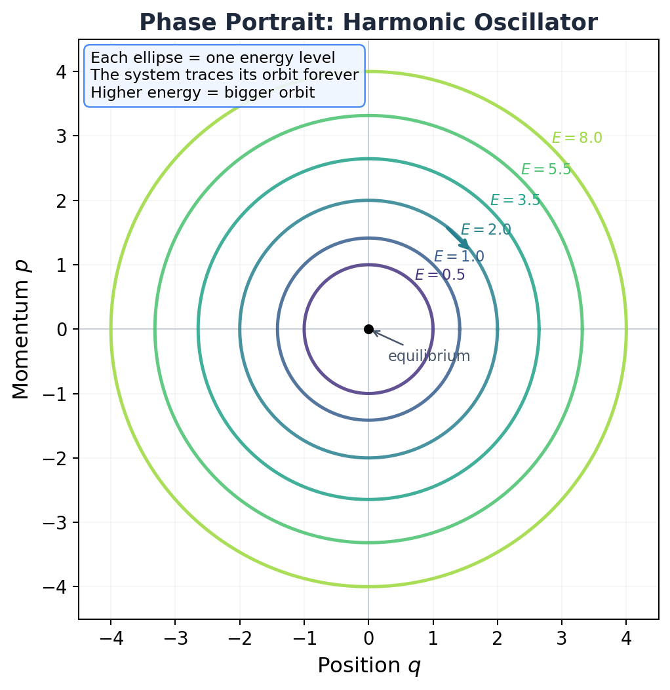
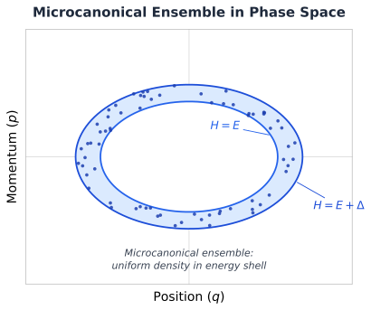
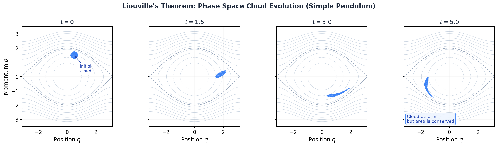

# 6.0 Foundations: Phase Space, Ensembles, and Liouville's Theorem

!!! info "Huang, *Statistical Mechanics* 2ed, Chapter 6 (prerequisites) & Chapter 3 (Liouville's theorem)"

## Confession time.

I've been running MD simulations for a while. Setting up force fields. Choosing thermostats. Dumping trajectories. Computing RDFs. And at some point I realized something uncomfortable: I don't actually know *why* any of this works. Like, I know *how* to compute a temperature from kinetic energy. I know the formula. I can write the LAMMPS input. But *why* does averaging over a trajectory tell me anything about equilibrium? Why does one simulation give me thermodynamics?

That's what this section answers. Before we get to the big postulate that launches all of statistical mechanics, we need to build the stage. Phase space, ensembles, Liouville's theorem. These aren't formalities. They're the reason your simulations produce real physics instead of just pretty movies of dots bouncing around.

Let's go.

## Phase space: the map of everything

We're thinking about a classical system. $N$ molecules in a box of volume $V$. When Huang says "large," he means *large*:

$$N \approx 10^{23} \text{ molecules}$$

That's a mole of stuff. More particles than grains of sand on every beach on Earth. And you want to track each one individually? Good luck. That's exactly the problem statistical mechanics was invented to avoid.

But let's pretend for a moment that you could. To describe the state of this system *completely*, you need the position and momentum of every single molecule. That's 3 coordinates ($x$, $y$, $z$) for each molecule's position, and 3 components ($p_x$, $p_y$, $p_z$) for each molecule's momentum.

So that's $6N$ numbers total.

We call the positions $q_1, q_2, \ldots, q_{3N}$ and the momenta $p_1, p_2, \ldots, p_{3N}$. Together, the full set $(p, q)$ defines a single point in what we call **$\Gamma$ space** (or **phase space**), a $6N$-dimensional space where each axis is one of these coordinates or momenta.

Yeah, $6N$ dimensions. For a mole of gas, that's about $3.6 \times 10^{24}$ dimensions. Don't try to visualize it. Nobody can. The point is: the system's *entire* state, every particle, every velocity, is captured by **one single point** in this enormous space.

<figure markdown="span">
  { width="600" }
  <figcaption>A 2D slice of phase space for a single particle: position on the x-axis, momentum on the y-axis. The trajectory traces an orbit on a constant-energy surface. In reality, your system lives in a 6N-dimensional version of this.</figcaption>
</figure>

!!! tip "Key Insight"
    One point in phase space = one complete snapshot of your system. If you've ever looked at a LAMMPS dump file with all positions and velocities at one timestep, that's one point in $\Gamma$ space. Every frame in your trajectory = one dot in a space with $10^{24}$ dimensions.

## What does a phase portrait look like?

OK, $6N$ dimensions is hopeless to draw. But for a one-dimensional system (one particle, one degree of freedom), phase space is just a 2D plane: position $q$ on one axis, momentum $p$ on the other. And we *can* draw that.

Take the simplest system that actually oscillates: the **harmonic oscillator**. A particle attached to a spring. The Hamiltonian is:

$$\mathcal{H} = \frac{p^2}{2m} + \frac{1}{2}kq^2$$

For $m = 1$, $k = 1$, each energy level traces a circle of radius $\sqrt{2E}$ in the $(q, p)$ plane. Higher energy, bigger circle. The particle goes around and around forever.

<figure markdown="span">
  { width="600" }
  <figcaption>Phase portrait of a harmonic oscillator. Each ring is one energy level. The system traces its orbit forever, never jumping between rings. Higher energy = bigger orbit. The dot at the origin is the (unstable) equilibrium: particle sitting still at the bottom of the potential well.</figcaption>
</figure>

See those concentric rings? Each one is a constant-energy curve. The system picks one (determined by its initial conditions) and stays on it forever. It can't jump to a higher or lower ring because that would violate energy conservation.

This is the simplest possible phase portrait. Real systems are messier, orbits aren't circles, energies aren't equally spaced, chaos shows up. But the core idea is the same: **the trajectory lives on a constant-energy surface and never leaves it.**

## How the system moves: Hamilton's equations

The physics is governed by the **Hamiltonian** $\mathcal{H}(p, q)$, which is just the total energy written as a function of all positions and momenta. The equations of motion are Hamilton's equations:

$$\dot{q}_i = \frac{\partial \mathcal{H}}{\partial p_i}, \qquad \dot{p}_i = -\frac{\partial \mathcal{H}}{\partial q_i}$$

These tell you: given where the system is right now in phase space, where does it go next? The point traces out a path, a trajectory, through $\Gamma$ space.

And here's the key constraint: since energy is conserved, that trajectory can never leave the **energy surface** $\mathcal{H}(p, q) = E$. The system is stuck on this surface forever. It can wander around on it, explore every corner, but it can't escape to higher or lower energies.

!!! note "MD Connection"
    When you run an NVE simulation, LAMMPS is numerically integrating exactly these equations (via the velocity-Verlet algorithm). Your trajectory file is literally a sampled path through $\Gamma$ space. Every single frame? One point on the energy surface.

## The ensemble: thinking statistically

Here's where the conceptual leap happens.

For a macroscopic system, we have *no way* to know the exact state (all $6N$ coordinates and momenta) at any given instant. And honestly, we don't want to. We only care about a few macroscopic numbers: $N$, $V$, and energy $E$ (within some small range $\Delta$).

But an *infinite* number of microscopic states are consistent with those macroscopic conditions. So instead of thinking about one system, we imagine a **huge collection of mental copies** of the same system, all satisfying the same macroscopic constraints ($N$, $V$, energy between $E$ and $E + \Delta$), but each in a different microscopic state.

This mental collection is the **Gibbsian ensemble**. In phase space, it's a cloud of points. A swarm of representative systems, each one a dot in $\Gamma$ space.

We describe this cloud with a **density function** $\rho(p, q, t)$:

$$\rho(p, q, t) \, d^{3N}p \, d^{3N}q = \text{number of representative points in a tiny volume around } (p, q) \text{ at time } t$$

Think of it as a probability fog spread across phase space. Dense regions = states the system is more likely to be in. Sparse regions = unlikely. Empty regions = forbidden.

<figure markdown="span">
  { width="600" }
  <figcaption>The ensemble as a cloud of points in phase space. Each dot is one "mental copy" of the system. They all have the same N and V, but different microscopic states. For the microcanonical ensemble, these dots are spread uniformly on the energy shell.</figcaption>
</figure>

And I'm sure you're thinking, "OK, but this is just an imaginary construct, right? Nobody actually creates millions of copies of a system."

Correct. The ensemble is a thought experiment. But here's the thing: it works. The averages you compute over this imaginary collection match what you measure in a real experiment on a single system. That connection is deep, and it's called **ergodicity**. We'll get there [later in this page](#the-ergodic-hypothesis-why-one-trajectory-is-enough). For now, trust the fog.

## Liouville's theorem: the fog that can't compress

Now here's a beautiful result from classical mechanics. Maybe my favorite in this whole chapter.

That cloud of ensemble points? As it evolves in time (each point following Hamilton's equations), it behaves like an **incompressible fluid**. The fog can swirl, stretch, deform into wild shapes. But it can't pile up, and it can't thin out. The density around any given trajectory point stays constant as that point moves.

Mathematically, that's Liouville's equation:

$$\frac{\partial \rho}{\partial t} + \sum_{i=1}^{3N} \left( \frac{\partial \rho}{\partial q_i} \frac{\partial \mathcal{H}}{\partial p_i} - \frac{\partial \mathcal{H}}{\partial q_i} \frac{\partial \rho}{\partial p_i} \right) = 0$$

In compact notation, using the Poisson bracket:

$$\frac{\partial \rho}{\partial t} = -\{\rho, \mathcal{H}\}$$

This says: the rate of change of $\rho$ at a fixed point in phase space equals the Poisson bracket of $\rho$ with the Hamiltonian. But along a trajectory (moving *with* the flow), $d\rho/dt = 0$. The local density is carried along unchanged. Incompressible flow. Done.

Where does this come from? It's a direct consequence of Hamilton's equations. The "velocity field" in phase space, $(\dot{q}_i, \dot{p}_i)$, has zero divergence:

$$\sum_i \left( \frac{\partial \dot{q}_i}{\partial q_i} + \frac{\partial \dot{p}_i}{\partial p_i} \right) = \sum_i \left( \frac{\partial^2 \mathcal{H}}{\partial q_i \partial p_i} - \frac{\partial^2 \mathcal{H}}{\partial p_i \partial q_i} \right) = 0$$

That's it. The mixed partials cancel. The flow is divergence-free. So the "fluid" is incompressible. Beautiful.

!!! tip "Key Insight"
    Liouville's theorem is the reason we can do statistical mechanics at all. If the phase space flow could compress (pile up density in some region), then our uniform ensemble would distort over time and stop being uniform. Liouville says: that can't happen. A uniform cloud stays uniform. That's what makes the microcanonical ensemble self-consistent.

### Seeing it with your own eyes

Let me show you what this actually looks like.

Take a simple pendulum: $\mathcal{H} = p^2/2 - \cos q$. Nonlinear, interesting dynamics. Now imagine starting with a compact blob of initial conditions, a little cluster of points in the $(q, p)$ plane, and letting them all evolve according to Hamilton's equations.

<figure markdown="span">
  { width="100%" }
  <figcaption>Liouville's theorem in action. A compact cloud of 800 initial conditions evolves under the simple pendulum Hamiltonian. The cloud stretches, bends, and wraps around the phase space contours, but its area is strictly conserved. The dashed curve is the separatrix (the boundary between oscillation and rotation). Background contours show constant-energy curves.</figcaption>
</figure>

Look at that. At $t = 0$, it's a tight little blob. By $t = 1.5$, it's already stretching. By $t = 5.0$, it's been pulled into a thin filament that wraps around the energy contours.

But here's what matters: **the area of that cloud hasn't changed**. Not by a single pixel. It started as a blob covering some area $A$, and at $t = 5.0$ it's a long, thin filament covering the exact same area $A$. The shape changed. The area didn't.

That's Liouville's theorem. Not as an equation. As a fact you can see.

And I'm sure you're thinking: "Wait, that filament looks way bigger than the original blob." It *looks* bigger because it's spread out. But if you measured the actual area of the filament (the thin strip, not the bounding box), it's exactly the same as the original circle. Stretch in one direction, compress in another, net area preserved. Always.

!!! warning "Common Mistake"
    Liouville's theorem says the **phase space volume** is conserved, not the shape. The cloud can deform dramatically. What it can't do is concentrate into a smaller region or spread to fill a larger one. In thermodynamic language: the fine-grained entropy is constant. (The *coarse-grained* entropy can increase, which is how you reconcile Liouville with the second law. But that's a story for later.)

## Why this matters for equilibrium

For equilibrium, we want an ensemble that doesn't change with time. $\partial \rho / \partial t = 0$. Liouville's equation says:

$$\{\rho, \mathcal{H}\} = 0$$

A clean way to guarantee this: make $\rho$ depend on $(p, q)$ *only through the Hamiltonian*:

$$\rho(p, q) = \rho'(\mathcal{H}(p, q))$$

If $\rho$ only cares about the energy, then the Poisson bracket vanishes identically (you can verify this, it's a direct consequence of Hamilton's equations), and the ensemble is stationary. It doesn't change. It doesn't evolve. It just sits there, the same fog, forever.

That's equilibrium. Not "the system stopped moving." The system is still bouncing around frantically in phase space. But the *ensemble*, the probability distribution over microstates, is frozen. The individual points move. The fog stays put.

## The ergodic hypothesis: why one trajectory is enough

OK, remember earlier when I said "the averages you compute over this imaginary ensemble match what you measure in a real experiment on a single system"? And I said "trust the fog"?

Time to stop trusting and start understanding.

Here's the problem. The ensemble is a mental construct. You don't have a million copies of your argon box. You have *one* box. You run *one* trajectory. LAMMPS gives you one sequence of snapshots, one path through phase space. How can averaging over that single path give you the same answer as averaging over the entire ensemble?

That's the **ergodic hypothesis**: given sufficient time, the trajectory of an isolated system will visit every accessible region of the energy surface. Not just some of it. All of it. So if you average a property along a long enough trajectory, you're effectively sampling the entire ensemble:

$$\langle O \rangle_\text{time} = \lim_{\tau \to \infty} \frac{1}{\tau} \int_0^\tau O(p(t), q(t))\, dt = \langle O \rangle_\text{ensemble}$$

Time average equals ensemble average. That's the whole claim.

The physical intuition: for more than three interacting bodies, classical mechanics is **chaotic**. Two states that start almost identical will diverge exponentially. After enough collisions, the trajectory has effectively randomized. It wanders over the energy surface like a random walk, eventually visiting every neighborhood. The system "forgets" its initial conditions.

For a gas at STP, the collision time is about $10^{-10}$ seconds. After a few thousand collisions, the system has thoroughly explored its neighborhood. That's why even a nanosecond MD simulation (millions of collisions) can give you reliable averages.

!!! warning "Common Mistake"
    "Ergodic" doesn't mean "fast." The hypothesis says the trajectory *eventually* visits everywhere, but says nothing about how long "eventually" takes. For a simple liquid like argon? Picoseconds. For a protein folding into its native state? Microseconds to seconds. For a glass or a system with high energy barriers? Maybe longer than the age of the universe. When your simulation hasn't explored all relevant states, the time average is NOT equal to the ensemble average. You have a **sampling problem**, and no amount of statistical tricks will fix it. You need longer simulations, enhanced sampling (replica exchange, metadynamics), or both.

!!! note "MD Connection"
    Every time you compute a time average in LAMMPS, you're banking on ergodicity. The temperature? Time average of kinetic energy. The pressure? Time average of the virial. The RDF? Time average of pair distances. If your system is ergodic (which it usually is for liquids and gases), these averages converge to the true ensemble values. If it's not (glassy systems, metastable crystals, slow conformational changes), your averages are only averages over whatever region the trajectory got stuck in. That's not wrong, it's just not the whole story. Recognizing *when* ergodicity fails is one of the most important skills in molecular simulation.

And with that picture in mind, we're ready for the postulate that launches everything. That's [Section 6.1](6.1-postulate.md).

## Takeaway

Phase space is the arena. One point = one complete microstate. The ensemble is a cloud of points representing our ignorance about which microstate the system is actually in. Liouville's theorem says this cloud is incompressible: it can deform but never concentrate or dilute. For equilibrium, we need a cloud that doesn't change in time. Any $\rho$ that depends only on the energy satisfies this. And the ergodic hypothesis says your single MD trajectory samples this cloud faithfully, as long as you run long enough. That's the foundation. Everything else gets built on top of it.

??? question "Check Your Understanding"
    1. Look at the pendulum cloud at $t = 5.0$. That filament looks *way* bigger than the original blob. Your friend says "Liouville is clearly violated." How do you convince them the area hasn't changed?
    2. You run NVE on a glassy polymer for 10 ns and compute the diffusion coefficient. Your advisor says "that number is meaningless." Why are they right? What broke?
    3. Your labmate says: "Liouville's theorem proves entropy can never increase, so the second law is wrong." They sound very confident. Where's the flaw in their argument?
    4. You switch from velocity-Verlet (symplectic) to a basic Euler integrator (not symplectic) for a long NVE run. Energy starts drifting. Why? What does this have to do with phase space volume?
