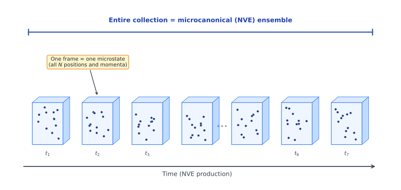
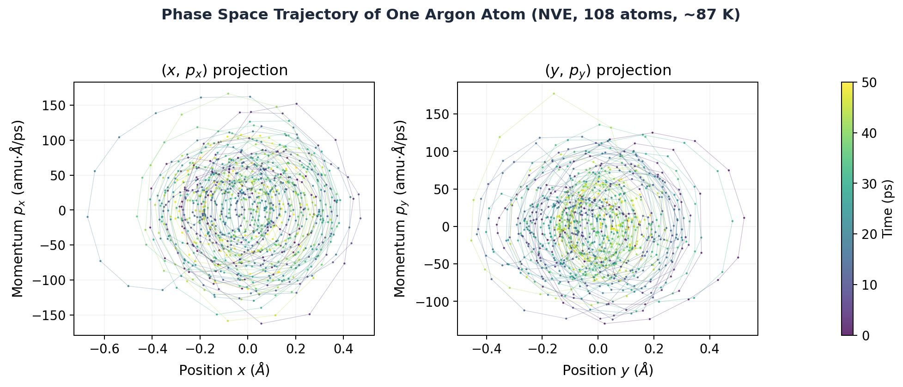
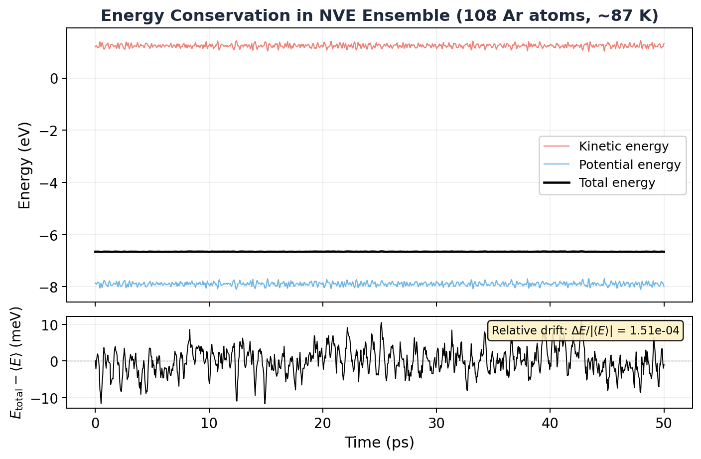

# 6.1 The Postulate of Classical Statistical Mechanics

!!! info "Huang, *Statistical Mechanics* 2ed, Section 6.1"

## What are we even doing here?

Here's a confession. I've been running MD simulations for a while (setting up force fields, choosing thermostats, dumping trajectories) and at some point I realized: I don't actually know *why* any of this works. Like, I know *how* to compute a temperature from kinetic energy. But why does that give the right answer? Why does averaging over a trajectory tell us anything about equilibrium?

That's what statistical mechanics answers. And this section is where it all starts.

## Why should you care?

Statistical mechanics is the bridge between "I know what each atom is doing" and "I know the temperature, pressure, and free energy of this system." Without it, your MD simulation is just a movie of dots bouncing around. With it, those dots become thermodynamics.

Here's the thing: statistical mechanics doesn't care about *how* a system reaches equilibrium. It doesn't model the relaxation process, and it doesn't prove that equilibrium will ever happen. It just says: **if** the system is in equilibrium, **then** here's what that looks like. That "what it looks like" is what we're about to build.

## Setting the stage: your system

We're thinking about a classical system, $N$ molecules in a box of volume $V$. When Huang says "large," he means large:

$$N \approx 10^{23} \text{ molecules}$$

$$V \approx 10^{23} \text{ molecular volumes}$$

That's a *mole* of stuff. About $6 \times 10^{23}$ particles. More than the number of grains of sand on every beach on Earth. And you want to track each one individually? Good luck. That's exactly the problem statistical mechanics was invented to avoid.

We're also going to treat the system as **isolated**, meaning total energy is constant, no energy leaking in or out. In reality, no system is truly isolated (you're literally shining light on it to look at it), but if the interactions with the outside world are weak enough that the energy stays roughly constant, we call it isolated and move on.

!!! note "MD Connection"
    If you've run an NVE simulation (constant N, V, E, no thermostat), you've simulated exactly this kind of isolated system. The total energy bounces around a tiny bit due to numerical integration errors, but ideally it's conserved.

## Phase space: the map of everything

To describe the state of this system *completely*, you need to know the position and momentum of every single molecule. That's 3 coordinates ($x$, $y$, $z$) for each molecule's position, and 3 components ($p_x$, $p_y$, $p_z$) for each molecule's momentum.

So that's $6N$ numbers total.

We call the positions $q_1, q_2, \ldots, q_{3N}$ and the momenta $p_1, p_2, \ldots, p_{3N}$. Together, the full set $(p, q)$ defines a single point in what we call **$\Gamma$ space** (or **phase space**), a $6N$-dimensional space where each axis is one of these coordinates or momenta.

Yeah, $6N$ dimensions. For a mole of gas, that's about $3.6 \times 10^{24}$ dimensions. Don't try to visualize it. Nobody can. The point is: the system's *entire* state, every particle, every velocity, is captured by **one single point** in this enormous space.

<figure markdown="span">
  { width="600" }
  <figcaption>A 2D slice of phase space for a single particle: position on the x-axis, momentum on the y-axis. The trajectory traces an orbit on a constant-energy surface. In reality, your system lives in a 6N-dimensional version of this.</figcaption>
</figure>

!!! tip "Key Insight"
    One point in phase space = one complete snapshot of your system. If you've ever looked at a LAMMPS dump file with all positions and velocities at one timestep, that's one point in $\Gamma$ space.

## How the system moves through phase space

The physics is governed by the **Hamiltonian** $\mathcal{H}(p, q)$, which is just the total energy written as a function of all the positions and momenta. The equations of motion are Hamilton's equations:

$$\dot{q}_i = \frac{\partial \mathcal{H}}{\partial p_i}, \qquad \dot{p}_i = -\frac{\partial \mathcal{H}}{\partial q_i}$$

These tell you: given where the system is right now in phase space, where does it go next? The point traces out a path, a trajectory, through $\Gamma$ space.

And here's a key constraint: since energy is conserved, that trajectory can never leave the **energy surface** $\mathcal{H}(p, q) = E$. The system is stuck on this surface forever. It can wander around on it, but it can't escape to higher or lower energies.

!!! note "MD Connection"
    When you run an NVE simulation, LAMMPS is numerically integrating exactly these equations (via the velocity-Verlet algorithm). Your trajectory file is literally a sampled version of this path through $\Gamma$ space.

## The ensemble: thinking statistically

Here's where the conceptual leap happens.

For a macroscopic system, we have *no way* to know the exact state (all $6N$ coordinates and momenta) at any given instant. And honestly, we don't want to. We only care about a few macroscopic numbers: $N$, $V$, and energy $E$ (within some small range $\Delta$).

But an *infinite* number of microscopic states are consistent with those macroscopic conditions. So instead of thinking about one system, we imagine a **huge collection of mental copies** of the same system, all satisfying the same macroscopic constraints ($N$, $V$, energy between $E$ and $E + \Delta$), but each in a different microscopic state.

This mental collection is the **Gibbsian ensemble**. In phase space, it's represented by a cloud of points, described by a **density function** $\rho(p, q, t)$:

$$\rho(p, q, t) \, d^{3N}p \, d^{3N}q = \text{number of representative points in a tiny volume } d^{3N}p \, d^{3N}q \text{ around } (p, q) \text{ at time } t$$

Think of it as a probability fog spread across phase space. Dense regions = states the system is more likely to be in.

<figure markdown="span">
  { width="600" }
  <figcaption>The ensemble as a cloud of points in phase space. Each dot is one "mental copy" of the system. They all have the same N and V, but different microscopic states. For the microcanonical ensemble, these dots are spread uniformly on the energy shell.</figcaption>
</figure>

## Liouville's theorem: the fog doesn't compress

Here's a beautiful result from classical mechanics. This cloud of ensemble points, as it evolves in time, behaves like an **incompressible fluid**:

$$\frac{\partial \rho}{\partial t} + \sum_{i=1}^{3N} \left( \frac{\partial \rho}{\partial q_i} \frac{\partial \mathcal{H}}{\partial p_i} - \frac{\partial \mathcal{H}}{\partial q_i} \frac{\partial \rho}{\partial p_i} \right) = 0$$

The fog can move, deform, and stretch, but it can't pile up or thin out. The local density around any given trajectory point stays constant as that point moves through phase space.

For equilibrium, we want $\rho$ to not change with time. A clean way to guarantee this: make $\rho$ depend on $(p, q)$ *only through the Hamiltonian*:

$$\rho(p, q) = \rho'(\mathcal{H}(p, q))$$

If $\rho$ only cares about the energy, then the second term vanishes identically (you can verify this, it's a direct consequence of Hamilton's equations), and we get:

$$\frac{\partial \rho}{\partial t} = 0$$

The ensemble is stationary. It doesn't change. That's equilibrium.

## The postulate: democracy in phase space

Now comes the founding assumption of the whole theory. Ready?

!!! abstract "The Postulate of Equal *a Priori* Probability"
    When a macroscopic system is in thermodynamic equilibrium, its state is **equally likely** to be any state satisfying the macroscopic conditions of the system.

That's it. Every microstate consistent with the macroscopic constraints ($N$, $V$, energy between $E$ and $E + \Delta$) is equally probable. No microstate is special. No region of the allowed phase space is preferred.

This gives us the **microcanonical ensemble**, the simplest ensemble:

$$\rho(p, q) = \begin{cases} \text{const.} & \text{if } E < \mathcal{H}(p, q) < E + \Delta \\ 0 & \text{otherwise} \end{cases}$$

Uniform density on the energy shell. Zero everywhere else. The microcanonical ensemble is the stubborn one: fixed $N$, fixed $V$, fixed $E$, and every allowed state gets exactly the same weight. No favoritism.

!!! warning "Common Mistake"
    The postulate is an *assumption*, not a derivation. You can't prove it from Newton's laws or Hamilton's equations. It's a hypothesis that we accept because everything we derive from it matches experiment. Huang is very explicit about this, and honest enough to point out that the real justification ultimately comes from quantum mechanics, not classical mechanics. We're doing classical stat mech first for pedagogical reasons.

## Averaging: how we extract predictions

Once we have the ensemble, we can compute observable quantities. If $f(p, q)$ is some property of the system (energy, pressure, momentum, whatever), the **ensemble average** is:

$$\langle f \rangle = \frac{\int d^{3N}p \, d^{3N}q \, f(p, q) \, \rho(p, q)}{\int d^{3N}p \, d^{3N}q \, \rho(p, q)}$$

For the microcanonical ensemble, this is just the average of $f$ over all states on the energy shell, weighted equally.

There's also the **most probable value**, the value of $f$ that the largest number of systems in the ensemble actually have. Are these the same?

Almost. They're nearly identical when fluctuations are small, meaning:

$$\frac{\langle f^2 \rangle - \langle f \rangle^2}{\langle f \rangle^2} \ll 1$$

And here's the punchline: for macroscopic systems, fluctuations scale as $\sim 1/N$. When $N \sim 10^{23}$, the relative fluctuation is roughly $10^{-23}$. The ensemble average and the most probable value are, for all practical purposes, *the same number*.

That's why statistical mechanics works. With $10^{23}$ particles, the spread around the average is so absurdly tiny that the average *is* the answer. Done. Beautiful.

!!! note "MD Connection"
    In your simulation, you compute **time averages**, averaging $f$ along a trajectory. Statistical mechanics claims this should equal the **ensemble average**. This deep connection is called **ergodicity**, and we'll see exactly how it works in the simulation below.

## Simulation: seeing phase space with real atoms

Here's something that might change how you think about your simulations.

We ran a small LAMMPS simulation: 108 argon atoms interacting via the Lennard-Jones potential in an NVE ensemble (constant energy, no thermostat). This is exactly the kind of isolated system section 6.1 describes. Nothing fancy, just atoms bouncing around in a box with no thermostat touching them.

Now here's the key insight. Every single frame you save during the production run is a complete snapshot of all $N$ positions and all $N$ momenta. That's one point in $\Gamma$ space. One microstate. The entire state of the system, frozen at one instant.

So what happens when you stack all those frames together?

<figure markdown="span">
  { width="800" }
  <figcaption>Each saved frame from the NVE production run is one microstate (one complete set of all N positions and momenta). The entire collection of frames, taken together, forms the microcanonical ensemble. You built it just by running a simulation and saving snapshots.</figcaption>
</figure>

You get the microcanonical ensemble. Seriously. That collection of frames IS the ensemble. Each card in the deck is one microstate. The whole deck is the ensemble. You didn't need to imagine millions of "mental copies" of your system, you already created them. Every frame is a copy, frozen at a different point on the energy surface.

This is the bridge between Gibbs's abstract "collection of mental copies" and what you actually do when you run `lmp -in argon-nve.lammps`. The ensemble isn't some theoretical fantasy. It's your trajectory file.

!!! tip "Key Insight"
    When you compute a time average from your trajectory (say, average temperature over 1000 frames), you're really computing an **ensemble average** over 1000 microstates. The assumption that these two are the same thing is called **ergodicity**: given enough time, a single trajectory visits representative microstates from the entire ensemble. That's why one simulation can tell you about thermodynamic properties.

Now let's look at what the trajectory actually reveals about phase space. Here's the path of a single argon atom, projected into the $(q, p)$ plane:

<figure markdown="span">
  { width="700" }
  <figcaption>Phase space trajectory for a single argon atom from an NVE simulation. Each panel shows one (position, momentum) projection. The atom oscillates around its lattice site, tracing out a bounded region of phase space over 50 ps. Color encodes time (purple = early, yellow = late).</figcaption>
</figure>

See those elliptical-looking orbits? The atom is rattling around in the potential well created by its neighbors, converting kinetic energy to potential and back again. In the full $6N$-dimensional phase space, all 108 atoms are doing this simultaneously, and the system's representative point traces a path that stays on the constant-energy surface $\mathcal{H}(p, q) = E$.

And here's the proof that the energy surface is real:

<figure markdown="span">
  { width="700" }
  <figcaption>Total energy vs time in the NVE simulation. Kinetic and potential energy fluctuate wildly (atoms speeding up and slowing down), but the total energy is rock-solid. The system really does stay on one energy surface.</figcaption>
</figure>

Kinetic and potential energy are sloshing back and forth constantly. But the total energy? Flat line. The relative drift over 50 ps is about $10^{-4}$. The system is confined to a thin energy shell in phase space, exactly as the theory demands.

!!! example "Simulation"
    The LAMMPS input script and Python analysis code are available in [`ch06/simulations/`](simulations/). You can run them yourself to reproduce these plots.

## Takeaway

Statistical mechanics starts with one postulate: in equilibrium, all microstates consistent with the macroscopic constraints are equally likely. That's the microcanonical ensemble. Everything else (temperature, entropy, free energy, equations of state) gets built on top of this single idea.

The postulate can't be proven. It just works. And that's enough.
