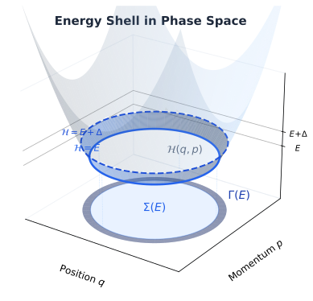
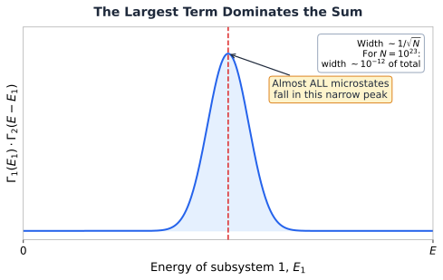

# 6.2 The Microcanonical Ensemble

!!! info "Huang, *Statistical Mechanics* 2ed, Section 6.2"

## Where entropy actually comes from

I remember the first time someone told me that entropy is "disorder." Sounds right, feels intuitive, and is almost completely useless when you need to calculate something.

Huang does something much better here. He defines entropy from scratch using only the microcanonical ensemble, then shows it behaves exactly like the entropy from thermodynamics. No hand-waving. Just counting microstates.

## Why should you care?

Section 6.1 gave us the stage (phase space, the postulate). Section 6.2 gives us the first real tool: **entropy**. And from entropy, everything else follows: temperature, pressure, free energy, equations of state.

For simulation people: when LAMMPS prints a temperature, where does that number *come from*? Not numerically (you know it's $\frac{2}{3Nk_B} \langle KE \rangle$), but *why* does that formula work? The answer traces back to exactly what Huang derives here.

## Measuring the energy shell

We're still in the microcanonical ensemble: $N$ particles, volume $V$, total energy between $E$ and $E + \Delta$. The postulate says all microstates in this shell are equally likely.

But how big is this shell? Huang introduces three ways to measure it:

<figure markdown="span">
  { width="550" }
  <figcaption>The Hamiltonian as a bowl in phase space. The energy surface slices through the bowl at a fixed height. The light disk on the base is the total phase space volume below E. The dark ring is the thin energy shell between E and E + &Delta;, where the microcanonical ensemble lives.</figcaption>
</figure>

**$\Sigma(E)$** is the total volume in $\Gamma$ space with energy less than $E$:

$$\Sigma(E) = \int_{\mathcal{H}(p,q) < E} d^{3N}p \, d^{3N}q$$

Think of it as the volume of water in a bowl filled up to height $E$.

**$\Gamma(E)$** is the volume of just the energy shell (the thin band between $E$ and $E + \Delta$):

$$\Gamma(E) = \Sigma(E + \Delta) - \Sigma(E)$$

**$\omega(E)$** is the **density of states**, how many microstates are packed per unit energy:

$$\omega(E) = \frac{\partial \Sigma}{\partial E}, \qquad \text{so} \quad \Gamma(E) = \omega(E) \cdot \Delta$$

!!! tip "Key Insight"
    All three quantities measure "how many microstates are available." $\Sigma$ counts everything below $E$. $\Gamma$ counts the thin shell. $\omega$ tells you how fast the count grows with energy. For defining entropy, it turns out *all three give the same answer* (up to negligible corrections).

## The definition: entropy = log of microstates

Here's the definition that launches all of statistical mechanics:

$$\boxed{S(E, V) = k \log \Gamma(E)}$$

Boltzmann's constant $k$ times the logarithm of the shell volume. More microstates available? Higher entropy. Fewer microstates? Lower entropy.

Why the logarithm? Because we need entropy to be **additive**. If you put two independent systems together, their entropies should add: $S_{total} = S_1 + S_2$. Two independent systems have $\Gamma_{total} = \Gamma_1 \times \Gamma_2$ (the microstates multiply). And $\log(A \times B) = \log A + \log B$. The log converts multiplication into addition. That's the entire reason.

Could we use $\omega(E)$ or $\Sigma(E)$ instead of $\Gamma(E)$? Yes. All three definitions give the same entropy up to terms of order $\log N$. When $N \sim 10^{23}$, a correction of size $\log(10^{23}) \approx 53$ is utterly irrelevant compared to the entropy itself, which scales as $N$.

## The largest term dominates (or: why thermodynamics works)

This is the deepest idea in section 6.2, and it's worth understanding intuitively even if you skip the algebra.

Imagine splitting your system into two halves: subsystem 1 ($N_1$ particles) and subsystem 2 ($N_2$ particles). The total energy $E$ can be distributed between them in many ways: maybe subsystem 1 gets most of the energy, or subsystem 2 does, or they share it roughly equally.

For each energy split, the number of microstates is $\Gamma_1(E_1) \times \Gamma_2(E - E_1)$. The total number of microstates is the sum over all possible splits:

$$\Gamma(E) = \sum_{\text{all splits}} \Gamma_1(E_1) \, \Gamma_2(E - E_1)$$

Here's what happens when you plot $\Gamma_1(E_1) \times \Gamma_2(E - E_1)$ as a function of $E_1$:

<figure markdown="span">
  { width="550" }
  <figcaption>The product of microstate counts as a function of how energy is split between two subsystems. The peak is absurdly narrow for macroscopic systems. Essentially all microstates correspond to one specific energy partition.</figcaption>
</figure>

The peak is *absurdly* sharp. For $10^{23}$ particles, the relative width of this peak is about $10^{-12}$. That means essentially *every single microstate* in the ensemble corresponds to one specific energy split. All the other splits are so rare they might as well not exist.

This is not an approximation. This is why thermodynamics works. Macroscopic systems don't fluctuate because there are just overwhelmingly more microstates at the most probable configuration than at any other.

## Temperature: it just falls out

The peak of $\Gamma_1(E_1) \times \Gamma_2(E - E_1)$ occurs where the derivative is zero. Working through it (set the derivative to zero with the constraint $E_1 + E_2 = E$):

$$\frac{\partial S_1}{\partial E_1}\bigg|_{\bar{E}_1} = \frac{\partial S_2}{\partial E_2}\bigg|_{\bar{E}_2}$$

Now define:

$$\frac{1}{T} \equiv \frac{\partial S}{\partial E}$$

And the equilibrium condition becomes simply:

$$T_1 = T_2$$

We didn't *assume* this. We *derived* it. Temperature is the quantity that's equal when two systems can exchange energy and have settled into equilibrium. It fell out of the math for free.

!!! note "MD Connection"
    Split your simulation box into two halves. Compute the temperature of each half independently. In equilibrium, you should get the same $T$. If you don't, your system hasn't equilibrated yet. That's a quick diagnostic you can run on any production trajectory.

## The second law in one sentence

For an isolated system ($N$ and $E$ fixed), the only thing that can change is $V$ (e.g., a gas expanding into vacuum). Since more volume means more positions available to particles, $\Sigma(E)$ can only increase. So $S = k \log \Sigma(E)$ can only increase. That's the second law.

!!! warning "Common Mistake"
    This only applies when the system starts and ends in equilibrium. Statistical mechanics doesn't describe what happens *during* an irreversible process. It only compares the before and after.

## Takeaway

Section 6.2 builds all of thermodynamics from one definition: $S = k \log \Gamma(E)$. The "largest term dominates" argument explains why macroscopic systems have well-defined energies, temperatures, and pressures. When $10^{23}$ particles are involved, the fluctuations are so tiny that the most probable state *is* the only state that matters.

That's not an approximation. That's why thermodynamics is exact.
