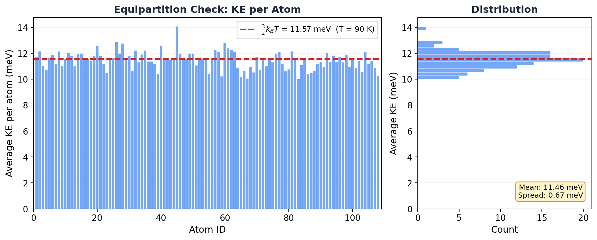

# 6.4 The Equipartition Theorem

!!! info "Huang, *Statistical Mechanics* 2ed, Section 6.4"

## The formula you've been using without knowing why

Every time you run an MD simulation and LAMMPS prints a temperature, it's using this formula:

$$T = \frac{2}{3Nk_B} \langle KE \rangle$$

You've probably typed that, or something like it, a hundred times. But have you ever wondered *why* kinetic energy is connected to temperature? Why the factor of 3? Why not 2 or 6?

The answer is the equipartition theorem. And once you see it, you'll realize it's been hiding inside almost every thermodynamic quantity your simulation computes.

## Why should you care?

Equipartition is the reason your simulation can measure temperature at all. It's also the reason:

- The **virial pressure** formula works
- **Rigid bond constraints** (SHAKE/RATTLE) change your temperature calculation
- You can diagnose equilibration by checking if all atoms have the same average kinetic energy
- The classical heat capacity of a solid is $3Nk_B$ (the Dulong-Petit law)

This one theorem connects energy, temperature, pressure, and heat capacity. It's the Swiss army knife of classical statistical mechanics.

## The bad intuition: "temperature is how fast atoms move"

Kind of. But not really.

Temperature isn't about speed. It's about how energy distributes itself across degrees of freedom. A single fast atom in an otherwise cold system doesn't have a high temperature. Temperature is a *collective* property that only makes sense when energy has had time to spread out evenly. The equipartition theorem tells you exactly what "evenly" means.

## The result (then we'll unpack it)

Huang proves the **generalized equipartition theorem**:

$$\left\langle x_i \frac{\partial \mathcal{H}}{\partial x_j} \right\rangle = \delta_{ij} \, kT$$

where $x_i$ can be any coordinate or momentum ($q_i$ or $p_i$), and $\delta_{ij}$ is the Kronecker delta (1 if $i = j$, 0 otherwise).

That's compact and abstract. Let's see what it actually means.

## What it means for kinetic energy

For a system of $N$ particles with mass $m$, the kinetic energy part of the Hamiltonian is:

$$\mathcal{H}_{kin} = \sum_{i=1}^{3N} \frac{p_i^2}{2m}$$

Pick one momentum component, say $p_1$, and apply the theorem with $x_i = p_1$, $x_j = p_1$:

$$\left\langle p_1 \frac{\partial \mathcal{H}}{\partial p_1} \right\rangle = kT$$

Since $\frac{\partial \mathcal{H}}{\partial p_1} = \frac{p_1}{m}$, this gives:

$$\left\langle \frac{p_1^2}{m} \right\rangle = kT \qquad \Longrightarrow \qquad \left\langle \frac{p_1^2}{2m} \right\rangle = \frac{1}{2}kT$$

Every single momentum degree of freedom carries exactly $\frac{1}{2}kT$ of kinetic energy on average. There are $3N$ momentum components (3 per atom). So:

$$\langle KE \rangle = 3N \times \frac{1}{2}kT = \frac{3}{2}NkT$$

Flip this around and you get the temperature formula:

$$\boxed{T = \frac{2}{3Nk_B} \langle KE \rangle}$$

That's it. That's where the formula comes from. The factor of 3 is because each atom has 3 directions of motion. The factor of 2 is because kinetic energy is quadratic in momentum.

!!! tip "Key Insight"
    Each **quadratic** term in the Hamiltonian contributes exactly $\frac{1}{2}kT$ to the average energy. Kinetic energy has $3N$ quadratic terms (one per momentum component), so it contributes $\frac{3}{2}NkT$ total. This is the "equi" in "equipartition": energy is partitioned equally among all quadratic degrees of freedom.

## What it means for your simulation

Here's the part the textbook doesn't tell you.

### Temperature from kinetic energy

When LAMMPS computes temperature, it literally sums up $\frac{1}{2}m v_i^2$ for every atom in every direction, then uses equipartition to convert that to temperature. The `thermo_style` keyword `temp` is just $\frac{2}{3Nk_B}\sum \frac{1}{2}m v_i^2$.

### The virial and pressure

The equipartition theorem has a sibling called the **virial theorem**. Applied to position coordinates instead of momenta:

$$\left\langle q_i \frac{\partial \mathcal{H}}{\partial q_i} \right\rangle = kT$$

Since $\frac{\partial \mathcal{H}}{\partial q_i} = -\dot{p}_i$ (that's Hamilton's equation, the force), this becomes:

$$\left\langle \sum_{i=1}^{3N} q_i \dot{p}_i \right\rangle = -3NkT$$

This is the **virial** of the system. It's the origin of the virial pressure formula that LAMMPS uses to compute pressure:

$$P = \frac{NkT}{V} + \frac{1}{3V} \left\langle \sum_i \mathbf{r}_i \cdot \mathbf{F}_i \right\rangle$$

The first term is the ideal gas part (from kinetic energy). The second is the correction from interatomic forces. Both come from equipartition.

### Frozen degrees of freedom

Here's a practical trap. If you use SHAKE or RATTLE to constrain bond lengths (common in water simulations like SPC/E or TIP3P), you're removing degrees of freedom. Each constraint freezes one degree of freedom.

For $N$ water molecules with 3 constraints each (2 O-H bonds + 1 H-O-H angle), the number of degrees of freedom drops from $9N$ (3 atoms per molecule, 3 directions each) to $9N - 3N = 6N$.

If your code doesn't account for this, it will compute the wrong temperature. LAMMPS handles this automatically when you define fixes like `fix shake`, but it's good to understand why.

!!! warning "Common Mistake"
    If you constrain bonds but don't adjust the degrees of freedom in your temperature calculation, your temperatures will be systematically wrong. For $N$ rigid water molecules, the correct formula is $T = \frac{2}{6Nk_B}\langle KE \rangle$, not $\frac{2}{9Nk_B}\langle KE \rangle$.

### Equipartition as an equilibration check

In equilibrium, equipartition says every atom should have the same average kinetic energy. If some atoms are systematically hotter or colder than others, your system hasn't equilibrated.

We can check this with our argon simulation from section 6.1:

<figure markdown="span">
  { width="700" }
  <figcaption>Average kinetic energy per atom from the NVE simulation. Equipartition predicts each atom should carry the same average KE. The dashed line shows the expected value from the measured temperature.</figcaption>
</figure>

!!! note "MD Connection"
    Try this on your own simulations. Compute the time-averaged KE for each atom individually. In equilibrium, they should all cluster tightly around $\frac{3}{2}kT$. If one group of atoms is systematically hotter (common at interfaces or near walls), you might have an equilibration problem.

## The classical heat capacity

If a system's Hamiltonian has $f$ quadratic terms (counting both kinetic and potential), then:

$$\langle E \rangle = \frac{f}{2} kT, \qquad C_V = \frac{f}{2} k$$

For a monatomic ideal gas: $f = 3N$ (kinetic only, no potential), so $C_V = \frac{3}{2}Nk$.

For a harmonic solid: $f = 6N$ (3N kinetic + 3N potential from springs), so $C_V = 3Nk$. That's the **Dulong-Petit law**, and it works well for most solids at room temperature.

## The classical paradox (and why quantum mechanics saves us)

Huang ends with a sharp observation. In classical physics, you can always keep resolving matter into smaller pieces (atoms into electrons and nuclei, nuclei into quarks, etc.). Each new degree of freedom should contribute $\frac{1}{2}kT$. So the heat capacity should be infinite.

This is a real paradox, and classical physics has no answer. Quantum mechanics resolves it: degrees of freedom only contribute when there's enough thermal energy to excite them. At low temperatures, high-energy modes "freeze out" and stop contributing. That's why the heat capacity of a real solid drops toward zero as $T \to 0$, violating the classical prediction.

## Takeaway

The equipartition theorem says: every quadratic degree of freedom gets exactly $\frac{1}{2}kT$ of energy. That one fact gives you the temperature formula, the virial pressure, the classical heat capacity, and a powerful diagnostic for checking whether your simulation is actually in equilibrium.
