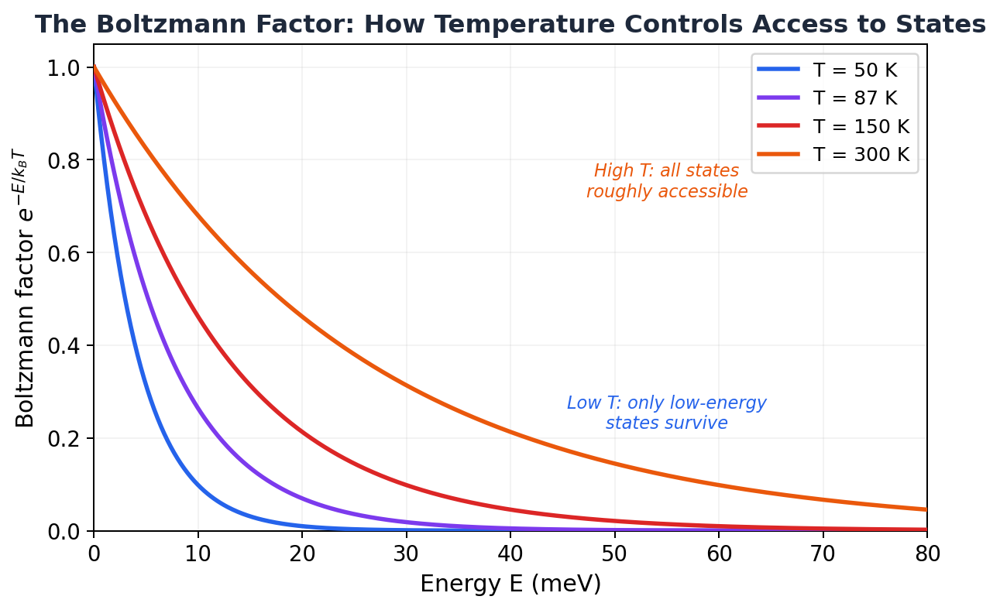
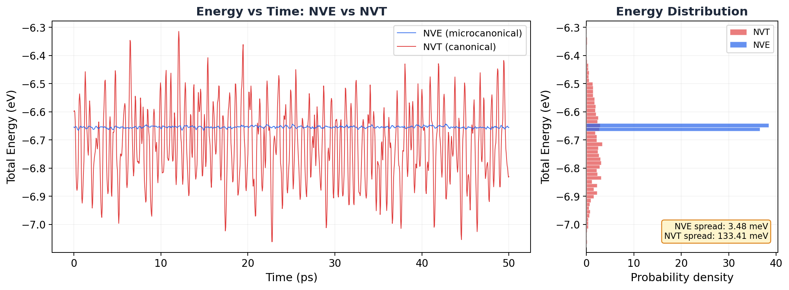

# 7.1 The Canonical Ensemble

!!! info "Huang, *Statistical Mechanics* 2ed, Section 7.1"

## The ensemble you've actually been using

I have a confession. All of chapter 6, we worked with the microcanonical ensemble. Constant $N$, constant $V$, constant $E$. The isolated system. The stubborn one that refuses to exchange anything with anyone.

And yeah, that's clean and fundamental. But when was the last time you ran a purely NVE production simulation? If you're like me, you almost always use NVT. You slap on a Nosé-Hoover thermostat, set a target temperature, and let it rip.

Every time you do that, you're using the **canonical ensemble**. And you deserve to know where it comes from.

## Why should you care?

The canonical ensemble is the workhorse of statistical mechanics. It describes a system at fixed temperature (not fixed energy), which is how most experiments and most simulations actually work. It gives us:

- The **Boltzmann factor** $e^{-\beta E}$, which tells you how probable each microstate is
- The **partition function** $Q_N$, the single most useful object in all of statistical mechanics
- A direct route to the **Helmholtz free energy** $A = -kT \log Q_N$, from which everything else follows

If the microcanonical ensemble is the foundation, the canonical ensemble is the building you actually live in.

## The bad intuition: "it's just NVE with a thermostat bolted on"

You might think the canonical ensemble is the microcanonical ensemble with some extra device controlling the temperature. Like the thermostat is an add-on, a correction, a hack.

It's not. The canonical ensemble is a fundamentally different beast. In the microcanonical ensemble, the system has a definite energy. In the canonical ensemble, the energy *fluctuates*. The system can borrow energy from the heat bath and give it back. At any instant, the system might have more energy than average, or less. What's fixed isn't the energy. It's the *temperature*.

That changes everything. The probability of finding the system in a given microstate is no longer "all states equally likely." It's weighted by the Boltzmann factor. And deriving that weight is exactly what Huang does in this section.

## The physical setup: a small system talks to a big reservoir

Picture this. You have your system (call it system 1, the one you care about). It's sitting inside a much larger system (system 2, the heat reservoir). Together, they form a composite isolated system with total energy $E$.

The composite system is isolated, so its total energy is fixed. But the two subsystems can exchange energy freely between each other. At any moment, system 1 has energy $E_1$ and the reservoir has energy $E_2 = E - E_1$.

Here's the key asymmetry: the reservoir is *much* bigger. $N_2 \gg N_1$. So from the reservoir's perspective, the energy that system 1 borrows is pocket change. The reservoir barely notices. Its temperature stays essentially constant.

Sound familiar? That's exactly what a thermostat does in your simulation. The Nosé-Hoover thermostat acts as an infinite heat bath. Your simulated atoms are system 1. The thermostat is system 2.

!!! note "MD Connection"
    When you write `fix nvt all nvt temp 300.0 300.0 0.1` in LAMMPS, the thermostat is playing the role of system 2. It maintains a constant temperature by adding or removing kinetic energy from your atoms. The coupling constant (0.1 ps in this example) controls how tightly the thermostat grips the system. Too tight and you get artifacts. Too loose and the temperature drifts. The physics of *why* this produces the right distribution is exactly what we're about to derive.

## Where the Boltzmann factor comes from

This is the big one. Let's derive it step by step.

The composite system (system 1 + reservoir) is isolated, so it lives in the microcanonical ensemble. All microstates of the *composite* system with total energy $E$ are equally likely. We learned that in chapter 6.

Now ask: what's the probability of finding system 1 in one specific microstate $(p_1, q_1)$ with energy $E_1 = \mathcal{H}_1(p_1, q_1)$?

We don't care what the reservoir is doing. We just need the reservoir to have energy $E_2 = E - E_1$. The number of ways the reservoir can arrange itself with that energy is $\Gamma_2(E - E_1)$. More reservoir microstates means more ways to achieve this particular $E_1$, means higher probability.

So the probability density in phase space for system 1 is:

$$\rho(p_1, q_1) \propto \Gamma_2(E - E_1)$$

That's it. The probability of finding your system in a particular state is proportional to how many options the *reservoir* has. The reservoir's flexibility determines your system's statistics.

Now we need to figure out what $\Gamma_2(E - E_1)$ looks like. Ready? Let's do this.

Take the log:

$$k \log \Gamma_2(E - E_1) = S_2(E - E_1)$$

That's just the reservoir's entropy at energy $E - E_1$. Since $E_1 \ll E$ (remember, the reservoir is huge), we can Taylor expand around $E$:

$$S_2(E - E_1) = S_2(E) - E_1 \frac{\partial S_2}{\partial E_2}\bigg|_{E_2 = E} + \cdots$$

What's $\frac{\partial S_2}{\partial E_2}$? We derived this in section 6.2. It's $\frac{1}{T}$, where $T$ is the reservoir's temperature. So:

$$S_2(E - E_1) \approx S_2(E) - \frac{E_1}{T}$$

Exponentiate both sides:

$$\Gamma_2(E - E_1) \approx e^{S_2(E)/k} \cdot e^{-E_1/kT}$$

The first factor is a constant (it doesn't depend on $E_1$ at all, it's just the reservoir being the reservoir). So for the probability:

$$\rho(p_1, q_1) \propto e^{-E_1/kT} = e^{-\beta \mathcal{H}_1(p_1, q_1)}$$

where $\beta = 1/kT$.

Done. Beautiful.

That's the **Boltzmann factor**. The probability of finding the system in microstate $(p, q)$ is proportional to $e^{-\beta \mathcal{H}(p,q)}$.

High-energy states? Suppressed exponentially. Low-energy states? Favored exponentially. But nothing is forbidden. Every state has *some* probability. The temperature $T$ controls how steep the penalty is: high $T$ means the exponential is gentle (all states roughly equal), low $T$ means it's brutal (only low-energy states survive).

<figure markdown="span">
  { width="600" }
  <figcaption>The Boltzmann factor at four temperatures. At 300 K (orange), states up to ~80 meV still have significant weight. At 50 K (blue), anything above ~15 meV is essentially forbidden. Temperature controls how far up the energy ladder the system can reach.</figcaption>
</figure>

!!! tip "Key Insight"
    The Boltzmann factor isn't a postulate. We *derived* it from the microcanonical ensemble by asking: "what happens to a small system in contact with a large reservoir?" The answer fell out of a Taylor expansion. The reservoir's entropy decreases when it gives energy to the system, and that decrease is $E_1/T$. The exponential is just the entropy cost, converted to a probability.

## The partition function: the most useful object in physics

Now we need to normalize. The total probability over all microstates must equal 1. So we integrate the Boltzmann factor over all of phase space:

$$Q_N(V, T) = \frac{1}{N! \, h^{3N}} \int d^{3N}p \, d^{3N}q \; e^{-\beta \mathcal{H}(p,q)}$$

This is the **partition function**. Don't let the name scare you. It's just a normalization constant. But it turns out to encode *all* the thermodynamics of the system.

Notice the $N!$ in the denominator? That's our friend from the Gibbs paradox (section 6.6). Correct Boltzmann counting. And the $h^{3N}$? That makes the integral dimensionless. In classical mechanics $h$ is just an arbitrary constant. When we get to quantum mechanics, it becomes Planck's constant. For now, it doesn't affect any thermodynamic derivatives, so don't worry about it.

## From the partition function to all of thermodynamics

Here's where it gets wild. The Helmholtz free energy is:

$$\boxed{A(V, T) = -kT \log Q_N(V, T)}$$

And from $A$, you get *everything*:

| Quantity | Formula |
|----------|---------|
| Entropy | $S = -\left(\dfrac{\partial A}{\partial T}\right)_V$ |
| Pressure | $P = -\left(\dfrac{\partial A}{\partial V}\right)_T$ |
| Internal energy | $U = A + TS$ |
| Gibbs free energy | $G = A + PV$ |
| Heat capacity | $C_V = \left(\dfrac{\partial U}{\partial T}\right)_V$ |

One function. Five thermodynamic quantities. All from computing a single integral.

Is that actually correct though? Let me show you why $A = -kT \log Q_N$ is the right identification. Start from the definition of $Q_N$:

$$\frac{1}{N! h^{3N}} \int dp \, dq \; e^{-\beta \mathcal{H}(p,q)} = Q_N = e^{-\beta A}$$

Which means:

$$\frac{1}{N! h^{3N}} \int dp \, dq \; e^{\beta[A - \mathcal{H}(p,q)]} = 1$$

Differentiate both sides with respect to $\beta$ (holding $V$ fixed). The right side is just zero. The left side, by the product rule, gives:

$$\left\langle A - \mathcal{H} + \beta \frac{\partial A}{\partial \beta} \right\rangle = 0$$

Since $\beta = 1/kT$, we have $\frac{\partial A}{\partial \beta} = \frac{\partial A}{\partial T} \cdot \frac{\partial T}{\partial \beta} = -kT^2 \frac{\partial A}{\partial T}$, so $\beta \frac{\partial A}{\partial \beta} = -T \frac{\partial A}{\partial T}$. Plugging in:

$$A - \langle \mathcal{H} \rangle - T\left(\frac{\partial A}{\partial T}\right)_V = 0$$

Rearrange:

$$\langle \mathcal{H} \rangle = A - T\left(\frac{\partial A}{\partial T}\right)_V = A + TS = U$$

That's the thermodynamic identity $U = A + TS$. It fell right out. The identification $A = -kT \log Q_N$ is self-consistent.

If you followed that, congratulations. You just proved that the partition function gives the correct thermodynamics. Not bad for a page of algebra.

## The recipe (and why canonical beats microcanonical)

So here's the practical workflow in the canonical ensemble:

1. Write down the Hamiltonian $\mathcal{H}(p, q)$
2. Compute $Q_N = \frac{1}{N! h^{3N}} \int dp \, dq \; e^{-\beta \mathcal{H}}$
3. Take $A = -kT \log Q_N$
4. Get everything else from derivatives of $A$

Compare this to the microcanonical recipe from section 6.3: compute the density of states $\omega(E)$ (which requires integrating over an energy *shell*, a much harder integral), get $S = k \log \omega$, then solve for $E(S, V)$...

The canonical approach is almost always easier. The integral in $Q_N$ runs over *all* of phase space (no energy constraint to worry about). For most systems, it factors into simple pieces. Huang himself says the microcanonical approach is "clumsy" and that there's "little hope" of using it for anything beyond the ideal gas. The canonical ensemble is where real calculations happen.

!!! warning "Common Mistake"
    Don't confuse the partition function $Q_N$ with the number of microstates $\Gamma(E)$. They measure completely different things. $\Gamma(E)$ counts microstates in an energy shell (microcanonical). $Q_N$ is a weighted integral over *all* energies (canonical). They give equivalent thermodynamics in the end (we'll see this in section 7.2 when we show energy fluctuations are tiny), but they're different objects.

## What this means for your simulation

### NVT = canonical ensemble sampling

When you run an NVT simulation with a Nosé-Hoover thermostat, your system is sampling microstates from the canonical distribution. Each frame in your trajectory is drawn (approximately) from $\rho(p, q) \propto e^{-\beta \mathcal{H}(p,q)}$. Low-energy configurations show up more often. High-energy ones are rare but not impossible.

This is different from NVE, where every microstate on the energy surface is equally likely. In NVT, states are *weighted*. The Boltzmann factor is the weight.

Let me show you. I ran the exact same 108-atom argon system twice: once with `fix nve` (microcanonical) and once with `fix nvt` at 87 K (canonical). Same atoms, same potential, same box. The only difference is whether energy is conserved or temperature is conserved. Look at the total energy:

<figure markdown="span">
  { width="750" }
  <figcaption>Total energy over 50 ps of production. NVE (blue) holds energy to within 3.5 meV. NVT (red) fluctuates with a spread of 133 meV, nearly 40 times larger. The histogram on the right shows NVE as a narrow spike and NVT as a broad distribution. That spread is not noise. It's the canonical ensemble doing exactly what it should.</figcaption>
</figure>

The NVE energy is a flat line (within numerical precision). The NVT energy is bouncing all over the place, with a spread about 40 times larger. That's not a bug. That's the canonical ensemble. The thermostat is lending and reclaiming energy, and the system is exploring states across a range of energies, weighted by the Boltzmann factor.

### The thermostat IS the reservoir

The Nosé-Hoover thermostat isn't just a numerical trick. It's a mathematical implementation of the heat reservoir we used in the derivation. It adds extra degrees of freedom that absorb and release energy, keeping the temperature fluctuating around the target value. The extended system (your atoms + thermostat variables) is microcanonical. Your atoms alone are canonical. Exactly the setup we derived.

### Why free energy is hard

Notice something about the partition function? To compute $A = -kT \log Q_N$, you'd need to evaluate $Q_N$ itself, not a derivative of it. But in a simulation, you only sample *relative* probabilities. You see which states the system visits, but you never know the absolute normalization.

That's why free energies are hard in MD. You can get $U$, $P$, $T$, $C_V$ easily (they're all *averages* or *derivatives*). But $A$ itself requires knowing $Q_N$, and you can't get that from a straightforward simulation. That's why we need tricks like thermodynamic integration, free energy perturbation, and umbrella sampling. All of those are clever workarounds for the fact that $Q_N$ is inaccessible to direct simulation.

!!! note "MD Connection"
    Every time someone says "free energy calculations are expensive," this is the fundamental reason. Temperature? Average the kinetic energy. Pressure? Average the virial. Free energy? You need the partition function itself, not just averages computed from it. That's a fundamentally harder problem, and the entire field of enhanced sampling exists because of it.

## Takeaway

Put a small system in contact with a big heat bath. The reservoir's entropy cost for lending energy $E$ to the system is $E/T$. That cost becomes the Boltzmann factor $e^{-\beta E}$. Sum it over all states and you get the partition function $Q_N$. Take the log and you get the Helmholtz free energy. From there, every thermodynamic quantity is one derivative away. That's the canonical ensemble. That's what your NVT thermostat has been sampling all along.

??? question "Check Your Understanding"
    1. We Taylor-expanded the reservoir's entropy and tossed out the second-order term. When would that be a bad idea? Think about what kind of "reservoir" would make that approximation blow up.
    2. There's an arbitrary constant $h$ hiding in $Q_N$. You can set it to anything you want. So why doesn't it mess up the pressure, entropy, or any other thermodynamic quantity you compute from $A = -kT \log Q_N$?
    3. You can measure $U = \langle \mathcal{H} \rangle$ by just averaging over your trajectory. But you can't get $A = -kT \log Q_N$ the same way. What's fundamentally different about $A$ that makes a single trajectory useless?
    4. You scale your argon box from 108 atoms to 10,000 atoms (same density, same temperature). Do the NVT energy fluctuations get bigger or smaller relative to the mean energy? By roughly how much?
