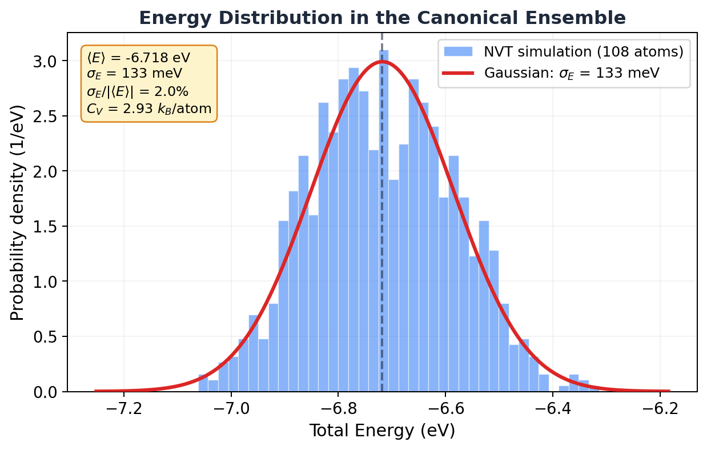

# 7.2 Energy Fluctuations in the Canonical Ensemble

!!! info "Huang, *Statistical Mechanics* 2ed, Section 7.2"

## Wait, doesn't the canonical ensemble have the wrong energy?

Here's something that should bother you. In section 7.1, we said the canonical ensemble allows *all* energies. Every microstate has some probability, weighted by the Boltzmann factor. But in the microcanonical ensemble, the energy is exactly fixed.

So which is it? Does the system have a definite energy or not? And if the two ensembles allow different energies, how can they give the same thermodynamics?

The answer is one of the most satisfying results in statistical mechanics: the canonical ensemble *technically* allows all energies, but *practically* only one energy matters. The fluctuations are so absurdly small for macroscopic systems that the two ensembles become identical.

## Why should you care?

This section answers three practical questions:

- **Are NVE and NVT simulations equivalent?** For thermodynamic averages, yes. This section proves why.
- **How big are energy fluctuations?** There's an exact formula, and you can check it against your simulation.
- **Can you measure the heat capacity from fluctuations?** Yes. And it's a method that actually works in practice.

That last one is a real technique. The fluctuation-dissipation theorem (which this result is a special case of) lets you extract response functions from equilibrium fluctuations. You'll see it used in real research.

## The bad intuition: "NVT fluctuations are just thermostat noise"

You might think the energy bouncing around in an NVT simulation is just the thermostat doing its thing. Numerical noise. An artifact of coupling to a fake heat bath.

Nope. Those fluctuations are *physical*. A real system in contact with a real heat bath genuinely fluctuates in energy. The thermostat isn't creating the fluctuations. It's faithfully reproducing the ones that nature demands.

And the size of those fluctuations tells you something fundamental about the system: its heat capacity.

## The result (then we unpack it)

Huang derives this beautiful formula for the mean square energy fluctuation:

$$\boxed{\langle \mathcal{H}^2 \rangle - \langle \mathcal{H} \rangle^2 = kT^2 C_V}$$

The left side is the variance of the energy: $\sigma_E^2$. The right side is temperature squared times the heat capacity. That's it. The energy fluctuation is completely determined by $T$ and $C_V$.

Let's unpack what this means before we derive it.

## What this formula tells you

Since $U = \langle \mathcal{H} \rangle \propto N$ and $C_V \propto N$, the standard deviation of the energy is:

$$\sigma_E = \sqrt{kT^2 C_V} \propto \sqrt{N}$$

But the mean energy itself scales as $N$. So the *relative* fluctuation is:

$$\frac{\sigma_E}{U} \propto \frac{\sqrt{N}}{N} = \frac{1}{\sqrt{N}}$$

For our 108-atom argon simulation: $\sigma_E / |U| \approx 2\%$. Visible. Meaningful. You can see it in the data.

For a mole of gas ($N = 6 \times 10^{23}$): $\sigma_E / |U| \approx 10^{-13}$. That's one part in *ten trillion*. The energy is so sharply defined that the canonical ensemble is indistinguishable from the microcanonical.

That's why NVE and NVT give the same thermodynamics. For macroscopic systems, the canonical energy distribution is essentially a delta function centered on $U$.

!!! tip "Key Insight"
    The canonical ensemble allows all energies but concentrates almost all its weight on a single energy $U$. The relative spread shrinks as $1/\sqrt{N}$. For $10^{23}$ particles, the fluctuation is $10^{-13}$. That's not "approximately the same energy." That's the same energy to thirteen decimal places. The two ensembles aren't just similar. They're equivalent.

## The derivation

Ready? Let's do this.

Start from the definition of the average energy in the canonical ensemble:

$$U = \langle \mathcal{H} \rangle = \frac{\int dp \, dq \; \mathcal{H} \, e^{-\beta \mathcal{H}}}{\int dp \, dq \; e^{-\beta \mathcal{H}}}$$

Here's a slick trick. Notice that $\mathcal{H} \, e^{-\beta \mathcal{H}} = -\frac{\partial}{\partial \beta} e^{-\beta \mathcal{H}}$. So:

$$U = -\frac{1}{Q_N} \frac{\partial Q_N}{\partial \beta} = -\frac{\partial \log Q_N}{\partial \beta} = \frac{\partial (\beta A)}{\partial \beta}$$

Now take one more derivative with respect to $\beta$:

$$\frac{\partial U}{\partial \beta} = -\left(\langle \mathcal{H}^2 \rangle - \langle \mathcal{H} \rangle^2\right)$$

Why? Because differentiating $U = \langle \mathcal{H} \rangle$ with respect to $\beta$ brings down another factor of $-\mathcal{H}$ from the Boltzmann weight, giving $-(\langle \mathcal{H}^2 \rangle - U^2)$. (This is the same trick that gives you the variance from the moment generating function in probability theory.)

So:

$$\sigma_E^2 = \langle \mathcal{H}^2 \rangle - \langle \mathcal{H} \rangle^2 = -\frac{\partial U}{\partial \beta}$$

Now convert from $\beta$ to $T$. Since $\beta = 1/kT$:

$$\frac{\partial}{\partial \beta} = \frac{\partial T}{\partial \beta} \frac{\partial}{\partial T} = -kT^2 \frac{\partial}{\partial T}$$

Therefore:

$$\sigma_E^2 = kT^2 \frac{\partial U}{\partial T} = kT^2 C_V$$

Done. Beautiful.

The energy variance equals $kT^2 C_V$. Two derivatives of the partition function, one change of variables. That's all it took.

## The energy distribution is Gaussian

Huang shows something even more specific. The partition function can be rewritten as an integral over energy:

$$Q_N = \frac{1}{N! h^{3N}} \int dp \, dq \; e^{-\beta \mathcal{H}} = \int_0^\infty dE \; \omega(E) \, e^{-\beta E}$$

where $\omega(E)$ is the density of states. Write $\omega(E) = e^{S(E)/k}$ (that's just the microcanonical entropy):

$$Q_N = \int_0^\infty dE \; e^{\beta[TS(E) - E]}$$

The integrand has a *very* sharp maximum at $E = U$ (where $\partial S / \partial E = 1/T$). Expand the exponent to second order around the peak:

$$TS(E) - E \approx [TS(U) - U] - \frac{(E - U)^2}{2kT^2 C_V}$$

That's a Gaussian. The energy distribution in the canonical ensemble is:

$$P(E) \propto \exp\!\left[-\frac{(E - U)^2}{2kT^2 C_V}\right]$$

A Gaussian centered at $U$ with width $\sigma_E = \sqrt{kT^2 C_V}$.

Let me show you. Here's the energy histogram from our 108-atom NVT argon simulation, with the predicted Gaussian overlaid:

<figure markdown="span">
  { width="650" }
  <figcaption>Energy distribution from the NVT argon simulation (108 atoms, 87 K). The histogram matches the predicted Gaussian. The relative fluctuation is 2% for 108 atoms. For a mole of atoms it would be 10-13.</figcaption>
</figure>

The Gaussian fits perfectly. For 108 atoms the spread is clearly visible (2% of the mean energy). But scale this up to $10^{23}$ atoms and the Gaussian becomes a needle. A spike so thin it's indistinguishable from a delta function.

## Measuring heat capacity from fluctuations

Here's the practical payoff. Rearrange the fluctuation formula:

$$C_V = \frac{\sigma_E^2}{kT^2}$$

You can measure $C_V$ without ever perturbing the system. Just run an NVT simulation, record the total energy at each step, compute the variance, and divide by $kT^2$. No need to heat the system up and measure the response. The fluctuations *are* the response.

From our simulation: $\sigma_E = 133$ meV, $T = 87$ K. Plugging in:

$$C_V = \frac{(0.133)^2}{8.617 \times 10^{-5} \times 87^2} = 0.027 \text{ eV/K} = 2.93 \, k_B \text{ per atom}$$

Is that reasonable? For an ideal gas (kinetic energy only), $C_V = \frac{3}{2}k_B$ per atom. For a harmonic solid (Dulong-Petit), $C_V = 3k_B$ per atom. Our argon at 87 K is a dense system near its triple point, with significant potential energy contributions. $2.93 \, k_B$ per atom sits right between the two limits. That checks out.

!!! note "MD Connection"
    This is a real technique called the **fluctuation method** for computing heat capacity. It works in any NVT simulation. The catch: you need long trajectories for the variance to converge, especially for large systems where the relative fluctuations are tiny. For small systems (like our 108 atoms), it converges fast. For 10,000+ atoms, you might need very long runs to get $\sigma_E$ accurately.

## Why this matters for ensemble equivalence

And I'm sure you're thinking, "so if the ensembles are equivalent, why bother with two of them?" Fair question.

For computing *equilibrium averages* (energy, pressure, temperature), it doesn't matter which ensemble you use. NVE and NVT will give the same answer for macroscopic systems.

But they're not interchangeable for everything:

- **Fluctuations** are different. Energy fluctuations are zero in NVE (by definition) but finite in NVT. If you want $C_V$ from fluctuations, you *must* use NVT.
- **Convenience** differs. Some quantities are much easier to compute in one ensemble than the other. Free energies, for instance, are naturally framed in the canonical ensemble.
- **Small systems** break equivalence. For 108 atoms, we saw 2% energy fluctuations. That's not negligible. The ensembles start to disagree for properties that are sensitive to the tails of the distribution.

!!! warning "Common Mistake"
    Don't use the fluctuation formula $C_V = \sigma_E^2 / kT^2$ on an NVE simulation. In NVE the total energy is constant (by construction), so $\sigma_E = 0$ and you'd get $C_V = 0$, which is wrong. This formula specifically requires the canonical (NVT) ensemble. For NVE you'd need to use $C_V = \partial U / \partial T$ directly, which requires running at multiple temperatures.

## Takeaway

Energy fluctuations in the canonical ensemble go as $\sqrt{N}$, but the mean energy goes as $N$. So the relative fluctuation shrinks as $1/\sqrt{N}$. For macroscopic systems, the canonical and microcanonical ensembles are identical. For small simulations, the fluctuations are measurable, and you can use them to extract the heat capacity directly. Those aren't bugs. Those are features.

??? question "Check Your Understanding"
    1. You measure energy fluctuations in NVE and plug them into $C_V = \sigma_E^2 / kT^2$. You get $C_V = 0$. That's obviously wrong. What happened?
    2. Your 108-atom argon box has ~2% relative energy fluctuations. You scale up to 10,800 atoms. Roughly what relative fluctuation do you expect now?
    3. We showed the canonical energy distribution is Gaussian. Can you think of a physical situation where that breaks down and the distribution gets seriously lopsided or multimodal?
    4. Your labmate computes $C_V$ two ways for a 50-atom system: once from NVT energy fluctuations, once from $\partial U / \partial T$ across multiple temperatures. They disagree by 15%. Bug or feature?
