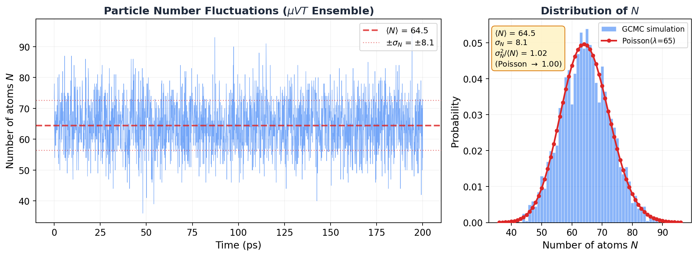

# 7.4 Density Fluctuations in the Grand Canonical Ensemble

!!! info "Huang, *Statistical Mechanics* 2ed, Section 7.4"

## My first GCMC run freaked me out

I'm going to be honest with you. The first time I ran a GCMC simulation, I thought something was broken. The particle count was jumping all over the place. 55 atoms one moment, 78 the next, back down to 49. My NVT simulations had nice, stable atom counts. This looked like chaos.

It wasn't broken. That's what the grand canonical ensemble *does*. Particles wander in and out, and the number fluctuates. But how much should it fluctuate? Is there a formula? Can you predict the size of those jumps?

Yes. And the answer connects to something you can measure in the lab: the isothermal compressibility.

## Why should you care?

- **GCMC sanity check**: You set a chemical potential, ran `fix gcmc`, and now $N$ is bouncing around. Is that the right amount of bouncing? Too much? Too little? This section gives you the exact formula to check.
- **Free compressibility**: In section 7.2, we extracted $C_V$ from energy fluctuations. Here, you extract $\kappa_T$ from particle number fluctuations. No perturbation. No separate calculation. Just watch $N$ and measure the variance.
- **Critical phenomena**: Near a critical point, these fluctuations don't just grow. They *explode*. And you can literally see it happen with your naked eye. More on that later.

## The bad intuition: "another $1/\sqrt{N}$ situation, who cares"

In section 7.2 we proved that energy fluctuations scale as $1/\sqrt{N}$. For a mole of gas, that's one part in $10^{13}$. Negligible. The canonical and microcanonical ensembles are effectively identical.

So you'd expect the same boring result here. Particle number fluctuations are tiny. Grand canonical and canonical ensembles give the same answers. Move along.

For most situations? Yeah, that's true.

But here's the thing. The energy fluctuation formula $\sigma_E^2 = kT^2 C_V$ has $C_V$ in it. Heat capacities can get large near phase transitions, but they generally stay finite. No explosion. No drama.

The density fluctuation formula has the isothermal compressibility $\kappa_T$ in it. And $\kappa_T$ doesn't just get large near a critical point. It goes to *infinity*. The fluctuations don't shrink as $1/\sqrt{N}$ anymore. They grow without bound.

Same mathematical structure. Dramatically different physics. That's what makes this section interesting.

## The result (then we derive it)

Let me show you the punchline first. The variance of the particle number in the grand canonical ensemble is:

$$\boxed{\sigma_N^2 = \langle N \rangle \frac{kT \kappa_T}{v}}$$

where $\kappa_T$ is the isothermal compressibility and $v = V/N$ is the volume per particle.

Now put it next to the energy fluctuation result from section 7.2:

| What fluctuates | Variance | What controls it |
|-----------------|----------|-----------------|
| Energy | $\sigma_E^2 = kT^2 C_V$ | Heat capacity |
| Particle number | $\sigma_N^2 = \langle N \rangle kT\kappa_T / v$ | Compressibility |

See the pattern? Variance on the left. $kT$ times a response function on the right. Energy fluctuations tell you how the system responds to temperature changes ($C_V$). Density fluctuations tell you how it responds to pressure changes ($\kappa_T$).

This pattern is the **fluctuation-dissipation theorem**. The system's thermal jiggling encodes everything about how it responds to perturbations. You don't need to poke it. Just listen to the noise.

That's amazing. But I'm getting ahead of myself. Let's derive it.

## The derivation

Ready? Let's do this.

Start from the grand partition function:

$$\mathcal{Q}(z, V, T) = \sum_{N=0}^{\infty} z^N Q_N(V, T)$$

We showed in section 7.3 that the average particle number comes from one derivative:

$$\langle N \rangle = z \frac{\partial}{\partial z} \log \mathcal{Q}$$

Now hit it with $z \frac{\partial}{\partial z}$ again. Same trick we used in 7.2 (differentiate the mean to get the variance). It's the moment-generating function trick from probability theory, and it keeps working:

$$z \frac{\partial}{\partial z} \langle N \rangle = \langle N^2 \rangle - \langle N \rangle^2 = \sigma_N^2$$

Second derivative of $\log \mathcal{Q}$ gives the variance. Every time.

Now use $PV = kT \log \mathcal{Q}$ and $\mu = kT \log z$, so $z \frac{\partial}{\partial z} = kT \frac{\partial}{\partial \mu}$:

$$\sigma_N^2 = kTV \frac{\partial^2 P}{\partial \mu^2}$$

OK, that's exact. But nobody measures $\partial^2 P / \partial \mu^2$. We need to massage this into something with the compressibility in it.

### Connecting to the compressibility

We're taking baby steps here.

Assume the free energy is extensive: $A(N, V, T) = N a(v)$ where $v = V/N$. The standard thermodynamic relations give us:

$$\mu = a(v) - v \frac{\partial a}{\partial v}, \qquad P = -\frac{\partial a}{\partial v}$$

Differentiate both with respect to $v$:

$$\frac{\partial \mu}{\partial v} = -v \frac{\partial^2 a}{\partial v^2}, \qquad \frac{\partial P}{\partial v} = -\frac{\partial^2 a}{\partial v^2}$$

Now here's the slick part. We want $\partial P / \partial \mu$. Use the chain rule:

$$\frac{\partial P}{\partial \mu} = \frac{\partial P / \partial v}{\partial \mu / \partial v} = \frac{-\partial^2 a / \partial v^2}{-v \, \partial^2 a / \partial v^2} = \frac{1}{v}$$

The $\partial^2 a / \partial v^2$ cancels top and bottom. Goodbye buddy. He's gone. We're left with $1/v$.

One more derivative (I promise, this is the last one):

$$\frac{\partial^2 P}{\partial \mu^2} = \frac{\partial}{\partial \mu}\left(\frac{1}{v}\right) = -\frac{1}{v^2}\frac{\partial v}{\partial \mu} = -\frac{1}{v^2} \cdot \frac{1}{\partial \mu / \partial v} = \frac{1}{v^3 \, \partial^2 a / \partial v^2}$$

Since $\partial^2 a / \partial v^2 = -\partial P / \partial v$:

$$\frac{\partial^2 P}{\partial \mu^2} = -\frac{1}{v^3 \, \partial P / \partial v}$$

Plug back into $\sigma_N^2 = kTV \frac{\partial^2 P}{\partial \mu^2}$ and use $V = \langle N \rangle v$:

$$\sigma_N^2 = \langle N \rangle \frac{kT}{v^2 (-\partial P / \partial v)_T} = \langle N \rangle \frac{kT \kappa_T}{v}$$

where we defined the isothermal compressibility:

$$\kappa_T \equiv \frac{1}{v(-\partial P / \partial v)_T}$$

Done. Beautiful.

Let me say that in words. The particle number variance equals the mean particle number, times $kT$, times the compressibility, divided by the volume per particle. A squishy system (large $\kappa_T$) has big density fluctuations. A stiff system (small $\kappa_T$) doesn't. The compressibility is the system's poker face. A stiff crystal barely flinches. A gas near its critical point? Shaking like a leaf.

!!! tip "Key Insight"
    The fluctuation-dissipation theorem strikes again: **variance = $kT$ times susceptibility**. Energy fluctuations are controlled by $C_V$ (how the system responds to temperature changes). Density fluctuations are controlled by $\kappa_T$ (how it responds to pressure changes). The system's equilibrium noise tells you how it responds to perturbations. No poking required.

## Special case: the ideal gas

And I'm sure you're thinking, "great, but what does this actually give for a real system?" Let's start with the simplest one. The ideal gas.

For an ideal gas, $PV = NkT$, so $P = kT/v$. Take the derivative:

$$-\frac{\partial P}{\partial v} = \frac{kT}{v^2}$$

Plug into the compressibility:

$$\kappa_T = \frac{1}{v \cdot kT/v^2} = \frac{v}{kT} = \frac{1}{P}$$

For an ideal gas, the compressibility is just $1/P$. The lower the pressure, the easier it is to compress. Makes sense.

Now plug into the fluctuation formula:

$$\sigma_N^2 = \langle N \rangle \frac{kT}{Pv} = \langle N \rangle \frac{kT}{kT} = \langle N \rangle$$

Wait. The variance *equals* the mean?

$$\boxed{\sigma_N^2 = \langle N \rangle \quad \text{(ideal gas)}}$$

If you've taken any probability course, you know exactly what that is. That's the **Poisson distribution**. The number of ideal gas particles in a box follows Poisson statistics. Each particle independently decides whether to be in or out. No correlations. No clustering. Pure randomness.

And the relative fluctuation: $\sigma_N / \langle N \rangle = 1/\sqrt{\langle N \rangle}$. For 65 atoms in a simulation box, that's about 12%. You can see it. For a mole of gas, that's $10^{-12}$. Gone.

If you followed that whole derivation, congratulations. You went from the grand partition function to Poisson statistics in about ten lines of algebra.

## Reality check: GCMC simulation

Enough math. Let me show you.

I set up a GCMC simulation: dilute argon at 300 K, $\mu = -0.3$ eV, 30 $\times$ 30 $\times$ 30 A box. That's well above argon's critical temperature ($T_c \approx 150$ K), so the gas should be nearly ideal. LAMMPS `fix gcmc` inserts and deletes atoms every 10 steps. The particle count fluctuates freely.

Here's what I saw:

<figure markdown="span">
  { width="750" }
  <figcaption>Left: particle number N(t) from a GCMC simulation of dilute argon (300 K, μ = −0.3 eV). N fluctuates around ⟨N⟩ = 64.5. Right: histogram of N matches the Poisson distribution almost perfectly. σN²/⟨N⟩ = 1.02, within 2% of the ideal gas prediction.</figcaption>
</figure>

Look at that histogram on the right. The red curve isn't a fit. It's the Poisson distribution with *zero free parameters* (just $\lambda = \langle N \rangle = 64.5$), overlaid on the data. It's basically sitting right on top of the histogram.

The numbers:

| Quantity | Value |
|----------|-------|
| $\langle N \rangle$ | 64.5 |
| $\sigma_N$ | 8.1 |
| $\sigma_N^2$ | 66.0 |
| $\sigma_N^2 / \langle N \rangle$ | 1.02 |
| Poisson prediction | 1.00 |

$\sigma_N^2 / \langle N \rangle = 1.02$. Within 2% of Poisson. The tiny deviation? That's the LJ interactions. At 300 K, $kT = 0.026$ eV while $\epsilon = 0.010$ eV, so $kT/\epsilon \approx 2.5$. Nearly ideal, but the weak attractions make particles slightly more likely to cluster together, pushing the variance just above $\langle N \rangle$. Super-Poisson. Barely, but measurably.

Not bad for a formula derived from two derivatives and a chain rule.

!!! note "MD Connection"
    Monitoring $\sigma_N^2 / \langle N \rangle$ in your GCMC simulation is like having a free thermodynamic diagnostic running in the background. Close to 1? Your system is behaving like an ideal gas. Significantly above 1? Attractive interactions are clustering particles together (super-Poisson). Below 1? Repulsive interactions are spreading them apart (sub-Poisson). And if this ratio starts diverging? You're near the critical point. Time to pay attention.

## When fluctuations go nuclear: critical opalescence

Everything above assumed $\kappa_T$ is finite. But look at the compressibility formula:

$$\kappa_T = \frac{1}{v(-\partial P / \partial v)_T}$$

What happens when $\partial P / \partial v = 0$?

$\kappa_T$ goes to infinity. And so does $\sigma_N^2$. The density fluctuations become *macroscopic*.

This isn't hypothetical. It happens at the critical point of every fluid. The system can't make up its mind. It wants to be a liquid. No wait, a gas. No, liquid again. It fluctuates wildly between high-density and low-density patches, and these patches form at *every length scale*, including the wavelength of visible light.

And when density fluctuations happen at the scale of visible light, they scatter it. That's why a fluid near its critical point turns milky white. It's called **critical opalescence**, and it's one of the most visually striking consequences of statistical mechanics. You can literally see the fluctuation-dissipation theorem with your eyes.

The ensemble framework still works at the critical point (Huang shows this in the detailed analysis later in the chapter). But the "fluctuations are negligible" shortcut? That breaks down completely.

!!! warning "Common Mistake"
    "Density fluctuations are negligible for macroscopic systems" is true *almost always*, but not at the critical point. The $1/\sqrt{N}$ scaling of relative fluctuations assumes $\kappa_T$ is finite. Near $T_c$, $\kappa_T$ diverges, and fluctuations become enormous regardless of system size. If your GCMC simulation near $T_c$ shows the particle count going haywire, don't restart the job. That's exactly what the theory predicts.

## The bigger picture

Zoom out. Across sections 7.2 and 7.4, we've found the same pattern twice:

1. **Energy fluctuations** (canonical): $\sigma_E^2 = kT^2 C_V$
2. **Density fluctuations** (grand canonical): $\sigma_N^2 = \langle N \rangle kT \kappa_T / v$

Both say: **equilibrium fluctuations = $kT$ times susceptibility**. This is the fluctuation-dissipation theorem, and it's everywhere:

- **Brownian motion**: Einstein's relation links diffusion to friction
- **Johnson-Nyquist noise**: Voltage fluctuations in a resistor tell you the resistance
- **Kubo formula**: Transport coefficients from equilibrium correlation functions

The deep message: thermal noise isn't just random junk. It's signal. A system's jiggling encodes complete information about how it responds to perturbations. You don't need to push it. You just need to listen.

## Takeaway

Particle number fluctuations in the grand canonical ensemble are controlled by the compressibility: $\sigma_N^2 = \langle N \rangle kT\kappa_T / v$. For an ideal gas, that gives Poisson statistics ($\sigma_N^2 = \langle N \rangle$), confirmed to 2% by our GCMC simulation. These fluctuations are negligible for macroscopic systems, *except* near a critical point where the compressibility diverges, density fluctuations become macroscopic, and you can see them scatter light. That's critical opalescence. And it's not a bug.

??? question "Check Your Understanding"
    1. You swap out the LJ potential for a purely repulsive WCA potential and rerun the GCMC simulation. Does $\sigma_N^2 / \langle N \rangle$ come out above or below 1? Think about what repulsion does to how particles arrange themselves.
    2. Your GCMC run near the critical point shows the particle count swinging wildly between 20 and 200. Your advisor asks: "Is that real or is your simulation broken?" How do you prove it's physical?
    3. You simulate argon adsorbing into a tight zeolite pore with GCMC and find $\sigma_N^2 / \langle N \rangle \ll 1$. Way below Poisson. What's the pore doing to the particles that suppresses the fluctuations so much?
