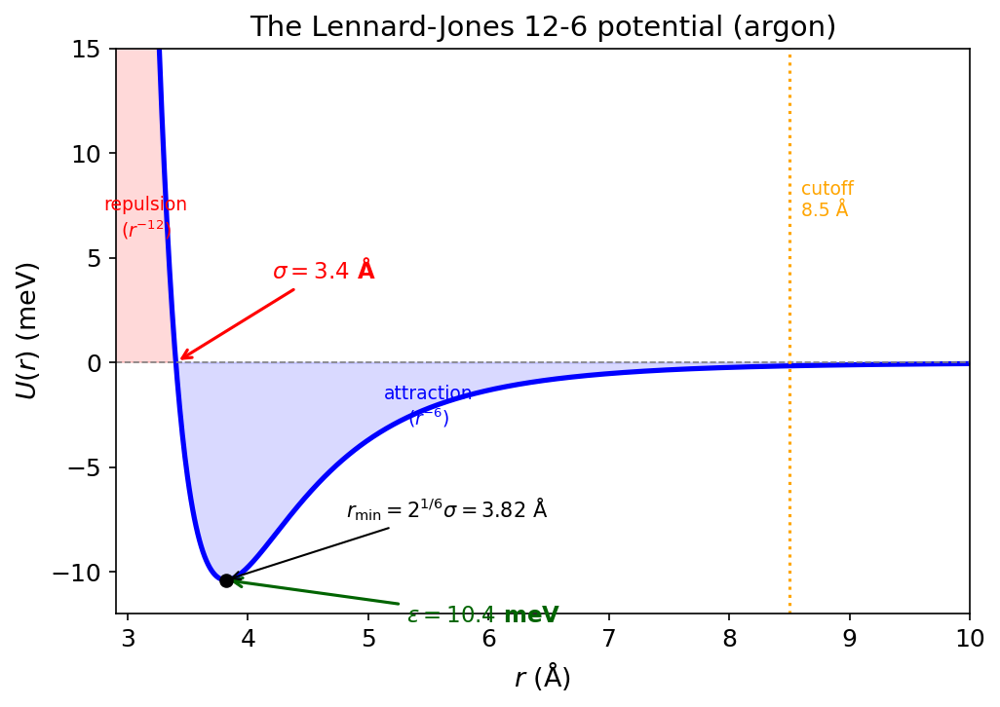
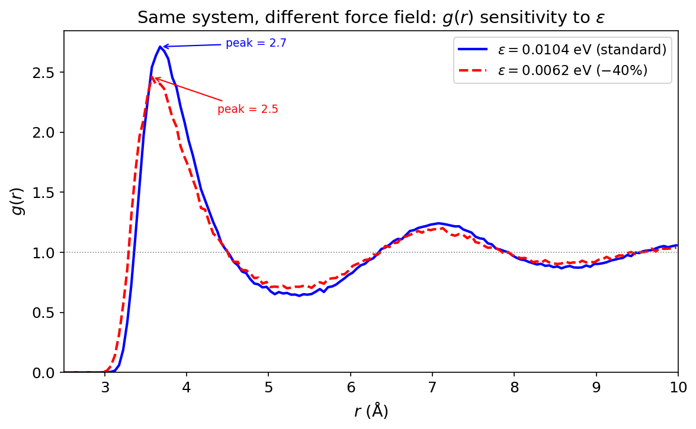

# Your Force Field Is a Lie (And That's OK)

!!! info "Practical MD topic — no specific Huang chapter. This is the stuff textbooks don't cover."

## Confession time.

I've been lying to my simulation. Every single run. I tell LAMMPS that argon atoms interact via a Lennard-Jones 12-6 potential with $\epsilon = 0.0104$ eV and $\sigma = 3.4$ Å. I tell it that's the truth. It's not. It's a *model*. A cartoon. A mathematically convenient approximation of the real quantum-mechanical interaction between two argon atoms.

And here's the thing: every observable I compute, every $g(r)$, every diffusion coefficient, every phase diagram, is downstream of that lie. Change the parameters by 10%, and the physics changes. The melting point shifts. The density shifts. The diffusion coefficient shifts. Everything.

So why does MD work at all? Because the lie is *good enough*. A well-parameterized force field captures the essential physics, the stuff that matters for the properties you care about. The art is knowing what "good enough" means, and what it doesn't.

Let's go.

## What a force field actually is

Strip away the jargon, and a force field is just a function. You give it the positions of all your atoms, and it gives you back a number: the potential energy $U(\mathbf{r}_1, \mathbf{r}_2, \ldots, \mathbf{r}_N)$.

That's it. That's the Hamiltonian. And from the Hamiltonian, everything else follows. Forces ($\mathbf{F}_i = -\nabla_i U$), equations of motion (Newton's second law), trajectories (velocity-Verlet integration), and every thermodynamic observable you compute from those trajectories.

The force field IS the physics of your simulation. It's not a detail. It's not a setting you pick and forget. It's the most important decision you make, and everything downstream is conditioned on it.

!!! tip "Key Insight"
    Statistical mechanics gives you the framework: ensembles, partition functions, fluctuation formulas. But the force field gives you the *Hamiltonian* that goes inside that framework. Get the framework right and the Hamiltonian wrong? Wrong answers. Get the Hamiltonian right and the framework wrong? Also wrong answers. You need both.

## The simplest lie: Lennard-Jones

The Lennard-Jones potential is the "Hello World" of force fields:

$$U_\text{LJ}(r) = 4\epsilon \left[ \left(\frac{\sigma}{r}\right)^{12} - \left(\frac{\sigma}{r}\right)^{6} \right]$$

Two parameters. That's it. $\epsilon$ sets the depth of the well (how strongly the atoms attract). $\sigma$ sets the size of the atom (where the potential crosses zero). The $r^{-6}$ part is the attractive van der Waals interaction. The $r^{-12}$ part is Pauli repulsion.

<figure markdown="span">
  { width="600" }
  <figcaption>The Lennard-Jones potential. Two parameters control everything: $\epsilon$ (well depth, sets the energy scale) and $\sigma$ (atomic diameter, sets the length scale). The minimum is at $r_\text{min} = 2^{1/6}\sigma \approx 1.12\sigma$. Beyond ~$2.5\sigma$, the interaction is negligible.</figcaption>
</figure>

Here's the honest truth about that $r^{-12}$ term: it has no theoretical justification. The attractive $r^{-6}$ comes from real physics (London dispersion forces, induced dipole-dipole interactions). But $r^{-12}$? That's chosen because it's computationally cheap ($r^{-12} = (r^{-6})^2$, one multiplication instead of a separate power). The real repulsion is exponential ($\sim e^{-r/\rho}$), not a power law. We use 12-6 because it's fast and "close enough."

And for liquid argon? It works shockingly well. With $\epsilon/k_B = 120$ K and $\sigma = 3.4$ Å, you get densities, diffusion coefficients, and radial distribution functions that match experiment to within a few percent. For a two-parameter model with a fake repulsion term. That's crazy.

!!! note "MD Connection"
    In LAMMPS: `pair_style lj/cut 10.0` with `pair_coeff 1 1 0.0104 3.4`. Those two numbers ($\epsilon$ in eV, $\sigma$ in Å for `metal` units) define the entire physics of your argon simulation. Change $\epsilon$ by 10%, and your melting point shifts by 10-15 K. That's how sensitive your results are to the force field.

## The force field determines your physics

This isn't abstract. Let me show you.

I ran our standard liquid argon simulation (256 atoms, 107 K, NVE) and computed the radial distribution function $g(r)$. Then I reran the exact same setup but with $\epsilon$ reduced by 40%. Same box. Same temperature. Same number of atoms. Different force field.

<figure markdown="span">
  { width="700" }
  <figcaption>The radial distribution function of liquid argon with two different $\epsilon$ values. Same system, same temperature, same density. The only difference is a 40% reduction in the well depth. The first peak drops dramatically. The structure is visibly different. Your force field parameters are not innocent bystanders.</figcaption>
</figure>

Look at that. Same temperature, same box, different force field, different structure. The first peak (nearest-neighbor shell) drops and broadens significantly. The second peak (next-nearest neighbors) washes out. The liquid with weaker attractions is less structured, closer to an ideal gas.

This is the fundamental point: **your simulation doesn't compute properties of argon. It computes properties of the LJ model with your chosen parameters.** If those parameters are good, the results match argon. If they're not, they match... something else.

## Where do the parameters come from?

Here's the part that surprises people. Force field parameters are not derived from first principles. They're **fitted**. Someone, somewhere, took experimental data (or quantum chemistry calculations) and adjusted the parameters until the model reproduced the target properties.

For a simple system like argon LJ:

- $\epsilon$ and $\sigma$ are fitted to the experimental second virial coefficient, the liquid density at the boiling point, or the lattice constant of solid argon. Different fitting targets give slightly different parameters.

For a complex biomolecular force field like AMBER or CHARMM:

- Bond lengths and angles: fitted to gas-phase quantum chemistry (MP2 or DFT optimized geometries)
- Torsional barriers: fitted to QM torsional energy scans
- Partial charges: fitted to reproduce QM electrostatic potentials
- LJ parameters: fitted to reproduce experimental liquid densities and heats of vaporization

That last point is crucial. The LJ parameters for carbon in OPLS-AA were fitted to reproduce the density of liquid cyclohexane and its heat of vaporization at 298 K and 1 atm. They were NOT fitted to get the right diffusion coefficient, the right viscosity, or the right behavior at 500 K. If those turn out right, great. But there's no guarantee.

!!! warning "Common Mistake"
    Reporting simulation results to four significant digits when your force field is accurate to maybe 10%. The force field is almost always the dominant source of systematic error. If your LJ parameters are uncertain by 5%, your computed density is uncertain by at least that much, no matter how long you run or how carefully you do your statistics.

## Beyond two atoms: bonded interactions

For molecules (as opposed to noble gases), the force field has more terms. The standard decomposition is:

$$U = U_\text{bonds} + U_\text{angles} + U_\text{dihedrals} + U_\text{nonbonded}$$

**Bonds**: Harmonic springs between bonded atoms. $U = \frac{1}{2}k_b(r - r_0)^2$. The equilibrium length $r_0$ and spring constant $k_b$ are fitted to QM bond lengths and vibrational frequencies.

**Angles**: Harmonic springs for bond angles. $U = \frac{1}{2}k_\theta(\theta - \theta_0)^2$. Same idea: fitted to QM geometries and bending frequencies.

**Dihedrals**: Periodic functions for rotation around bonds. $U = \sum_n V_n [1 + \cos(n\phi - \gamma_n)]$. These control the conformational preferences (gauche vs trans, cis vs trans). Fitted to QM torsional scans.

**Nonbonded**: LJ + Coulomb between atoms separated by 3+ bonds (and between different molecules). $U = 4\epsilon[(\sigma/r)^{12} - (\sigma/r)^6] + q_iq_j / (4\pi\epsilon_0 r)$. The charges $q_i$ are partial charges, not integers (a carbon in a protein might carry $-0.18e$).

This is a **Class I** force field. Every term is either harmonic or a simple cosine. No cross-terms. No polarization. OPLS-AA, AMBER, CHARMM, GROMOS are all Class I.

**Class II** force fields (like CFF, COMPASS) add cross-terms: bond-angle coupling, angle-dihedral coupling, etc. More parameters, better vibrational frequencies, rarely used for biomolecules because the parameter fitting is a nightmare.

**Reactive force fields** (ReaxFF) allow bonds to form and break by making the bond order a continuous function of distance. Massively more parameters (thousands). Can model chemical reactions in MD. But the accuracy per interaction is lower, and the parameterization effort is enormous.

!!! note "MD Connection"
    In LAMMPS, Class I force fields use `bond_style harmonic`, `angle_style harmonic`, `dihedral_style opls` or `charmm`. The parameters live in the data file or are specified via `pair_coeff`, `bond_coeff`, etc. For ReaxFF: `pair_style reaxff` with a separate parameter file that can be hundreds of lines long.

## Mixing rules: the other lie

When you have two different atom types (say, argon and krypton), you need cross-interaction parameters: $\epsilon_{12}$ and $\sigma_{12}$. But you only fitted $\epsilon_{11}$, $\sigma_{11}$ and $\epsilon_{22}$, $\sigma_{22}$. What do you do?

You guess. Systematically.

**Lorentz-Berthelot** (the default in most codes):

$$\sigma_{12} = \frac{\sigma_{11} + \sigma_{22}}{2}, \qquad \epsilon_{12} = \sqrt{\epsilon_{11} \cdot \epsilon_{22}}$$

Arithmetic mean for sizes, geometric mean for energies. Simple. Intuitive. And often wrong by 5-20% for the cross-interaction energy.

**Geometric mixing** (used by OPLS):

$$\sigma_{12} = \sqrt{\sigma_{11} \cdot \sigma_{22}}, \qquad \epsilon_{12} = \sqrt{\epsilon_{11} \cdot \epsilon_{22}}$$

**Kong rules**, **Waldman-Hagler**, and others exist. Each gives slightly different cross-interactions. For similar atoms, the differences are small. For very different atoms (small + large, weak + strong), they can be significant.

The point isn't which rule is "right." The point is that mixing rules are an approximation on top of an approximation. If you're studying a binary mixture and your results are sensitive to the cross-interaction, you should probably fit $\epsilon_{12}$ directly rather than trusting a combining rule.

## How to evaluate a force field

So you're starting a new project. How do you choose a force field? Here's the decision tree I actually use:

**Step 1: What has been validated for your system?** Check the literature. Has someone already shown that OPLS-AA / CHARMM36 / whatever reproduces the experimental properties you care about for a similar system? Use what works. Don't reinvent the wheel.

**Step 2: What properties was it fitted to?** If it was fitted to reproduce liquid density and heat of vaporization at 298 K, it will probably get those right. It might get the viscosity wrong. It will probably get the melting point wrong (melting points are notoriously hard for empirical force fields).

**Step 3: Test it yourself.** Run a short simulation and compare against known experimental values. Density. RDF peak positions. Diffusion coefficient. If these are off by more than 10%, either your simulation setup is wrong or the force field isn't appropriate for your system.

**Step 4: Report what you used and acknowledge the limitations.** "We used OPLS-AA parameters for..., which have been validated for liquid-state properties at ambient conditions. We note that these parameters were not fitted to high-pressure behavior and results above 1 GPa should be interpreted with caution."

That last step costs nothing and saves everyone downstream.

!!! warning "Common Mistake"
    Mixing force fields. Using AMBER parameters for the protein and OPLS parameters for the solvent. These were fitted in different ecosystems with different philosophies. The cross-interactions are not guaranteed to be consistent. Stick to one force field family for the whole system, or use parameters that were explicitly fitted to work together.

## The transferability problem

Here's the deepest issue. You fit LJ parameters for carbon in cyclohexane. Do those same parameters work for carbon in benzene? In graphite? In a protein backbone?

The hope is yes. That's **transferability**: the idea that atom-type parameters, once fitted for one chemical environment, work in others. Class I force fields rely heavily on this assumption.

The reality is... mostly yes, within the chemical space the force field was designed for. CHARMM36 works well for proteins, lipids, nucleic acids, and common small molecules. But take it outside that space (exotic metal-organic frameworks, reactive surfaces, extreme conditions) and the transferability breaks down.

This is why specialized force fields exist. TraPPE for phase equilibria. SPC/E and TIP4P for water. CLAYFF for clay minerals. Each was fitted for a specific domain, and each works well in that domain but may fail outside it.

## Takeaway

Your force field is a model Hamiltonian with fitted parameters, not a law of nature. It determines every observable your simulation produces. The LJ 12-6 potential has a fake repulsion term but works anyway because it was fitted to real data. Parameters come from fitting to experiments or QM, not from first principles, and they're only reliable for the properties and conditions they were fitted against. Mixing rules for cross-interactions are approximations on top of approximations. Choose a validated force field, test it against experiment, don't mix force field families, and never report more precision than your Hamiltonian deserves.

??? question "Check Your Understanding"
    1. You compute a diffusion coefficient for liquid argon and get $D = 2.43 \times 10^{-5}$ cm$^2$/s. Your force field parameters ($\epsilon$, $\sigma$) are uncertain by about 5%. Is it honest to report all three significant digits? What's the real precision of your result?
    2. The LJ $r^{-12}$ repulsion has no theoretical basis (the real repulsion is exponential). So why does the LJ potential work so well for noble gases? What property of the fitting procedure saves us?
    3. Your labmate is simulating a protein in water. They use CHARMM36 for the protein and SPC/E for the water "because SPC/E is a better water model." What could go wrong with this mix-and-match approach?
    4. You're studying a binary Ar-Kr mixture and your results are sensitive to the cross-interaction $\epsilon_{\text{Ar-Kr}}$. The Lorentz-Berthelot rule gives one value; geometric mixing gives another. How do you decide which is right? (Trick question. Neither is "right.")
    5. A paper reports the melting point of a model system to within $\pm 0.5$ K. The force field was parameterized against liquid density at 300 K. Should you trust that melting point?
