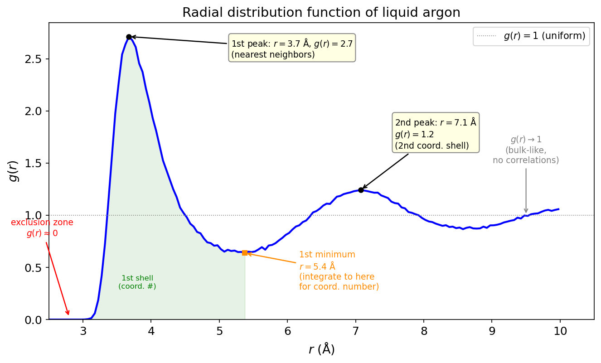

# The Radial Distribution Function: Your Simulation's Fingerprint

!!! info "Practical MD topic — connects to [Energy Fluctuations](ch07/7.2-energy-fluctuations.md) and [Density Fluctuations](ch07/7.4-density-fluctuations.md). This is probably the most-computed quantity in all of molecular simulation."

## You've already computed $g(r)$. But do you know what it means?

Every MD tutorial has you compute the radial distribution function. Plot it. Get the nice peaks. Put it in your report. Move on. But $g(r)$ isn't just a pretty plot. It's a complete description of the pairwise structure of your system, and you can extract thermodynamic properties directly from it. Energy, pressure, compressibility, coordination numbers. All from one function.

Most people treat $g(r)$ as a sanity check: "peaks are in the right place, simulation must be working." That's selling it short. Let's actually understand what this function is, how to read it, and what it can tell you about your simulation's physics.

Let's go.

## What $g(r)$ actually measures

Start with a simple question. Pick any atom in your liquid. Look outward from it. How many atoms do you find at a distance between $r$ and $r + dr$?

In an ideal gas, the answer is easy: $\rho \cdot 4\pi r^2 \, dr$, where $\rho = N/V$ is the number density. Atoms are randomly distributed, so the number you find in a thin shell is just the density times the shell volume.

In a real liquid, the answer is different. There's a shell of nearest neighbors at a preferred distance (the first coordination shell). Then a gap (the "exclusion zone" where atoms can't easily fit). Then a second shell. And so on. The actual number density at distance $r$ isn't uniform. It has structure.

The radial distribution function $g(r)$ is the ratio of the actual local density to the ideal gas density:

$$g(r) = \frac{\text{actual number of atoms in shell at } r}{\text{number expected from uniform density}} = \frac{n(r)}{\rho \cdot 4\pi r^2 \, dr}$$

If $g(r) = 1$: the density at distance $r$ is exactly what you'd expect from a uniform distribution. No structure.

If $g(r) > 1$: atoms are **more likely** to be found at distance $r$ than random. There's a preferred distance.

If $g(r) < 1$: atoms are **less likely** to be found there. Something is pushing them away.

If $g(r) = 0$: no atoms at all. The repulsive core of the potential excludes them completely.

!!! tip "Key Insight"
    $g(r)$ is a probability enhancement factor. It tells you: "compared to a random arrangement, how much more (or less) likely am I to find an atom at this distance?" That's why it approaches 1 at large $r$. Far enough away, the liquid looks uniform. The correlations wash out.

## Reading $g(r)$: a diagnostic guide

Here's our liquid argon $g(r)$ from a real simulation. Let me show you how to read it.

<figure markdown="span">
  { width="700" }
  <figcaption>The radial distribution function of liquid argon (256 atoms, ~107 K, NVE production). Every feature tells you something about the local structure.</figcaption>
</figure>

**The exclusion zone** ($r < \sigma$): $g(r) \approx 0$. The repulsive wall of the LJ potential prevents atoms from getting this close. The onset of $g(r)$ rising from zero tells you the effective atomic diameter.

**The first peak** ($r \approx 3.7$ Å $\approx 1.09\sigma$): This is the nearest-neighbor shell. The height tells you how ordered the local structure is. For a liquid, the first peak is typically 2.5-3.5. For a solid, it's much sharper and taller. For an ideal gas, there's no peak at all.

**The first minimum** ($r \approx 5.0$ Å): The gap between the first and second coordination shells. Atoms don't like to sit here because there's no stable packing arrangement at this distance. The depth of this minimum tells you how well-defined the shells are.

**The second peak** ($r \approx 7.0$ Å): The second coordination shell. Broader and lower than the first. The structure is washing out. By the third peak (if you can see one), the oscillations are subtle.

**The long-range limit** ($r \to \infty$): $g(r) \to 1$. The liquid is uniform on large length scales. If your $g(r)$ doesn't approach 1 at large $r$, something is wrong (normalization bug, box too small, or system not equilibrated).

## The coordination number

Integrate $g(r)$ to get the number of neighbors within a given distance:

$$N_\text{coord}(R) = 4\pi \rho \int_0^R r^2 g(r) \, dr$$

Integrate out to the first minimum, and you get the first-shell coordination number. For liquid argon near the triple point, this is about 12, which is close to the FCC coordination number (also 12). The liquid "remembers" the close-packed structure, even though it's disordered.

This is useful. If you're studying solvation, the coordination number tells you how many water molecules are in the first shell around an ion. If you're studying nucleation, watching the coordination number evolve with time tells you when local crystalline order emerges.

## Three routes to thermodynamics

Here's where $g(r)$ gets powerful. If you know $g(r)$ and the pair potential $u(r)$, you can compute thermodynamic properties directly. Three independent routes:

### The energy equation

$$\frac{E}{N} = \frac{3}{2} k_B T + 2\pi \rho \int_0^\infty r^2 u(r) g(r) \, dr$$

The first term is kinetic energy. The integral is the average potential energy. This says: the total potential energy is determined by how many atom pairs you find at each distance ($g(r)$), weighted by the interaction energy at that distance ($u(r)$). Makes sense.

### The pressure equation (virial route)

$$\frac{P}{\rho k_B T} = 1 - \frac{2\pi \rho}{3 k_B T} \int_0^\infty r^3 \frac{du(r)}{dr} g(r) \, dr$$

The "1" is the ideal gas contribution. The integral is the virial correction from interactions. If the potential is attractive (negative $du/dr$ at intermediate $r$), the integral reduces the pressure below ideal gas. If repulsive (positive $du/dr$ at short range), it increases pressure.

### The compressibility equation

$$k_B T \left(\frac{\partial \rho}{\partial P}\right)_T = 1 + 4\pi\rho \int_0^\infty [g(r) - 1] r^2 \, dr$$

This relates the isothermal compressibility to the integral of $[g(r) - 1]$ over all space. The quantity $h(r) = g(r) - 1$ is the **total correlation function**. Its integral tells you the strength of density-density correlations.

!!! tip "Key Insight"
    For an exact $g(r)$ and pair potential, all three routes give the same thermodynamic state. In practice, they don't exactly agree because: (1) your simulation has finite statistics, (2) your $g(r)$ has bin-width effects, and (3) many-body correlations mean the pair potential doesn't tell the whole story. The discrepancy between routes is itself a diagnostic for the quality of your force field and sampling.

## The structure factor: $g(r)$'s Fourier twin

Experimentalists don't measure $g(r)$ directly. They measure the **structure factor** $S(q)$ from X-ray or neutron scattering. The two are related by a Fourier transform:

$$S(q) = 1 + 4\pi\rho \int_0^\infty [g(r) - 1] \frac{\sin(qr)}{qr} r^2 \, dr$$

Sharp peaks in $g(r)$ (real-space order) produce peaks in $S(q)$ (scattering peaks). The first peak of $S(q)$ corresponds to the dominant real-space periodicity. For a crystal, $S(q)$ has Bragg peaks. For a liquid, broad diffuse peaks. For an ideal gas, $S(q) = 1$ everywhere.

This is why $g(r)$ is the bridge between simulation and experiment. You compute $g(r)$ from your trajectory. Fourier transform it. Compare to experimental scattering data. If they match, your simulation is producing the right structure.

## Practical gotchas

### Bin width matters

$g(r)$ is computed by histogramming pairwise distances. The bin width $\Delta r$ determines the resolution. Too wide: you smear out the peaks, underestimate their height, lose structural detail. Too narrow: noisy, especially at small $r$ where few pairs contribute.

A reasonable default: $\Delta r \approx 0.02\sigma$ to $0.05\sigma$ (0.07 to 0.17 Å for argon). Always check that your first peak height doesn't change when you halve the bin width. If it does, your bins are too coarse.

### Maximum $r$ and the box

You can only compute $g(r)$ out to $r = L/2$ (half the box length). Beyond that, the minimum image convention means you're double-counting. And even near $L/2$, the statistics get worse because fewer independent pairs contribute to each bin.

If your $g(r)$ is still oscillating at $r = L/2$, your box is too small to capture the full correlation structure. This matters for computing the compressibility (which integrates $g(r) - 1$ to infinity) and the structure factor (which needs $g(r)$ at all $r$).

### Number of frames

$g(r)$ converges surprisingly fast because it's an average over all atom pairs in all frames. For 256 atoms and 100 frames, you have $\sim 256 \times 255 / 2 \times 100 \approx 3.3$ million pair distances. The first peak converges in a few dozen frames. The long-range tail takes longer.

But don't confuse fast convergence of $g(r)$ with fast convergence of properties derived from $g(r)$. The coordination number (integral of $g(r)$) is more robust than the peak height. The pressure (which involves the derivative of $u(r)$, amplifying noise) needs more frames.

!!! note "MD Connection"
    In LAMMPS: `compute myRDF all rdf 200` computes $g(r)$ with 200 bins out to half the box length. Output it with `fix ave/time`. For multi-component systems, use `compute rdf` with type specifications: `compute myRDF all rdf 200 1 1 1 2 2 2` for all three partial RDFs of a binary system. The partial $g_{\alpha\beta}(r)$ tells you the structure around each species.

## Takeaway

$g(r)$ measures the local structure of your fluid: where atoms prefer to sit relative to each other, compared to a random arrangement. The first peak gives the nearest-neighbor distance, its height tells you how ordered the structure is, and integration gives the coordination number. Three thermodynamic routes (energy, pressure, compressibility equations) extract bulk properties directly from $g(r)$. The Fourier transform gives $S(q)$, which is what experiments measure. Always check: does $g(r)$ approach 1 at large $r$? Is the first peak converged with respect to bin width? And remember that $g(r)$ captures pairwise correlations only. It's the most important single function in liquid-state physics, but it doesn't tell you everything.

??? question "Check Your Understanding"
    1. You compute $g(r)$ for liquid water and see a sharp first peak at 2.8 Å (O-O distance) with height ~3. Then you compute $g(r)$ for liquid argon and see a first peak at 3.7 Å with height ~2.7. Which liquid is "more structured"? What determines the peak height?
    2. Your $g(r)$ flattens out at 0.97 instead of 1.0 at large $r$. Three possible causes: normalization error, box too small, or system not equilibrated. How would you diagnose which one?
    3. You compute the pressure two ways: from the virial in the LAMMPS log file, and from the pressure equation using your computed $g(r)$. They disagree by 5%. Should you be worried? What could cause this?
    4. You're simulating a mixture of big and small particles. The total $g(r)$ shows a broad first peak with a shoulder. Your advisor asks for the partial RDFs $g_{11}(r)$, $g_{12}(r)$, and $g_{22}(r)$. What does each one tell you that the total $g(r)$ doesn't?
    5. A crystal has $g(r)$ with sharp delta-function-like peaks at specific distances. A liquid has broad peaks. What does the $g(r)$ of a glass look like, and how would you tell it apart from a liquid using only $g(r)$?
