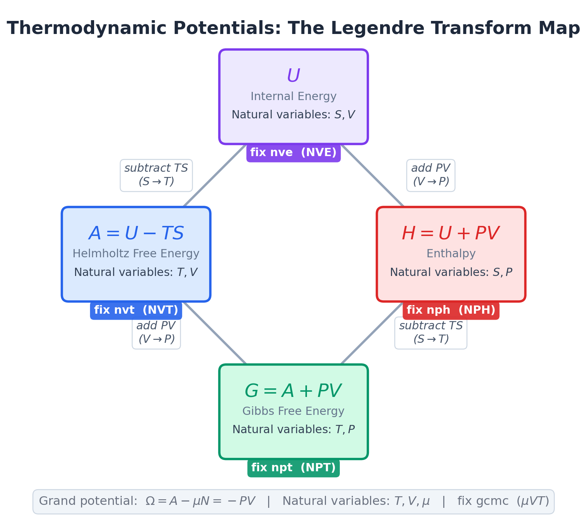
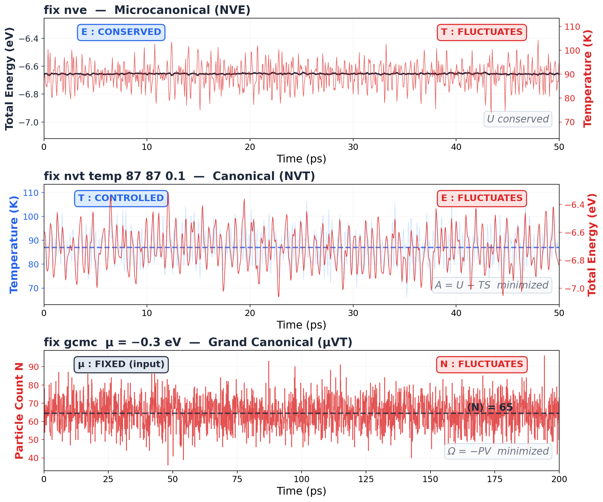

# Thermodynamic Potentials — Which Energy Are We Even Talking About?

!!! info "Companion reading: Huang, *Introduction to Statistical Physics* 2ed, Sections 3.5–3.9"

## Confession time.

Every time someone says "free energy," I nod. "Free energy minimization." Yep. "The Gibbs free energy determines phase equilibrium." Totally. "Use Helmholtz, not Gibbs, for your NVT simulation." Sure thing.

And the whole time I'm thinking: *which one is which again?*

U, A, G, H, $\Omega$. Five "energies." All have units of energy. All differ by some combination of TS and PV. I learn the difference, I use them in a homework set, and two weeks later they're a blur again.

If that's you too, this page is for us. No derivations. Just: what are they, when do you use which, and what does your simulation actually compute.

## Why should you care?

Because every ensemble in your simulation has a thermodynamic potential attached to it. That potential is the quantity the system *minimizes* at equilibrium. If you don't know which one, you don't know what your simulation is actually doing.

- Running NVT? Your system minimizes **Helmholtz free energy** $A$
- Running NPT? Your system minimizes **Gibbs free energy** $G$
- Running NVE? Your system conserves **internal energy** $U$ (it's already at the minimum, there's nothing to exchange)
- Running GCMC? Your system minimizes the **grand potential** $\Omega$

Get the wrong one and you'll misinterpret your results. Use Gibbs intuition for an NVT simulation and you'll confuse yourself about pressure. Use Helmholtz intuition for an NPT simulation and you'll confuse yourself about volume.

Done. That's the punchline. The rest of this page is the *why*.

## The problem: too many "energies"

Here's what makes this confusing. All five potentials are just the internal energy $U$ with different corrections bolted on:

| Potential | Formula | What it adds to $U$ |
|-----------|---------|---------------------|
| Internal energy $U$ | $U$ | Nothing. The OG. |
| Helmholtz $A$ | $U - TS$ | Subtracts the entropy tax |
| Enthalpy $H$ | $U + PV$ | Adds the pressure-volume work |
| Gibbs $G$ | $U - TS + PV$ | Both corrections |
| Grand potential $\Omega$ | $U - TS - \mu N$ | Entropy tax + particle exchange cost |

Look at that. $A$ is $U$ minus $TS$. $H$ is $U$ plus $PV$. $G$ is $U$ minus $TS$ plus $PV$. They're all the same physics with different bookkeeping.

So why do we need five versions of the same thing?

## The key insight: it's about what you hold fixed

This is the part that finally made it click for me.

Each potential answers one question: **"Given what I'm holding constant, what does the system minimize at equilibrium?"**

Think about it this way. In an isolated system (NVE), nothing enters or leaves. Energy is fixed. Entropy increases until it's maximized. Equivalently, $U$ is already at its minimum for that entropy. Fine.

But what if the system is in contact with a heat bath at temperature $T$? Now energy *isn't* fixed. The system can borrow energy from the bath. So minimizing $U$ doesn't make sense anymore. The system will happily *increase* its energy if doing so increases its entropy enough to make the bath happy.

What *is* minimized? The quantity $A = U - TS$. The Helmholtz free energy. It's $U$ with a penalty for entropy: the system wants low energy, but it also wants high entropy, and the temperature $T$ sets the exchange rate. $A$ is the compromise.

Same logic for NPT. Now both energy and volume can fluctuate (heat bath + pressure bath). Neither $U$ nor $A$ is minimized. Instead, $G = U - TS + PV$ is minimized. The $PV$ term is the "rent" the system pays for occupying volume against external pressure $P$.

That's it. That's the whole story. Each time you relax a constraint (let energy flow, let volume change, let particles enter), you add a correction term and get a new potential that accounts for the exchange.

!!! tip "Key Insight"
    The thermodynamic potentials are not five different quantities. They're five different *accountings* of the same physics. Each one tracks the "cost" of what the system exchanges with its environment. $-TS$ accounts for heat exchange. $+PV$ accounts for work against pressure. $-\mu N$ accounts for particle exchange. The "right" potential is the one that accounts for everything your system actually exchanges.

## The Legendre transform: swapping your control knob

Textbooks call this a "Legendre transform." Don't let that name scare you. It answers one very specific question: **how do I rewrite my thermodynamic function in terms of the variables I actually control?**

Here's the situation. Internal energy $U$ naturally depends on $S$ and $V$:

$$dU = T\,dS - P\,dV$$

Those are its "control knobs." But in your NVT simulation, you don't control $S$ (entropy). You control $T$ (temperature). So you want a new function whose natural control knobs are $T$ and $V$ instead of $S$ and $V$.

How? Define $A = U - TS$. Now take the differential:

$$dA = dU - T\,dS - S\,dT$$

Substitute $dU = T\,dS - P\,dV$:

$$dA = \cancel{T\,dS} - P\,dV - \cancel{T\,dS} - S\,dT = -S\,dT - P\,dV$$

The $T\,dS$ cancelled. That's the whole point. By subtracting $TS$ from $U$, we killed the $dS$ dependence and replaced it with $dT$ dependence. That's the swap. $A$ now naturally depends on $T$ and $V$, which are exactly the variables you control in NVT.

The subtraction of $TS$ isn't arbitrary. It's the *exact* operation that kills $T\,dS$ and replaces it with $-S\,dT$.

Same trick works for every swap:

$$dH = d(U + PV) = T\,dS + V\,dP$$

Adding $PV$ killed the $-P\,dV$ term and replaced it with $+V\,dP$. Now $H$ depends on $S$ and $P$ instead of $S$ and $V$.

| Swap | What you subtract/add | Why | What you get |
|------|----------------------|-----|--------------|
| $S \to T$ | Subtract $TS$ | Kills $T\,dS$, brings in $-S\,dT$ | $A(T,V) = U - TS$ |
| $V \to P$ | Add $PV$ | Kills $-P\,dV$, brings in $+V\,dP$ | $H(S,P) = U + PV$ |
| Both | Subtract $TS$, add $PV$ | Swaps both | $G(T,P) = U - TS + PV$ |
| $N \to \mu$ | Subtract $\mu N$ | Kills $\mu\,dN$, brings in $-N\,d\mu$ | $\Omega(T,V,\mu) = A - \mu N$ |

That's it. No magic. Just a cancellation trick that lets you pick your own independent variables.

<figure markdown="span">
  { width="600" }
  <figcaption>The four thermodynamic potentials connected by Legendre transforms. Each box shows the potential, its natural variables, and the LAMMPS fix that uses it. Edges show what operation converts one potential to another. The grand potential (bottom) extends this to open systems.</figcaption>
</figure>

## The thermodynamic square: your cheat sheet

The figure above replaces the boring "thermodynamic square" from your textbook. Same information, but anchored to things you actually use. Here's how to read it:

**Finding natural variables**: Each potential ($U$, $A$, $G$, $H$) sits between the two variables it naturally depends on. $U$ sits between $S$ and $V$. $A$ sits between $T$ and $V$. And so on.

**Finding equations of state**: The differential of each potential is:

$$dU = T\,dS - P\,dV$$

$$dA = -S\,dT - P\,dV$$

$$dG = -S\,dT + V\,dP$$

$$dH = T\,dS + V\,dP$$

Each term is a natural variable multiplied by its conjugate.

**Finding Maxwell relations**: These are the free lunch of thermodynamics. Cross-differentiate any potential and you get equalities between seemingly unrelated derivatives. The square helps you find them visually: follow the diagonal arrows.

For example, from $dA = -S\,dT - P\,dV$:

$$\left(\frac{\partial S}{\partial V}\right)_T = \left(\frac{\partial P}{\partial T}\right)_V$$

That's not obvious. But it's free. And it lets you compute things you can't measure directly (like how entropy changes with volume) from things you *can* measure (like how pressure changes with temperature). That's the energy equation from section 3.1 of the companion book in action.

!!! note "MD Connection"
    In practice, Maxwell relations let you cross-check your simulation. Measure $(\partial P / \partial T)_V$ by running NVT at two temperatures and comparing pressures. Independently compute $(\partial S / \partial V)_T$ from a thermodynamic integration. They should agree. If they don't, something is wrong with your sampling.

## Which potential does your simulation use?

This is the practical part. Match your LAMMPS fix to the right potential:

<figure markdown="span">
  { width="100%" }
  <figcaption>Real data from our 108-atom argon simulations. Top: NVE holds energy constant (blue, flat) while temperature fluctuates (red, noisy). Middle: NVT holds temperature constant while energy fluctuates. Bottom: GCMC holds chemical potential fixed while particle count jumps around. The pattern: what you fix is flat, what the system adjusts is noisy.</figcaption>
</figure>

Look at those three panels. Same atoms, same box, completely different behavior depending on which fix you use.

In NVE, the total energy is a ruler-flat line (standard deviation: 0.004 eV). Temperature bounces around by 5 K. In NVT, flip it: temperature is controlled at 87 K, but now total energy swings by 0.13 eV (30x more than NVE). In GCMC, the particle count itself jumps by 8 atoms around a mean of 65. Different constraints, different fluctuations, different potentials.

| Your fix | Ensemble | Controlled | Fluctuates | Potential minimized | LAMMPS thermo keyword |
|----------|----------|------------|------------|--------------------|-----------------------|
| `fix nve` | Microcanonical | $N, V, E$ | Nothing | $U$ is conserved | `etotal` |
| `fix nvt` | Canonical | $N, V, T$ | $E$ | $A = U - TS$ | Not directly output |
| `fix npt` | Isothermal-isobaric | $N, P, T$ | $E, V$ | $G = A + PV$ | Not directly output |
| `fix nph` | Isenthalpic | $N, P, H$ | $E, V$ | $H = U + PV$ | `enthalpy` |
| `fix gcmc` | Grand canonical | $\mu, V, T$ | $E, N$ | $\Omega = -PV$ | Not directly output |

See the pattern? The controlled variables are the natural variables of the potential. That's not a coincidence. That's the whole point.

!!! warning "Common Mistake"
    "My NVT simulation gives me `pe` and `ke` and `etotal`. So it computes $U$, right?"

    Yes, it computes $U$ at every timestep. But $U$ is **not** what's minimized in NVT. The Helmholtz free energy $A = U - TS$ is. The problem is that LAMMPS doesn't output $A$ directly because computing entropy $S$ from a trajectory is genuinely hard (it requires thermodynamic integration, the 2PT method, or similar techniques). You get $U$ for free. You have to *work* for $A$.

## What LAMMPS actually gives you

Here's a typical `thermo_style` line and what each keyword maps to:

```lammps
thermo_style custom step temp press pe ke etotal enthalpy vol density
```

| Keyword | Symbol | What it is |
|---------|--------|------------|
| `temp` | $T$ | Temperature from kinetic energy: $\frac{2}{3Nk_B}\sum \frac{p_i^2}{2m_i}$ |
| `pe` | $U_\text{pot}$ | Potential energy (pair + bond + angle + ...) |
| `ke` | $K$ | Kinetic energy $\sum \frac{p_i^2}{2m_i}$ |
| `etotal` | $U = K + U_\text{pot}$ | Total internal energy |
| `enthalpy` | $H = U + PV$ | Enthalpy |
| `press` | $P$ | Pressure (kinetic + virial) |
| `vol` | $V$ | Box volume |

Notice what's *missing*: entropy $S$, Helmholtz free energy $A$, and Gibbs free energy $G$. These are the quantities you actually want for NVT and NPT analysis, and LAMMPS can't give them to you from a single trajectory. That's not a LAMMPS limitation. That's a fundamental issue: entropy is a *global* property of the ensemble, not a local property of a single configuration.

## Chemical potential: the fifth variable

What if the number of particles can change too? Then you need the chemical potential $\mu$, and the first law picks up an extra term:

$$dU = T\,dS - P\,dV + \mu\,dN$$

We cover $\mu$ in detail in [Section 7.5](ch07/7.5-chemical-potential.md). The short version: $\mu$ is the free energy cost of adding one more particle. Negative $\mu$ means the system is happy to accept more particles (dilute gas, lots of room). Positive $\mu$ means the system is full.

In LAMMPS, you set $\mu$ when you use `fix gcmc`. That's the value that determines how many particles the simulation accepts or ejects at equilibrium.

## Computing free energies: the hard (but important) part

Here's the uncomfortable truth. The two most useful potentials for simulation ($A$ and $G$) are the two that LAMMPS *can't* directly output. You can't just read them off a thermo log. You have to compute them.

Why? Because they contain entropy, and entropy counts *all* accessible microstates, not just the one you're currently sitting in.

Here are the standard methods. This isn't a how-to (that's a whole chapter of its own), just a map of the landscape:

| Method | Computes | Idea | Ensemble |
|--------|----------|------|----------|
| **Thermodynamic integration (TI)** | $\Delta A$ or $\Delta G$ | Slowly switch one Hamiltonian into another, integrate the work | NVT or NPT |
| **Free energy perturbation (FEP)** | $\Delta A$ | Compute $\langle e^{-\beta \Delta U} \rangle$ from a single simulation | NVT |
| **Widom insertion** | $\mu$ | Insert ghost particles, measure the energy cost | NVT |
| **Metadynamics** | Free energy surface | Add bias potential to flatten barriers, recover $A$ as a function of collective variables | NVT |
| **Two-phase thermodynamics (2PT)** | $S$, then $A$ | Decompose velocity autocorrelation into gas-like and solid-like components | NVT |

Each has trade-offs. TI is the gold standard but requires multiple simulations along a parameter path. FEP is elegant but breaks down for large perturbations. Widom insertion is simple but fails for dense liquids (the ghost particle always overlaps with something). Metadynamics handles barriers but requires choosing good collective variables.

!!! note "MD Connection"
    If you've ever used `compute fep`, `fix adapt`, `fix ti/spring`, or `fix gcmc` in LAMMPS, you've used one of these methods. They all ultimately compute differences in $A$ or $G$ by cleverly sampling the entropy that a single trajectory can't see.

## The energy equation: a useful relation

One more practical result from thermodynamics. The **energy equation** (section 3.1 of the companion book) tells you how internal energy changes with volume at constant temperature:

$$\left(\frac{\partial U}{\partial V}\right)_T = T\left(\frac{\partial P}{\partial T}\right)_V - P$$

For an ideal gas, the right side is zero ($P = NkT/V$, so $T(\partial P/\partial T)_V = P$). That's why $U$ depends only on temperature for an ideal gas, not on volume. Joule's free expansion experiment confirms this.

For a real system (like your LJ argon), this derivative is *not* zero. The internal energy changes when you expand the box at constant temperature, because the atoms move apart and the attractive part of the potential changes. This equation lets you compute that change from your simulation's $P(T)$ data instead of running separate simulations at different volumes.

## Takeaway

Five potentials, one idea: each one tracks what the system exchanges with its environment. Subtract $TS$ for heat exchange (that gives Helmholtz). Add $PV$ for pressure-volume work (that gives enthalpy). Both (that gives Gibbs). Also $\mu N$ for particles (grand potential). Your simulation fix picks the ensemble. The ensemble picks the potential. The potential tells you what's minimized. Everything else follows.

??? question "Check Your Understanding"
    1. You already know the Legendre transform trick: subtract $TS$ to swap $S \to T$, add $PV$ to swap $V \to P$. Now go all in. Define $\Phi = U - TS - PV - \mu N$. What are its natural variables? Write down $d\Phi$. (Bonus: does this potential have a name?)
    2. LAMMPS happily outputs $U$ every timestep but can't give you the Helmholtz free energy $A$. The missing piece is entropy. Why can't you compute $S$ from a single snapshot? What makes it fundamentally different from energy?
    3. Your NVT simulation of a crystal at high temperature spontaneously *increases* its potential energy as defects form. That seems wrong if "the system minimizes energy." But it's not minimizing $U$. It's minimizing $A = U - TS$. Explain why forming defects can lower $A$ even though it raises $U$.
    4. You do Joule's free expansion on an ideal gas: double the volume, constant $T$. The internal energy doesn't change. Now do the same thing with your LJ argon. The internal energy *does* change. Why the difference?
