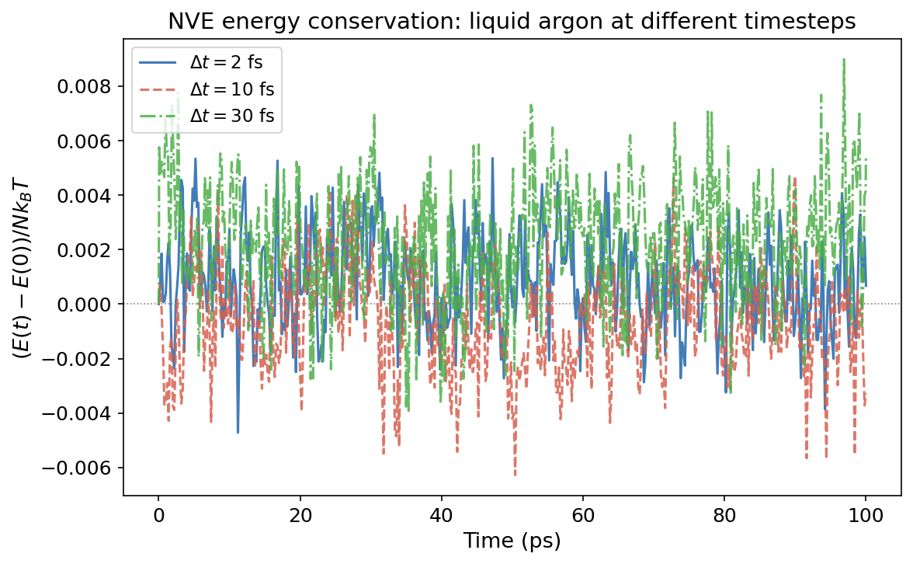

# Time Integration: Your Timestep Is Destroying Physics

!!! info "Practical MD topic — connects to [Liouville's Theorem](ch06/6.0-foundations.md) and the microcanonical ensemble. This is what happens between `run 100000` and your observables."

## Let's talk about the thing you never think about.

You write `timestep 0.002` in your LAMMPS input file. Two femtoseconds. The simulation runs. You get a trajectory. You compute stuff. And at no point do you stop and think: "Wait. I'm solving Newton's equations numerically. How bad is the numerical error? And is it quietly wrecking my physics?"

Turns out, the answer depends almost entirely on which integrator you're using and how big your timestep is. And there's something genuinely beautiful about why velocity-Verlet works as well as it does. It's not just a good approximation. It preserves a fundamental property of classical mechanics that most other integrators destroy. Let me show you.

## Newton's equations and the phase space flow

Quick recap. Classical mechanics says: given positions $\mathbf{r}$ and momenta $\mathbf{p}$ at time $t$, Newton's equations determine positions and momenta at time $t + \Delta t$. The system traces a trajectory through phase space.

Liouville's theorem (we covered this in the [stat mech intro](ch06/6.0-foundations.md)) says this trajectory preserves phase space volume. If you start with a cloud of initial conditions occupying some volume in $(r, p)$ space, that cloud changes shape as it evolves, but its volume is exactly conserved. This is a consequence of Hamiltonian mechanics. It's not approximate. It's exact.

Now here's the problem. We can't solve Newton's equations exactly (except for trivially simple systems). We discretize time into steps of size $\Delta t$ and approximate the continuous trajectory with a sequence of discrete updates. This approximation breaks things. The question is: what does it break, and does it matter?

## The velocity-Verlet integrator

This is what LAMMPS uses by default (and what most MD codes use). The algorithm is:

$$\mathbf{r}(t + \Delta t) = \mathbf{r}(t) + \mathbf{v}(t)\Delta t + \frac{1}{2}\mathbf{a}(t)\Delta t^2$$

$$\mathbf{v}(t + \Delta t) = \mathbf{v}(t) + \frac{1}{2}[\mathbf{a}(t) + \mathbf{a}(t + \Delta t)]\Delta t$$

Positions are updated using current velocities and accelerations. Then new forces are computed at the new positions. Then velocities are updated using the average of old and new accelerations.

This looks like a simple Taylor expansion, and it is, but it has a property that's not obvious from the formula: it's **symplectic**.

## What symplectic means (and why it saves your simulation)

A symplectic integrator preserves phase space volume at every step. Just like the exact Hamiltonian flow. This sounds like a technicality. It's not. It has enormous practical consequences.

Because velocity-Verlet is symplectic, it doesn't just approximately conserve energy. It **exactly** conserves a slightly different energy, called the **shadow Hamiltonian** $\tilde{H}$:

$$\tilde{H} = H + O(\Delta t^2)$$

The shadow Hamiltonian differs from the true Hamiltonian by terms of order $\Delta t^2$. For small $\Delta t$, the difference is tiny. The system evolves on a slightly perturbed energy surface, but it stays on that surface forever. No drift. No systematic energy gain or loss.

Compare this to a non-symplectic integrator (like forward Euler). Forward Euler doesn't preserve phase space volume. Energy drifts systematically. The longer you run, the worse it gets. After enough steps, the system either explodes (energy grows without bound) or collapses (energy drains away). Non-symplectic integrators are useless for long MD trajectories.

!!! tip "Key Insight"
    Velocity-Verlet is "only" second-order accurate (the error per step is $O(\Delta t^3)$, the global error after $N$ steps is $O(\Delta t^2)$). There are fourth-order methods that are more accurate per step. But for MD, accuracy per step isn't what matters. What matters is long-time stability: does the energy stay bounded forever? Symplectic integrators guarantee this. Higher-order non-symplectic methods don't.

## Choosing a timestep

The timestep must be small enough to resolve the fastest motion in your system. This is the Nyquist-like criterion for MD: if a vibrational mode has period $\tau$, you need at least $\Delta t < \tau / (2\pi)$ to track it, and in practice you want $\Delta t \approx \tau / 20$ or better for accurate dynamics.

What's the fastest motion?

- **Bond stretches**: C-H stretch has a period of ~10 fs. O-H stretch in water is ~9 fs. These are the speed limit.
- **Bond angles**: Bending motions are ~20-30 fs.
- **Heavy atom motions**: C-C stretches, backbone torsions, etc. are 30+ fs.
- **Collective motions**: Diffusion, conformational changes. Milliseconds.

So the C-H stretch at 10 fs demands $\Delta t \leq 1$ fs. That's why 1 fs is the standard timestep for all-atom biomolecular simulations. For metal units (LAMMPS), where argon's vibrational timescale is longer, you can often get away with 2 fs.

### How to test your timestep

The gold standard: run a short NVE simulation and monitor the total energy. If it's conserved to within thermal fluctuations over the production timescale, your timestep is fine. If it drifts, your timestep is too large.

A quantitative criterion: the energy drift should be less than $\sim 10^{-4} k_BT$ per picosecond per atom. Anything worse, and the integration error is contaminating your thermodynamics.

<figure markdown="span">
  { width="700" }
  <figcaption>NVE energy conservation for liquid argon at three timesteps. All three use velocity-Verlet (symplectic), so there's no systematic drift. But the fluctuation amplitude grows with $\Delta t^2$: the shadow Hamiltonian $\tilde{H}$ deviates more from the true $H$ at larger timesteps. For argon (no fast bond vibrations), even 30 fs is stable. For molecules with C-H stretches, anything above ~1 fs without SHAKE would blow up.</figcaption>
</figure>

!!! warning "Common Mistake"
    "My simulation is in NVT, so energy conservation doesn't matter." Wrong. The thermostat compensates for integration error by adding or removing energy. This means the thermostat is doing double duty: maintaining temperature AND cleaning up after your bad timestep. The dynamics are corrupted even if the averages look OK. Always test energy conservation in NVE first, then add the thermostat.

## SHAKE/RATTLE: buying a bigger timestep

If the fastest motion is the C-H stretch at 10 fs, and we need $\Delta t < 1$ fs because of it, but we don't actually *care* about C-H stretching (it's quantum-mechanical anyway and has almost no effect on thermodynamics), why not just freeze it?

That's what **SHAKE** (and its velocity-correcting cousin **RATTLE**) do. They constrain bond lengths to fixed values, eliminating the fast vibrational modes entirely. With hydrogen bonds constrained, the fastest remaining motion is bond angle bending at ~20 fs, and you can safely use $\Delta t = 2$ fs. Double the timestep, half the computational cost, for free.

The tradeoff: constrained dynamics is no longer strictly Hamiltonian (the constraints introduce forces that don't come from a potential), so the connection to the shadow Hamiltonian is less clean. But in practice, the thermodynamic properties are essentially identical, and the factor-of-two speedup is too good to pass up.

In LAMMPS: `fix shake all shake 1e-4 100 0 t 1 2` constrains bonds involving types 1 and 2. For water models: `fix shake all shake 1e-4 100 0 b 1 a 1` constrains the O-H bonds and H-O-H angle.

## r-RESPA: multiple timescales

Different interactions have different timescales. The bonded interactions (bonds, angles) change fast and need small timesteps. The nonbonded interactions (LJ, Coulomb) change slowly and could tolerate larger steps. Why compute the expensive long-range forces at every single step?

**r-RESPA** (reversible Reference System Propagator Algorithm) uses different timesteps for different force groups. Bonds get a 0.5 fs inner timestep. Short-range nonbonded get a 2 fs middle timestep. Long-range electrostatics get a 4-6 fs outer timestep. The fast forces are computed more often, the slow forces less often, and the total cost drops because the expensive forces are evaluated fewer times.

In LAMMPS: `run_style respa` with appropriate level specifications. It's more complex to set up, and the speedup depends on your system, but for large biomolecular simulations it can be significant.

!!! note "MD Connection"
    In LAMMPS, the integrator is baked into the `fix` command. `fix nve` is velocity-Verlet in the microcanonical ensemble. `fix nvt` is velocity-Verlet plus Nose-Hoover thermostat. The timestep is set with `timestep 0.002` (in the current unit system). For `metal` units, that's 2 fs. For `real` units, `timestep 1.0` is 1 fs.

    Quick rules: 1 fs for all-atom with flexible bonds. 2 fs with SHAKE on hydrogens. 2 fs for LJ argon in metal units. If in doubt, run NVE and check energy conservation.

## Takeaway

Velocity-Verlet is the default MD integrator for good reasons: it's symplectic (preserves phase space volume), time-reversible, and exactly conserves a shadow Hamiltonian that differs from the true Hamiltonian by $O(\Delta t^2)$. This means energy stays bounded forever, no drift, no explosions. Your timestep must resolve the fastest motion in the system (typically C-H stretches at ~10 fs, so $\Delta t \leq 1$ fs). SHAKE constraints remove fast bond vibrations and let you double the timestep. Always test energy conservation in NVE before trusting your timestep. The thermostat is not a substitute for a good integrator.

??? question "Check Your Understanding"
    1. You run NVE with $\Delta t = 1$ fs and the total energy fluctuates around a constant value. You increase to $\Delta t = 5$ fs and the total energy creeps upward at 0.01 eV/ps. Is this fixable by running NVT instead, or is the underlying dynamics already corrupted?
    2. Someone says "I use a fourth-order Runge-Kutta integrator for MD because it's more accurate per step." Why is this a terrible idea for long MD simulations, despite being higher order?
    3. You constrain all O-H bonds with SHAKE and increase $\Delta t$ from 1 fs to 2 fs. Your RDF and density are unchanged. But your diffusion coefficient changes by 3%. Should you be concerned, and what's the likely cause?
    4. Your labmate runs a protein simulation with a 5 fs timestep and says "the simulation is stable, it's been running for 10 ns." They're using NVT. The temperature looks fine. Is the simulation trustworthy?
    5. The shadow Hamiltonian concept says velocity-Verlet exactly conserves $\tilde{H} = H + O(\Delta t^2)$. If you halve the timestep, how does $|\tilde{H} - H|$ change? What does this predict for the energy fluctuations in NVE?
