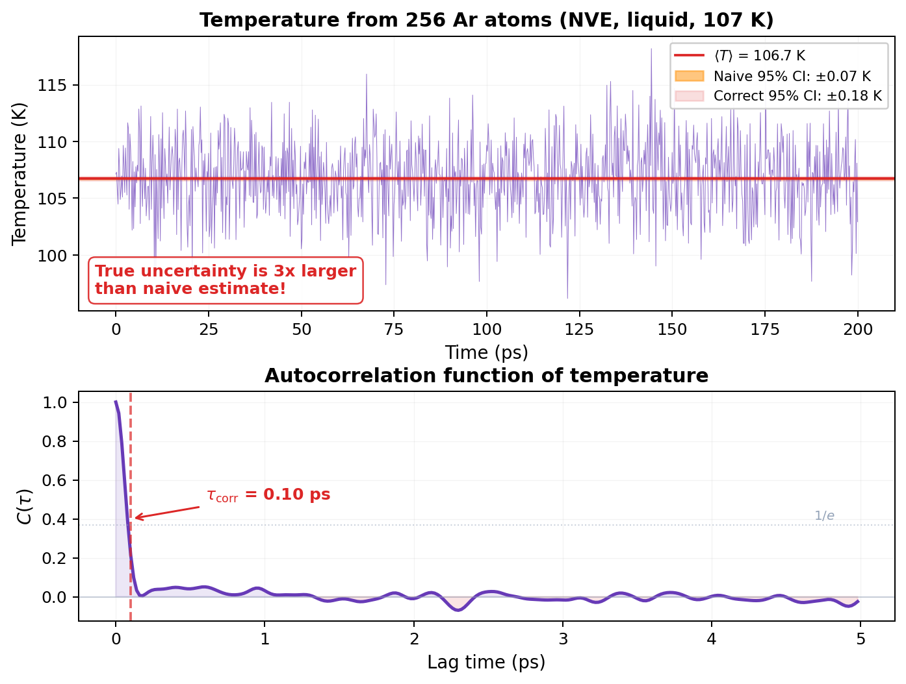
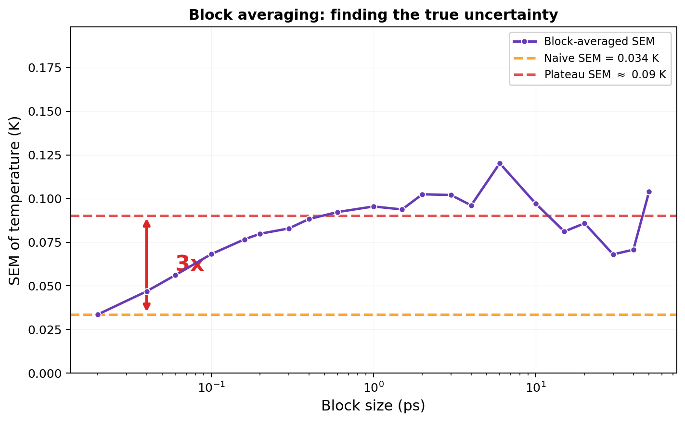

# Uncertainty & Sampling Quality

!!! info "LiveCoMS Best Practices for Quantification of Uncertainty and Sampling Quality in Molecular Simulations"

## Your error bars are lying to you.

I need to tell you something uncomfortable. Every time you compute an average from your MD trajectory and report a standard error, there's a good chance your error bar is too small. Maybe 3x too small. Maybe 10x. Maybe more.

Here's why. You ran a 200 ps simulation. Dumped thermo every 20 fs. That's 10,001 data points. You compute the average temperature: 106.7 K. Standard error: $\sigma / \sqrt{N} = 3.4 / \sqrt{10001} = 0.034$ K. Beautiful precision. Five significant figures. Paper-ready.

Except it's wrong. The true uncertainty is about 0.09 K. Three times larger.

The problem? Your data points aren't independent. Frame 1000 and frame 1001 are almost the same configuration. The atoms barely moved. Those two measurements carry almost the same information. Counting them as two independent samples is cheating, and $\sqrt{N}$ is punishing you for it by making your error bar absurdly small.

This page is about fixing that. Let's go.

## The standard error formula (and when it lies)

You know the formula. Sample mean $\bar{x}$, sample standard deviation $s$, standard error of the mean:

$$\text{SEM} = \frac{s}{\sqrt{N}}$$

This formula has *one* assumption: the $N$ samples are **linearly uncorrelated**. Flip a coin 1000 times and count heads? Uncorrelated. Each flip is independent. $\sqrt{N}$ works perfectly.

But MD data isn't coin flips. Each configuration is generated from the previous one by integrating Hamilton's equations forward by one timestep. Frame $k$ and frame $k+1$ share almost all the same positions and velocities. They're *correlated*. The autocorrelation decays over some timescale $\tau_\text{corr}$, and until it does, your samples are redundant.

Using $N$ in the denominator when your effective number of independent samples is $N_\text{eff} \ll N$ makes your error bar too small by a factor of $\sqrt{N / N_\text{eff}}$.

!!! warning "Common Mistake"
    The most common error in reporting MD results is using the naive standard error $s/\sqrt{N}$ where $N$ is the number of trajectory frames. This can underestimate the true uncertainty by an order of magnitude for slowly decorrelating properties. No reviewer will catch this if you don't flag it yourself. Be honest with your error bars.

## Autocorrelation: measuring the memory

How correlated are your data? Measure it. The **autocorrelation function** (ACF) tells you how similar a measurement at time $t$ is to a measurement at time $t + \tau$:

$$C(\tau) = \frac{\langle (x(t) - \bar{x})(x(t + \tau) - \bar{x}) \rangle}{\langle (x(t) - \bar{x})^2 \rangle}$$

At $\tau = 0$: $C(0) = 1$. Perfect correlation with yourself. Obviously.

At $\tau \to \infty$: $C(\infty) = 0$. No memory left. The system has forgotten.

The **correlation time** $\tau_\text{corr}$ is how long it takes for $C(\tau)$ to decay. A common definition is the $1/e$ crossing: the lag where $C(\tau) = 1/e \approx 0.37$.

<figure markdown="span">
  { width="750" }
  <figcaption>Top: Temperature from 256 liquid argon atoms (NVE, 107 K). The naive 95% CI (amber band) is absurdly narrow; the correct 95% CI (red band) is 3x wider. Bottom: Autocorrelation function of temperature. Initial rapid decay (from velocity decorrelation), followed by oscillations that take about 1.3 ps to fully die out.</figcaption>
</figure>

For our liquid argon simulation (256 atoms, NVE, 107 K), the temperature ACF shows:

- **Fast initial decay** ($1/e$ at 0.1 ps): most velocity correlations die quickly
- **Long oscillatory tail** (first zero crossing at 1.3 ps): the cage effect causes lingering correlations
- **Total correlation window**: about 1.3 ps before $C(\tau)$ fluctuates around zero

From the ACF, we can compute the **statistical inefficiency**:

$$g = 1 + 2 \sum_{i=1}^{N_\text{max}} C_i$$

where the sum runs until $C_i$ has decayed to zero. This tells you how many raw samples equal one independent sample. For our temperature data: $g = 10.3$. That means every 10 consecutive measurements carry the information of roughly one independent measurement.

The effective number of independent samples:

$$N_\text{eff} = \frac{N}{g} = \frac{10{,}001}{10.3} \approx 975$$

So out of 10,001 data points, only about 975 are truly independent. The correct standard error is:

$$\text{SEM}_\text{correct} = \frac{s}{\sqrt{N_\text{eff}}} = \frac{3.4}{\sqrt{975}} = 0.11 \text{ K}$$

Compare that to the naive $0.034$ K. Three times larger. If you reported the naive value, your 95% confidence interval wouldn't even cover the true uncertainty at the 1$\sigma$ level.

!!! note "MD Connection"
    Different observables have different correlation times. Temperature (kinetic energy) decorrelates fast because velocities randomize quickly through collisions. Pressure decorrelates slower because it depends on the virial, which involves interatomic distances. Structural properties (RDF peaks, coordination numbers) can take much longer. Always compute the autocorrelation for the *specific* observable you're reporting, not just temperature.

## Block averaging: the practical fix

The autocorrelation approach works, but it requires choosing where to truncate the sum (that $N_\text{max}$), which can be tricky. **Block averaging** is the more robust alternative that most practitioners actually use.

The idea is simple. Instead of asking "how correlated are individual samples?", ask "how large do blocks need to be before block averages are uncorrelated?"

### The recipe

1. Divide your $N$ data points into $M$ blocks of size $n$ ($M = N/n$).
2. Compute the average of each block: $\bar{x}_j^b = \frac{1}{n}\sum_{k=1}^n x_{(j-1)n + k}$.
3. Compute the SEM of the block averages: $\text{SEM} = s(\bar{x}^b) / \sqrt{M}$.

If $n$ is small (say, 1), the block averages ARE your original data. You get the naive SEM. Too small.

If $n$ is very large, each block spans many correlation times. The block averages are independent. You get the true SEM. But with very few blocks, so the estimate is noisy.

### The plateau method

Here's the key. Repeat the calculation for many different block sizes $n$. Plot SEM vs $n$. As $n$ increases past $\tau_\text{corr}$, the SEM rises from the naive value and **plateaus** at the true value. That plateau is your answer.

<figure markdown="span">
  { width="700" }
  <figcaption>Block-averaged SEM of temperature vs block size. At small blocks (0.02 ps), the SEM is the naive value (0.034 K, amber dashed line). As block size increases past the correlation time (~1 ps), the SEM rises and plateaus near 0.09 K (red dashed line). The true uncertainty is 3x larger than naive. At very large block sizes (>10 ps), the SEM becomes noisy because too few blocks remain.</figcaption>
</figure>

For our liquid argon temperature:

- **Naive SEM** (block size = 1): 0.034 K
- **Plateau SEM** (block size 1-6 ps): ~0.09 K
- **Factor**: 3x

The plateau is clear between ~1 and 6 ps block sizes. Beyond that, fewer blocks mean noisier estimates. The block averaging plateau is the standard method for uncertainty quantification in MD.

If the SEM keeps rising and never plateaus? Your simulation is too short. The blocks haven't decorrelated. You need more data.

!!! tip "Key Insight"
    Block averaging is your best friend for honest error bars. The recipe: try a range of block sizes, plot SEM vs block size, and read off the plateau value. If there's no plateau, your simulation isn't long enough. No amount of post-processing can fix that.

## Equilibration: don't use the warm-up data

Before you even start computing averages, you need to throw away the beginning of your trajectory. The system starts from some initial configuration (usually a crystal lattice or a minimized structure) that has nothing to do with the equilibrium distribution. The time it takes to relax from those initial conditions to equilibrium is the **equilibration period** (or "burn-in").

How do you know when equilibration is done?

**The simple way**: Plot your observable vs time. If it's drifting, you're still equilibrating. If it's fluctuating around a constant mean, you're probably in production territory. Cut the drifting part. Keep the rest.

**The principled way** (Chodera's method): For each trial "cut point" $t_\text{equil}$, compute $N_\text{eff}$ of the remaining data. Pick the $t_\text{equil}$ that **maximizes** $N_\text{eff}$. This balances removing non-equilibrated data (which biases the result) against keeping as much production data as possible (which reduces uncertainty).

**The paranoid way**: Run multiple independent simulations from different starting configurations. If their averages agree within error bars, you're equilibrated. If they don't, you're not, and no single-trajectory diagnostic will save you.

!!! warning "Common Mistake"
    Including equilibration data doesn't just increase your error bars. It **biases** your average. If the first 20% of your trajectory has a systematically different energy, your reported mean is wrong, not just imprecise. Always remove burn-in before computing anything.

## The correct workflow

Putting it all together. Every time you compute an observable from an MD trajectory:

**Step 1: Equilibration check.** Plot the time series. Is it stationary? If it drifts, identify and remove the equilibration period.

**Step 2: Compute the mean.** Average over the production data only.

**Step 3: Block averaging.** Compute SEM for a range of block sizes. Find the plateau. That's your standard uncertainty.

**Step 4: Confidence interval.** For a 95% confidence interval (which is what you should report), multiply the SEM by the coverage factor $k$ from the Student's $t$-distribution:

| $N_\text{eff}$ (blocks) | $k$ (95% CI) |
|:---:|:---:|
| 6 | 2.57 |
| 10 | 2.23 |
| 20 | 2.09 |
| 50 | 2.01 |
| 100+ | 1.96 |

For our example: $T = 106.7 \pm 2 \times 0.09 = 106.7 \pm 0.2$ K (95% CI, $k \approx 2$ for ~100 blocks).

Compare that to the naive report of $106.7 \pm 0.07$ K. The difference matters.

**Step 5: Significant figures.** Only report digits warranted by your uncertainty. If SEM = 0.09 K, then reporting $T = 106.734 \pm 0.034$ K is not precise science. It's false precision. Report $106.7 \pm 0.2$ K.

## Bootstrapping (for non-standard observables)

Block averaging works great for simple averages (temperature, pressure, energy). But what about derived quantities? Free energy differences? Rate constants? Quantities that aren't just arithmetic means?

**Bootstrapping** handles these. The idea:

1. Identify $N_\text{eff}$ independent samples (via block averaging or autocorrelation analysis).
2. Draw $N_\text{eff}$ samples **with replacement** from your data. This is one "bootstrap replicate."
3. Compute your observable from this replicate.
4. Repeat steps 2-3 hundreds of times.
5. The distribution of results IS your uncertainty distribution. The 2.5th and 97.5th percentiles give your 95% CI.

Bootstrapping makes no assumption about the distribution shape. It works for any observable, any functional form, any weirdness. The only requirement: your samples must be effectively independent. If they're correlated, subsample or block-average first.

!!! note "MD Connection"
    In practice, many analysis tools (MDAnalysis, LAMMPS `fix ave/time`, etc.) don't account for autocorrelation when computing error bars. They report the naive SEM. It's YOUR job to apply the correction. Always. The tool doesn't know your correlation time. You do (or should).

## The reporting checklist

Before you submit that paper:

- [ ] Equilibration data identified and removed
- [ ] Time series plotted and visually inspected for stationarity
- [ ] Block averaging performed; plateau identified
- [ ] Uncertainty reported as 95% confidence interval (not 1$\sigma$, not "standard error")
- [ ] Coverage factor $k$ from Student's $t$-distribution used (not just $\times 2$)
- [ ] Only significant figures reported (uncertainty dictates precision)
- [ ] For multiple independent runs: results compared across simulations
- [ ] UQ method described in sufficient detail for reproduction
- [ ] Analysis scripts published as supporting information

## Takeaway

Your MD data is correlated. Consecutive frames carry redundant information. The naive standard error formula ($s/\sqrt{N}$) assumes independence that doesn't exist, and it will underestimate your uncertainty by a factor of $\sqrt{g}$ where $g$ is the statistical inefficiency. Block averaging fixes this: compute SEM for increasing block sizes and read off the plateau. If there's no plateau, your simulation is too short. Report 95% confidence intervals, not raw standard errors. And for the love of reproducible science, describe how you computed your error bars.

??? question "Check Your Understanding"
    1. We showed temperature's naive SEM was off by 3x. Now imagine computing the SEM for something that decorrelates *way* slower, like a polymer's end-to-end distance. Is the underestimation worse or better than 3x?
    2. You make the block averaging plot and the SEM just keeps climbing. No plateau in sight. What is your simulation telling you, and can any amount of clever post-processing fix it?
    3. Your colleague says "I included the first 20% of my trajectory. Worst case, my error bars are a bit bigger." Why is that dangerously wrong? What's the difference between bias and imprecision?
    4. A paper reports $D = 2.41 \pm 0.03 \times 10^{-5}$ cm$^2$/s. The error bar came from $s/\sqrt{N}$ with $N$ = number of trajectory frames. What did they forget, and is their real uncertainty larger or smaller than 0.03?
